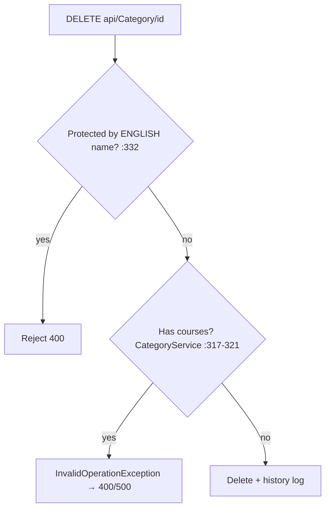

# CategoryController Module Documentation (API — Admin)

---

## Overview

### Purpose
Category taxonomy: public reads + admin CRUD with protected-category guards.

### Business Objective
Administer the course taxonomy while exposing it publicly for navigation widgets.

### Main Functionality
- List / by-id / top categories (anonymous)
- Create / update / delete / bulk-delete (AdminArea)

### Primary User Roles

| Role | Description |
|------|-------------|
| Anonymous | Read categories |
| AdminArea (any claim) | Mutations |

---

## Module Architecture

```
Presentation           API controllers (JSON)
Application            ICategoryService
Storage                Categories table
```

### Controllers

| Controller | Responsibility |
|-----------|----------------|
| `CategoryController` | 7 actions (`api/Category`) — **no class-level `[Authorize]`** |

### Services

| Service | Responsibility |
|---------|----------------|
| `CategoryService` | CRUD; delete blocked when category has courses (:317-321) |

---

## Endpoints

**Route**: `api/Category`  
**Authorization**: mixed — see table

| # | Action | HTTP | Route | Auth | Description |
|---|--------|------|-------|------|-------------|
| 1 | GetCategories | GET | `api/Category` | 🔓 **anonymous** (:57) | All categories |
| 2 | GetCategoryById | GET | `api/Category/{id}` | 🔓 **anonymous** (:98) | One category |
| 3 | GetTopCategories | GET | `api/Category/top?count=6` | 🔓 **anonymous** (:148) | Top by course count |
| 4 | CreateCategory | POST | `api/Category` | 🛡️ AdminArea (:183) | Create |
| 5 | UpdateCategory | PUT | `api/Category` | 🛡️ AdminArea (:245) | Update |
| 6 | DeleteCategory | DELETE | `api/Category/{id}` | 🛡️ AdminArea (:309) | Delete |
| 7 | BulkDeleteCategories | DELETE | `api/Category/bulk?ids=` | 🛡️ AdminArea (:370) | Bulk delete |

---

## Internal Workflows & Runtime Behavior

### Workflow 1: Delete Guards



#### Runtime Behavior
- Protected check by **English name only** (`SD.ProtectedCategories`, SD.cs:24-40 — 58 names).
- `BulkDeleteCategories` (`int.Parse` per token) — a non-integer id → `FormatException` → **500** instead of 400 (:383); no id-count limit.
- Any protected category in the bulk request → whole request 400 (:389-393).
- **Every action logs history — including the 3 anonymous GETs** → anonymous callers can spam the history table (:77, :119, …).

---

## Business Rules

| Rule | Verified in | Why it exists |
|------|-------------|---------------|
| Protected categories undeletable | CategoryController.cs:332-336, 388-393 | System taxonomy |
| Category with courses undeletable | CategoryService.cs:317-321 | FK integrity |
| Name ≤ 30 chars | CategoryCreateDTO.cs:13-14 | Display constraints |

---

## Security Analysis

| Control | Status |
|---------|--------|
| **Auth gap (critical)** | ❌ all 3 GET endpoints anonymous — full category list + by-id enumerable by anyone (the convention adds nothing because the controller mixes authorized + unauthorized actions) |
| **IDOR** | `GetCategoryById` enumerable anonymously |
| **Validation** | `int.Parse` crash → 500 on bulk; per-id failures swallowed as `failed` (:412) |
| Claim granularity | ❌ any admin claim can mutate categories (see AdminArea policy, Program.cs:42-47) |
| **Dead field** | `_courseService` declared (:27) but never assigned/used |

---

## Hidden Behaviors & Technical Notes

1. **Three anonymous GETs** — public "top categories" is plausible, but full listing + by-id is admin data exposed.
2. **`DeleteCategory` returns 204** while `BulkDeleteCategories` returns 200 with a message — inconsistent shapes.
3. **XML docs claim 401/403** on the GETs that can never return them (:180-181, :240-242).
4. **History spam via anonymous GETs**.

---

## Configuration

| Key | Purpose |
|-----|---------|
| (none module-specific) | — |

---

## Change Log

**Current functionality (verified):** taxonomy CRUD with protected/course guards — plus anonymous read endpoints, a FormatException 500 path, and dead DI fields.

**Maintenance notes:** authorize the GETs (or explicitly `[AllowAnonymous]` the intended ones only); parse bulk ids defensively.