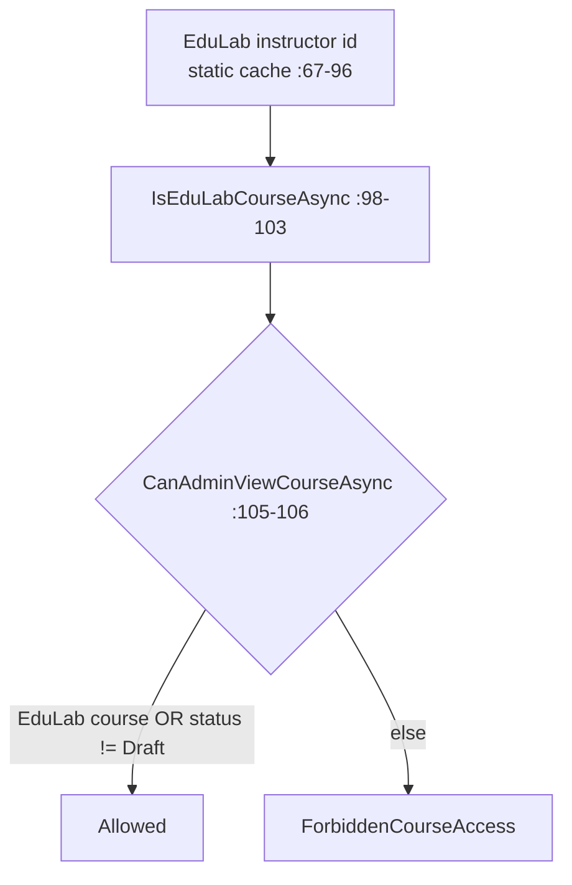
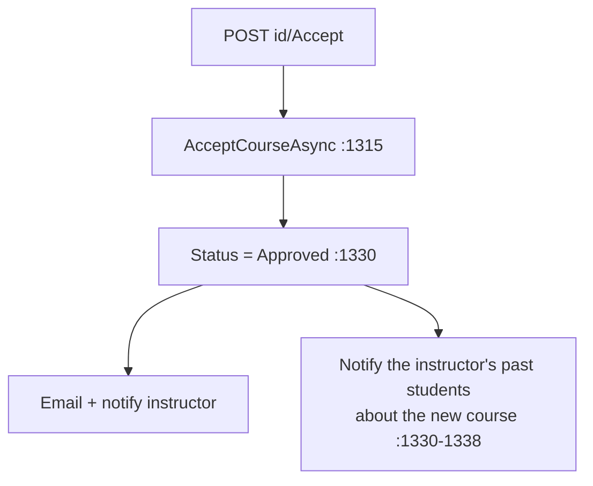

# CourseController Module Documentation (API — Admin)

---

## Overview

### Purpose
Admin course management: full catalog reads, EduLab-owned course authoring, approval workflow (accept/reject/publish), bulk actions.

### Business Objective
Moderate the catalog: approve instructor submissions, maintain platform-owned (EduLab) courses, protect instructor content.

### Main Functionality
- Course reads (anonymous + admin gates)
- EduLab-owned create/update/delete + curriculum
- Accept / reject / publish (direct approve)
- Bulk delete / bulk action (delete/publish/unpublish)

### Primary User Roles

| Role | Description |
|------|-------------|
| Anonymous | Read catalog |
| AdminArea (any claim) | All management |

---

## Module Architecture

```
Presentation           API controllers (JSON)
Application            ICourseService + IFileStorageService
Storage                Courses/Sections/Lectures/Resources + uploads
```

### Controllers

| Controller | Responsibility |
|-----------|----------------|
| `CourseController` | 23 actions (`api/Course`, 1541 lines) — **no class-level `[Authorize]`** |

### Services

| Service | Responsibility |
|---------|----------------|
| `CourseService` | Full CRUD, publish validation, approval side-effects (emails/notifications) |
| `FileStorageService` | Image/video/resource uploads + deletes |

---

## Endpoints

**Route**: `api/Course`  
**Authorization**: mixed — critical gaps (see Security)

| # | Action | HTTP | Route | Auth | Notes |
|---|--------|------|-------|------|-------|
| 1 | GetAllCourses | GET | `api/Course` | 🔓 anonymous (:134) | All courses |
| 2 | GetCourseById | GET | `api/Course/{id:int}` | 🔓 anonymous + role gate (:179) | Gate only for Admin role |
| 3 | GetCoursesByInstructor | GET | `api/Course/instructor/{instructorId}` | 🔓 anonymous (:229) | |
| 4 | GetCoursesWithCategory | GET | `api/Course/category/{categoryId:int}` | 🔓 anonymous (:270) | |
| 5 | GetLectureResources | GET | `api/Course/lecture/{lectureId}/resources` | 🔓 anonymous + role gate (:304) | |
| 6 | AddCourse | POST | `api/Course` | 🛡️ AdminArea (:363) | Multipart, 4GB limits |
| 7 | AddResourceToLecture | POST | `api/Course/lecture/{lectureId}/resources` | 🔓 **anonymous write!** (:504) | ⚠️ critical |
| 8 | UpdateCourse | PUT | `api/Course/{id:int}` | 🛡️ AdminArea (:551) | Multipart |
| 9 | DeleteCourse | DELETE | `api/Course/{id:int}` | 🛡️ AdminArea (:792) | Enrollment-guarded |
| 10 | DeleteResource | DELETE | `api/Course/resources/{resourceId}` | 🔓 **anonymous delete!** (:869) | ⚠️ critical |
| 11 | BulkDelete | POST | `api/Course/BulkDelete` | 🛡️ AdminArea (:908) | EduLab-filtered |
| 12 | BulkAction | POST | `api/Course/BulkAction` | 🛡️ AdminArea (:1012) | ⚠️ no EduLab filter |
| 13 | AcceptCourse | POST | `api/Course/{id:int}/Accept` | 🛡️ AdminArea (:1089) | ⚠️ no ownership check |
| 14 | RejectCourse | POST | `api/Course/{id:int}/Reject` | 🛡️ AdminArea (:1141) | ⚠️ no ownership check |
| 15 | CreateCourseDraft | POST | `api/Course/create-draft` | 🛡️ AdminArea (:1190) | As EduLab instructor |
| 16 | AddSection | POST | `api/Course/{courseId:int}/sections` | 🛡️ AdminArea (:1229) | ⚠️ no EduLab check |
| 17 | GetSection | GET | `api/Course/sections/{sectionId:int}` | 🛡️ AdminArea (:1259) | |
| 18 | UpdateSection | PUT | `api/Course/sections/{sectionId:int}` | 🛡️ AdminArea (:1282) | |
| 19 | DeleteSection | DELETE | `api/Course/sections/{sectionId:int}` | 🛡️ AdminArea (:1319) | |
| 20 | AddLecture | POST | `api/Course/sections/{sectionId:int}/lectures` | 🛡️ AdminArea (:1361) | |
| 21 | GetLecture | GET | `api/Course/lectures/{lectureId:int}` | 🛡️ AdminArea (:1401) | |
| 22 | UpdateLecture | PUT | `api/Course/lectures/{lectureId:int}` | 🛡️ AdminArea (:1430) | |
| 23 | DeleteLecture | DELETE | `api/Course/lectures/{lectureId:int}` | 🛡️ AdminArea (:1468) | |
| 24 | PublishCourse | POST | `api/Course/{courseId:int}/publish` | 🛡️ AdminArea (:1508) | Direct approve |

---

## Internal Workflows & Runtime Behavior

### Workflow 1: EduLab Ownership Gate



- Cached forever in a `static` field; errors swallowed → fallback `SD.EduLabInstructorId` (:90-93).

### Workflow 2: Accept (side effects)



### Workflow 3: Publish (direct approve)

#### Behavior
- `AdminPublishCourseAsync` (:1152) validates via `ValidateCourseForPublishAsync` (:1170) then sets **`Approved` directly — skips the Pending queue** (:1176).
- `BulkUnpublishCoursesAsync` sets status **`Rejected`** (:1297) — "unpublish" mislabels the course as rejected.

### Workflow 4: Publish Validation Rules (CourseService.cs:1004-1107)

Title/shortDescription/category/thumbnail required; **≥ 3 sections**; **exactly 1 free-preview section with 5–10 video lectures**; ≥ 2 lectures/section; videos ≥ 60s; ≥ 3 requirements; ≥ 3 learnings; targetAudience; price ≥ 0.

---

## Business Rules

| Rule | Verified in | Why it exists |
|------|-------------|---------------|
| EduLab-owned course editing | CourseController.cs:98-120 | Platform content guard |
| Delete blocked when enrolled | CourseService.cs:544-550, 1208-1213 | Protect paid students |
| Update notifies enrolled students | :457 | Transparency |
| Admin publish = direct approve | :1176 | Admin authority |

---

## Security Analysis (critical findings)

| Control | Status |
|---------|--------|
| **Anonymous write #1** | ❌ `POST api/Course/lecture/{id}/resources` has NO `[Authorize]`; the manual `User.IsInRole(SD.Admin)` guard (:510) is skipped for anonymous + non-admin callers — **anyone can upload resource files into any lecture** |
| **Anonymous write #2** | ❌ `DELETE api/Course/resources/{resourceId}` same pattern — **anyone can delete any resource** (:869-875) |
| **Anonymous reads** | ❌ 5 GET endpoints anonymous; the EduLab/draft gate applies only when `User.IsInRole(SD.Admin)` (:197, :312) — bypassable |
| **AddSection without EduLab check** | ❌ unlike every sibling endpoint (:1231) — any claim-holder adds sections to ANY course |
| **Accept/Reject/Publish without ownership checks** | ❌ any claim-holder approves/rejects/publishes any course (:1096, :1148, :1510) |
| **BulkAction lacks the EduLab filter** | ❌ BulkDelete filters (:929-941), BulkAction doesn't (:1019) — `"delete"` branch deletes any course |
| **File validation** | ❌ no type/size validation on uploads (only the 4GB cap) |
| **InstructorId trusted from client** | `AddCourse` accepts body `InstructorId` (:373) |
| **Info disclosure** | generic catches leak `ex.Message`/`ex.InnerException.Message` (:496-501, :739, :866, …) |
| **Status codes** | ❌ enrolled-students `InvalidOperationException` → 500 instead of 400/409 (:863-867) |

---

## Hidden Behaviors & Technical Notes

1. **The two anonymous write endpoints are the most severe security findings in the entire API.**
2. **`DeleteCourse` deletes the DB row first, then files** — a file-delete failure 500s after the course is gone (:817-853).
3. **`DeleteOldFilesAsync` uses fire-and-forget `Task.Run`** with swallowed errors (:750-772) — orphaned files likely.
4. **`IMapper` injected but never used** (:31).
5. **`GetCourseById` admin gate is role-based** (`SD.Admin`) while the rest of the admin surface is claim-based — inconsistent.
6. **Route conflicts resolved by literal precedence** — `create-draft` vs `{id:int}/Accept` etc. are safe today but fragile.
7. 499 responses for client cancellations (:161, :211).

---

## Configuration

| Key | Purpose |
|-----|---------|
| `EduLab:InstructorEmail` | resolves the EduLab instructor id (fallback `SD.EduLabInstructorId`) |
| `wwwroot/Images/Courses`, `Videos/Courses`, `Resources/Lectures` | uploads |

---

## Change Log

**Current functionality (verified):** EduLab-gated authoring + approval workflow with publish validation — undermined by anonymous write endpoints, missing ownership checks on review actions, and file-validation gaps.

**Maintenance notes:**
- `[Authorize]` the two resource endpoints (and align the manual role gates).
- Add EduLab checks to AddSection/Accept/Reject/Publish/BulkAction.
- Validate upload types/sizes; fix the 500-on-enrolled status codes.