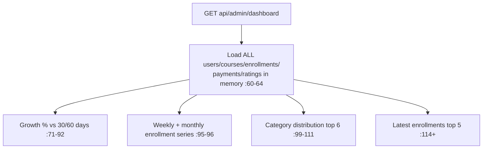

# DashboardController Module Documentation (API — Admin)

---

## Overview

### Purpose
Platform-wide admin KPIs: users, courses, enrollments, payments, ratings, growth, series.

### Business Objective
One screen for platform health and growth trends.

### Main Functionality
- Aggregated dashboard with 30/60-day growth, weekly/monthly enrollment series, category distribution, latest enrollments

### Primary User Roles

| Role | Description |
|------|-------------|
| AdminArea (any claim) | Read |

---

## Module Architecture

```
Presentation           API controllers (JSON)
Application            IDashboardService
Storage                full-table in-memory aggregation
```

### Controllers

| Controller | Responsibility |
|-----------|----------------|
| `DashboardController` | 1 action (`api/admin/dashboard`) |

---

## Endpoints

**Route**: `api/admin/dashboard`  
**Authorization**: `[Authorize(Policy="AdminArea")]` class (:15-17)

| # | Action | HTTP | Route | Description |
|---|--------|------|-------|-------------|
| 1 | GetAdminDashboard | GET | `api/admin/dashboard` | Platform KPIs (:32-60) |

---

## Internal Workflows & Runtime Behavior

### Workflow 1: Aggregation



#### Runtime Behavior
- **No claim check** (`ViewDashboard` exists in AdminClaims but is never enforced) — any admin claim suffices.
- 499 on cancellation (:46-50); **500 leaks `ex.Message`** (:51-59).

---

## Business Rules

| Rule | Verified in | Why it exists |
|------|-------------|---------------|
| AdminArea-only | class policy | Platform data |

---

## Security Analysis

| Control | Status |
|---------|--------|
| Authentication | ✅ AdminArea (any claim — coarse) |
| **Info disclosure** | ❌ `ex.Message` leaked in 500s (:51-59) |
| Performance | full-table scans per request (no caching) |

---

## Hidden Behaviors & Technical Notes

1. **Coarse auth**: any single admin claim (e.g. `ViewCategories`) can read the full platform dashboard.
2. **Expensive aggregation** with no caching.

---

## Configuration

| Key | Purpose |
|-----|---------|
| (none module-specific) | — |

---

## Change Log

**Current functionality (verified):** single admin-dashboard endpoint with growth/series aggregates — coarse any-claim auth and exception-message leakage.

**Maintenance notes:** enforce `ViewDashboard`; stop leaking exception text; add caching.