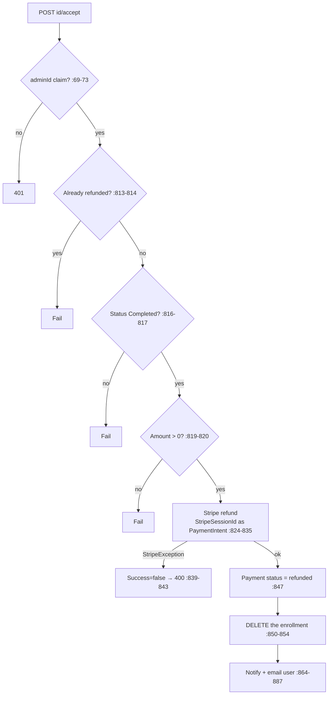

# RefundController Module Documentation (API — Admin)

---

## Overview

### Purpose
Refund administration: list requests, accept (execute Stripe refund), reject.

### Business Objective
Enforce the refund policy with human approval and real money movement via Stripe.

### Main Functionality
- All refund requests (with user PII)
- Accept → Stripe refund + enrollment deletion
- Reject with reason

### Primary User Roles

| Role | Description |
|------|-------------|
| AdminArea (any claim) | List + decide |

---

## Module Architecture

```
Presentation           API controllers (JSON)
Application            IPaymentService
External               Stripe (refunds)
```

### Controllers

| Controller | Responsibility |
|-----------|----------------|
| `RefundController` | 3 actions (`api/admin/refunds`) — class `[Authorize(Policy="AdminArea")]` |

---

## Endpoints

**Route**: `api/admin/refunds`  
**Authorization**: `[Authorize(Policy="AdminArea")]` class (:13-15)

| # | Action | HTTP | Route | Description |
|---|--------|------|-------|-------------|
| 1 | GetAll | GET | `api/admin/refunds` | Requests + user email (:37-53) |
| 2 | Accept | POST | `api/admin/refunds/{id}/accept` | Stripe refund + delete enrollment (:61-88) |
| 3 | Reject | POST | `api/admin/refunds/{id}/reject` | Reject with reason (:97-124) |

---

## Internal Workflows & Runtime Behavior

### Workflow 1: Accept (AdminProcessRefundAsync, PaymentService.cs:756-904)



#### Runtime Behavior
- `StripeSessionId` actually stores the PaymentIntent ID (`paymentIntent.Id`, PaymentService.cs:476) — verified correct.
- **No re-check of the 7-day window or <25% progress** — admin override is intentional (those gates ran at user submission, RefundAsync :659-670).
- **Errors use a generic message** — no exception detail leaked here (unlike most controllers).
- `RejectRefundBody.Reason` optional (`body?.Reason`, :111).

---

## Business Rules

| Rule | Verified in | Why it exists |
|------|-------------|---------------|
| User eligibility: ≤7d, <25% progress, completed, not refunded, no pending | PaymentService.cs:640-670 | Refund policy |
| Admin approve guards: pending, completed, not refunded, amount>0 | :762-820 | State machine |
| Stripe failure → request stays pending | :839-843 | No money lost silently |
| Approve deletes the enrollment | :850-854 | Access revocation |

---

## Security Analysis

| Control | Status |
|---------|--------|
| Authentication | ✅ AdminArea |
| **Claim granularity** | ❌ any admin claim can move money (no `ManageRefunds`/`ViewRefunds` checks — claims exist at ClaimStore.cs:79-83) |
| **PII** | request list includes user emails — coarse auth |
| Error handling | ✅ generic messages (good) |
| adminId identity | from token claim (:69-73) |

---

## Hidden Behaviors & Technical Notes

1. **Money movement with any-claim auth** — the most consequential coarse-auth gap.
2. **Stripe refund uses `StripeSessionId`** (stores the `pi_` id) — correct today, fragile naming.
3. `"refunded"` status set via hardcoded string (:847), not the `SD.PaymentStatusRefunded` constant.

---

## Configuration

| Key | Purpose |
|-----|---------|
| `Stripe:SecretKey` | Stripe refunds |

---

## Change Log

**Current functionality (verified):** policy-gated refund requests with real Stripe execution and enrollment deletion — coarse any-claim auth over money operations.

**Maintenance notes:** enforce `ManageRefunds`/`ViewRefunds` claims; use the status constant.