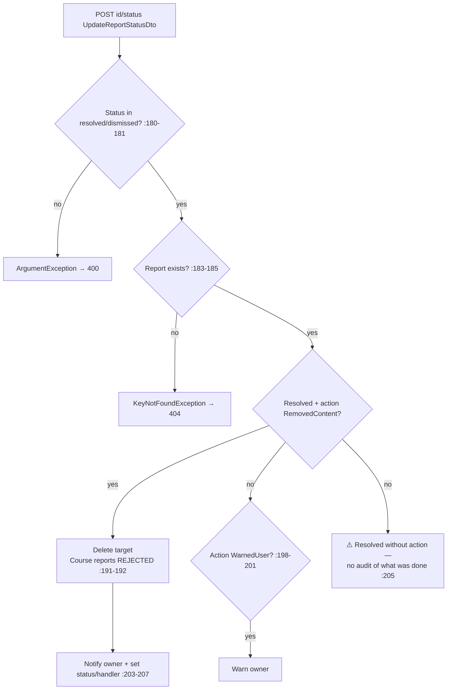

# ReportsController Module Documentation (API — Admin)

---

## Overview

### Purpose
Moderation queue: paginated reports, pending count, status updates (resolve/dismiss + action), content deletion.

### Business Objective
Let admins triage abuse reports and remove violating content.

### Main Functionality
- Paginated report list with filters
- Pending count
- Update status (resolved/dismissed) + action (warn/remove)
- Delete reported content

### Primary User Roles

| Role | Description |
|------|-------------|
| AdminArea + claim `ViewReports` | Read |
| AdminArea + claim `HandleReports` | Act |

---

## Module Architecture

```
Presentation           API controllers (JSON)
Application            IReportService
Storage                Reports + target content (comments/ratings)
```

### Controllers

| Controller | Responsibility |
|-----------|----------------|
| `ReportsController` | 4 actions (`api/admin/reports`) — class `[Authorize(Policy="AdminArea")]` |

---

## Endpoints

**Route**: `api/admin/reports`  
**Authorization**: AdminArea class + **manual claim checks** (the only properly claim-gated admin controller)

| # | Action | HTTP | Route | Claim | Description |
|---|--------|------|-------|-------|-------------|
| 1 | GetAll | GET | `api/admin/reports?status&type&search&page=1&pageSize=10` | ViewReports (:35) | Paginated |
| 2 | GetPendingCount | GET | `api/admin/reports/pending-count` | ViewReports (:53) | Count |
| 3 | UpdateStatus | POST | `api/admin/reports/{id}/status` | HandleReports (:71) | Resolve/dismiss + action |
| 4 | DeleteContent | POST | `api/admin/reports/{id}/delete-content` | HandleReports (:101) | Delete target |

---

## Internal Workflows & Runtime Behavior

### Workflow 1: Update Status



### Workflow 2: Delete Content

#### Behavior
- Course reports rejected (:218-219); deletes comment (+ replies, :243-250) or rating (:253-257); marks Resolved with `"تم حذف المحتوى المخالف"` (:224-225).

---

## Business Rules

| Rule | Verified in | Why it exists |
|------|-------------|---------------|
| Only resolved/dismissed statuses | ReportService.cs:180-181 | State machine |
| Course deletion NOT allowed via reports | :191-192, :218-219 | Courses go through review, not moderation |
| Cannot report own content / duplicates | :101-108 (learner side) | Anti-griefing |
| Page ≥ 1, pageSize 1–100 | :131-132 | Bounds |

---

## Security Analysis

| Control | Status |
|---------|--------|
| **Claim gating** | ✅ the ONLY admin controller with correct ViewReports/HandleReports checks |
| Auth | ✅ AdminArea + claims |
| Action vocabulary | ⚠️ `UpdateStatusDto.Action` accepts arbitrary strings — unknown actions silently do nothing (:189-201) |
| Error mapping | 404/400 mapped correctly (:83-90, :117-120) |
| Duplicated paths | `DeleteContent` duplicates UpdateStatus's `RemovedContent` branch — two shapes for one action |

---

## Hidden Behaviors & Technical Notes

1. **"Resolve without action" leaves no audit** — `ResolvedActions` null (:205).
2. **Owner warnings swallow failures** (log-only, :322-326, :353-357).
3. `ExportReports` claim exists (ClaimStore.cs:75) but is never enforced anywhere.

---

## Configuration

| Key | Purpose |
|-----|---------|
| (none module-specific) | — |

---

## Change Log

**Current functionality (verified):** the reference implementation for admin claim-gating — moderation queue with content deletion that deliberately excludes courses.

**Maintenance notes:** validate the action vocabulary; require an action on resolve; merge the duplicate delete paths.