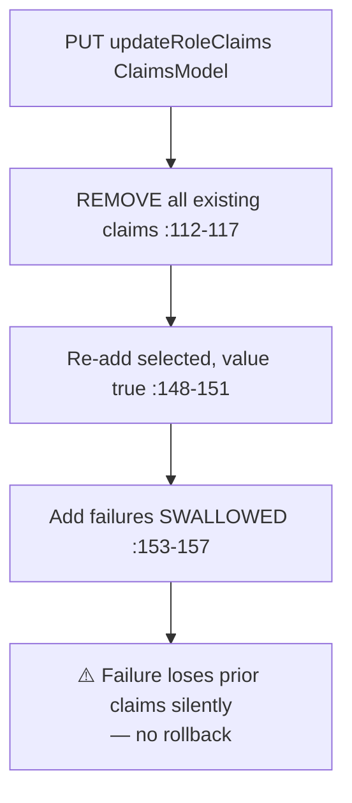

# RoleController Module Documentation (API — Admin)

---

## Overview

### Purpose
RBAC administration: role CRUD, statistics, claims management, users-in-role.

### Business Objective
Define roles and permission claims; the claims drive the AdminArea policy.

### Main Functionality
- Role CRUD (protected-role guards, users-assigned guard)
- Claims read + replace
- Role statistics + users-in-role

### Primary User Roles

| Role | Description |
|------|-------------|
| AdminArea (any claim) | Everything (⚠️ self-escalation) |

---

## Module Architecture

```
Presentation           API controllers (JSON)
Application            IRoleService + IRoleClaimsService
Storage                Identity Roles + RoleClaims
```

### Controllers

| Controller | Responsibility |
|-----------|----------------|
| `RoleController` | 10 actions (`api/Role`) — class `[Authorize(Policy="AdminArea")]` |

---

## Endpoints

**Route**: `api/Role`  
**Authorization**: `[Authorize(Policy="AdminArea")]` class (:24)

| # | Action | HTTP | Route | Description |
|---|--------|------|-------|-------------|
| 1 | GetAllRoles | GET | `api/Role` | All roles |
| 2 | GetRoleById | GET | `api/Role/{id}` | One role |
| 3 | CreateRole | POST | `api/Role` | `[FromBody] string roleName` |
| 4 | UpdateRole | PUT | `api/Role/{id}` | Rename |
| 5 | DeleteRole | DELETE | `api/Role/{id}` | Protected + users guards |
| 6 | BulkDeleteRoles | POST | `api/Role/bulk-delete` | Body List<string> |
| 7 | GetRolesStatistics | GET | `api/Role/statistics` | Stats |
| 8 | GetRoleClaims | GET | `api/Role/getRoleClaims/{roleId}` | Claims model |
| 9 | UpdateRoleClaims | PUT | `api/Role/updateRoleClaims/{roleId}` | Replace claims |
| 10 | GetUsersInRole | GET | `api/Role/{roleName}/users` | Users |

---

## Internal Workflows & Runtime Behavior

### Workflow 1: Update Claims (replace-all)



#### Runtime Behavior
- **`UpdateRoleClaims` can strip every claim from any role — including Admin** — with no guard.
- `PaymentClaimList` (ClaimsModel.cs:19) is **never read** by the updater — submitted payment claims are silently ignored (RoleClaimsService.cs:120-136).

### Workflow 2: Delete Guards

#### Behavior
- Protected check by name vs `SD.ProtectedRoles` (:272; SD.cs:19-22) — **Moderator NOT protected** (and `SD.Moderator` has a trailing space, SD.cs:16).
- Users-assigned → `InvalidOperationException` → generic catch → **500 instead of 400** (:298-302, :354-358).

---

## Business Rules

| Rule | Verified in | Why it exists |
|------|-------------|---------------|
| Duplicate role names blocked | RoleService.cs:143, 195-200 | Uniqueness |
| Role with users undeletable | :250-258, :318-325 | FK integrity |
| Protected roles: Admin/Instructor/InstructorPending/Student/Support | SD.cs:19-22 | System roles |
| Claims stored as (type, "true") | RoleClaimsService.cs:148-151 | Policy assertions |

---

## Security Analysis (critical)

| Control | Status |
|---------|--------|
| **Self-escalation (critical)** | ❌ any admin-claim holder can edit their own role's claims → grant every permission (policy is any-claim, Program.cs:42-47); Admin's claims have no protection |
| **Moderator deletable** | ❌ not in ProtectedRoles; the trailing-space constant breaks `[Authorize(Roles="Admin,Moderator ")]` matches for real `Moderator` users |
| Claim granularity | ❌ no ViewRoles/CreateRole/EditRole/DeleteRole/ManageRoleClaims checks (ClaimStore.cs:50-57) |
| **Silent claim loss** | replace-then-add without rollback — a failed add loses existing claims |
| **Dead service method** | `RoleService.UpdateRoleClaimsAsync(List<ClaimDto>)` (:413) unused — controller uses `RoleClaimsService` |
| Status codes | 500 on users-assigned instead of 400/409 |

---

## Hidden Behaviors & Technical Notes

1. **`[FromBody] string roleName`** requires a raw JSON string body (`"Admin"`) — easy to misuse, no annotations.
2. **Role named `"Moderator "`** (with space) would actually pass the `[Authorize(Roles="Admin,Moderator ")]` check (0.5 bug) — a created role could grant privileged access.
3. Route conflicts resolved by literal precedence (`statistics`, `getRoleClaims`, `updateRoleClaims` win over `{id}`).

---

## Configuration

| Key | Purpose |
|-----|---------|
| (none module-specific) | — |

---

## Change Log

**Current functionality (verified):** full RBAC administration — with the most critical privilege-escalation vector in the platform (claim editing under any-claim policy) and silent claim-loss on failed adds.

**Maintenance notes:**
- Protect the Admin role's claims from self-editing; enforce granular claims.
- Add Moderator to ProtectedRoles + fix the trailing space.
- Transactional claim replacement with rollback.