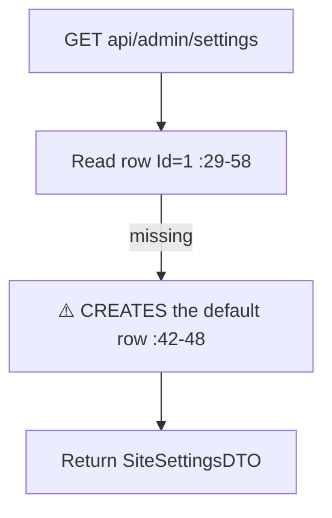

# SiteSettingsController Module Documentation (API — Admin)

---

## Overview

### Purpose
Platform settings: read (public) + update (AdminArea).

### Business Objective
Expose branding/maintenance configuration to the frontend and let admins change it.

### Main Functionality
- Get settings (⚠️ public)
- Update settings

### Primary User Roles

| Role | Description |
|------|-------------|
| Anonymous | Read |
| AdminArea (any claim) | Write |

---

## Module Architecture

```
Presentation           API controllers (JSON)
Application            ISiteSettingsService
Storage                SiteSettings single row (Id=1)
```

### Controllers

| Controller | Responsibility |
|-----------|----------------|
| `SiteSettingsController` | 2 actions (`api/admin/settings`) |

---

## Endpoints

**Route**: `api/admin/settings`  
**Authorization**: mixed

| # | Action | HTTP | Route | Auth | Description |
|---|--------|------|-------|------|-------------|
| 1 | GetSettings | GET | `api/admin/settings` | 🔓 `[AllowAnonymous]` (:32) | Public settings |
| 2 | UpdateSettings | PUT | `api/admin/settings` | 🛡️ AdminArea (:50) | Update |

---

## Internal Workflows & Runtime Behavior

### Workflow 1: Get (side-effecting GET)



#### Runtime Behavior
- **Public GET** exposes `MaintenanceMode`, `PrimaryColor`, `LogoUrl`, etc. (SiteSettingsDTO.cs:5-20) — under the otherwise-protected `api/admin/...` prefix.
- **The 500 branch on `!result` (:62-63) is unreachable** — the service returns true or throws (SiteSettingsService.cs:88-95).
- Errors leak `ex.Message` (:45, :71).
- `UpdatedBy` may be null for claim-based principals (`GetUserIdAsync` can return null).

---

## Business Rules

| Rule | Verified in | Why it exists |
|------|-------------|---------------|
| Single row Id=1 | SiteSettingsService.cs:42-48, 73-77 | Singleton config |
| UpdatedAt/UpdatedBy tracked | :80-81 | Audit |

---

## Security Analysis

| Control | Status |
|---------|--------|
| **Public config read** | ⚠️ site config (maintenance flag, branding URLs) exposed anonymously — phishing/branding surface |
| **Any-claim write** | ❌ any admin claim can flip `MaintenanceMode` or replace logo URLs (no ViewSiteSettings/EditSiteSettings checks) |
| Validation | ❌ DTO has no annotations — arbitrary `DefaultLanguage`/`Timezone` strings |
| Dead branch | the `!result` 500 path is unreachable |

---

## Hidden Behaviors & Technical Notes

1. **A GET with a side effect** (row creation).
2. **Maintenance-mode flip via any claim-holder** — a low-privilege claim can take the site down (middleware respects the flag).

---

## Configuration

| Key | Purpose |
|-----|---------|
| (none module-specific) | — |

---

## Change Log

**Current functionality (verified):** public settings read + coarse-auth write with a maintenance-mode switch reachable by any claim-holder.

**Maintenance notes:** claim-gate UpdateSettings (EditSiteSettings); validate DTO; consider a separate public endpoint outside `/api/admin`.