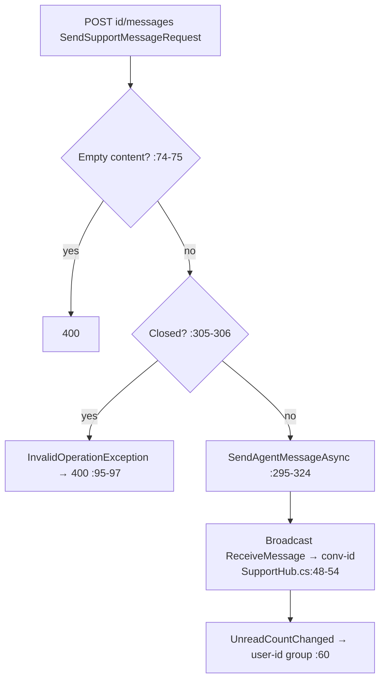

# SupportController Module Documentation (API — Admin)

---

## Overview

### Purpose
Agent inbox: conversations, thread view (marks read), replies, status, unread, mark-all-read — with SignalR delivery.

### Business Objective
Agents handle support tickets in real time; users get instant replies.

### Main Functionality
- Conversations list + detail
- Agent reply (realtime broadcast)
- Open/close status
- Unread count + mark-all-read

### Primary User Roles

| Role | Description |
|------|-------------|
| AdminArea + claim `ViewSupport` | Read |
| AdminArea + claim `HandleSupport` | Act |

---

## Module Architecture

```
Presentation           API controllers (JSON) + SignalR
Application            ISupportService + IHubContext<SupportHub>
```

### Controllers

| Controller | Responsibility |
|-----------|----------------|
| `SupportController` | 6 actions (`api/admin/support`) — class AdminArea + claim checks |

---

## Endpoints

**Route**: `api/admin/support`  
**Authorization**: AdminArea class (:22) + manual claims (correct pattern)

| # | Action | HTTP | Route | Claim | Description |
|---|--------|------|-------|-------|-------------|
| 1 | GetConversations | GET | `api/admin/support/conversations` | ViewSupport (:42) | All |
| 2 | GetConversation | GET | `api/admin/support/conversations/{conversationId}` | ViewSupport (:52) | Detail + mark read + push unread to user (:60) |
| 3 | SendMessage | POST | `api/admin/support/conversations/{conversationId}/messages` | HandleSupport (:68) | Reply + broadcast (:82-87) |
| 4 | SetStatus | POST | `api/admin/support/conversations/{conversationId}/status` | HandleSupport (:104) | Open/close + notify (:110-115) |
| 5 | GetUnreadCount | GET | `api/admin/support/unread-count` | ViewSupport (:123) | Count |
| 6 | MarkAllRead | POST | `api/admin/support/mark-all-read` | HandleSupport (:133) | Mark read |

---

## Internal Workflows & Runtime Behavior

### Workflow 1: Agent Reply (realtime)



### Workflow 2: Eavesdropping (critical)

```mermaid
flowchart TD
    A[User calls hub JoinConversation(id) :34-35] --> B[⚠️ NO ownership check in hub]
    B --> C[Subscribes to conv-id group]
    C --> D[Receives agent replies in real time<br/>— any authenticated user eavesdrops]
```

---

## Business Rules

| Rule | Verified in | Why it exists |
|------|-------------|---------------|
| Closed conversations reject messages | SupportService.cs:305-306 | Ticket lifecycle |
| Reading marks inbound read | :264-274 | Unread semantics |
| Agents = Admin/Support roles (hub) | SupportHub.cs:24-26 | Group membership |

---

## Security Analysis

| Control | Status |
|---------|--------|
| **Realtime IDOR (critical)** | ❌ `SupportHub.JoinConversation` has no ownership check (SupportHub.cs:34-35) — any authenticated user can subscribe to any conversation's messages |
| Claim gating | ✅ REST ViewSupport/HandleSupport — correct pattern |
| Hub/HTTP inconsistency | ❌ hub groups by role only — claim-holders without Admin/Support roles get no realtime agent pushes |
| Edge case | `SetStatus` with missing body → `request?.Open == true` false → **closes the conversation** (:107) |

---

## Hidden Behaviors & Technical Notes

1. **The hub IDOR mirrors the learner-side SupportController finding** — the same unguarded `JoinConversation`.
2. **`MarkAllRead` hardcodes `UnreadCountChanged → 0`** (:138) — correct only because everything is marked.
3. `GetConversations`/`GetUnreadCount` have no try/catch — framework 500s.

---

## Configuration

| Key | Purpose |
|-----|---------|
| SignalR `/hubs/support` | realtime transport |

---

## Change Log

**Current functionality (verified):** correctly claim-gated agent inbox with realtime delivery — undermined by the hub's unguarded conversation subscription.

**Maintenance notes:** authorize `JoinConversation` against conversation ownership (mirror the REST check).