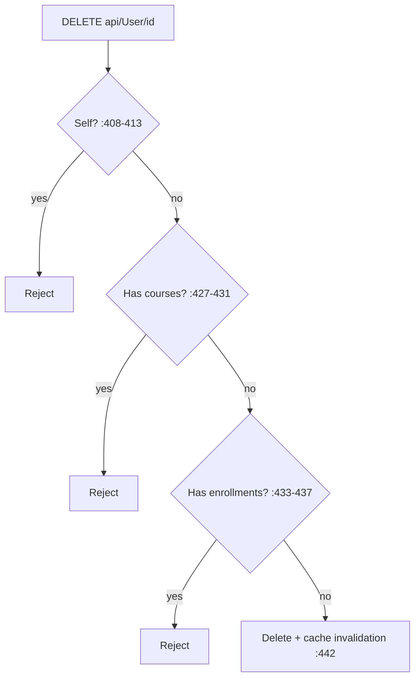

# UserController Module Documentation (API — Admin)

---

## Overview

### Purpose
User administration + self-service: user lists, profile reads, delete/lock/unlock/update, preferred language.

### Business Objective
Admin identity lifecycle (delete/lock/role changes) alongside authenticated profile access.

### Main Functionality
- All users / instructors / admins lists
- Any-user profile read (⚠️ `[Authorize]` only)
- Delete single/bulk, lock/unlock, update
- Own preferred language

### Primary User Roles

| Role | Description |
|------|-------------|
| Any authenticated | `GetById`, `me`, preferred-language |
| Admin/Moderator roles | user lists |
| AdminArea | destructive ops |

---

## Module Architecture

```
Presentation           API controllers (JSON)
Application            IUserService
Storage                Identity users + roles; 5-min memory caches
```

### Controllers

| Controller | Responsibility |
|-----------|----------------|
| `UserController` | 11 actions (`api/User`) — class `[Authorize]` (:19) |

---

## Endpoints

**Route**: `api/User`  
**Authorization**: class `[Authorize]` + per-action

| # | Action | HTTP | Route | Auth | Description |
|---|--------|------|-------|------|-------------|
| 1 | GetAllUsers | GET | `api/User` | 🎭 `[Authorize(Roles="Admin,Moderator ")]` (:55) | All users w/ roles |
| 2 | GetById | GET | `api/User/{id}` | 🔐 any authenticated (:88) | ⚠️ ANY user's full profile |
| 3 | GetCurrentUser | GET | `api/User/me` | 🔐 (:133) | Own profile |
| 4 | GetInstructors | GET | `api/User/Instructors` | 🎭 same roles (:178) | Instructors |
| 5 | GetAdmins | GET | `api/User/Admins` | 🛡️ AdminArea (:212) | Admins |
| 6 | DeleteUser | DELETE | `api/User/{id}` | 🛡️ AdminArea (:251) | Delete (self/courses/enrollments guards) |
| 7 | DeleteRangeUsers | POST | `api/User/DeleteUsers` | 🛡️ AdminArea (:299) | Bulk delete |
| 8 | UpdateUser | PUT | `api/User` | 🛡️ AdminArea (:354) | Name + role replace |
| 9 | LockUsers | POST | `api/User/LockUsers` | 🛡️ AdminArea (:411) | Lock N minutes |
| 10 | UnlockUsers | POST | `api/User/UnlockUsers` | 🛡️ AdminArea (:468) | Unlock |
| 11 | UpdatePreferredLanguage | PUT | `api/User/preferred-language` | 🔐 (:525) | Own language |

---

## Internal Workflows & Runtime Behavior

### Workflow 1: Delete Guards



### Workflow 2: Update (role replace)

#### Behavior
- Validates role exists (:558-562); updates name; **removes ALL current roles, adds the single requested role** (:573-581); **deletes instructor applications when downgraded from Instructor/InstructorPending** (:583-598).

### Workflow 3: Lock

#### Behavior
- **Skips the current user** (:812); `SetLockoutEndDateAsync(now + minutes)` (:817-819); emails (:822-831).

---

## Business Rules

| Rule | Verified in | Why it exists |
|------|-------------|---------------|
| Cannot delete self / users with courses / enrollments | UserService.cs:408-437 | Integrity |
| Role replace is destructive | :573-581 | Single-role model |
| Downgrade deletes instructor applications | :583-598 | Consistency |
| Lock skips self | :812 | Prevent self-lockout |
| Language validated against supported cultures | :998-1002 | Locale integrity |

---

## Security Analysis

| Control | Status |
|---------|--------|
| **Cross-user profile read** | ❌ `GetById` = any authenticated user views ANY user's full profile (email, phone, about, roles) — no ownership check (:87-126) |
| **Trailing-space role bug** | ❌ `[Authorize(Roles="Admin,Moderator ")]` (:55, :178) — a real `Moderator` role never matches (SD.cs:16); only a literal `"Moderator "` role would |
| Claim granularity | ❌ destructive ops = any admin claim |
| Caching | 5-min caches (`AllUsersWithRoles`, `UserById:{id}`) — stale data windows; exceptions → empty list / null (:397, :643) |

---

## Hidden Behaviors & Technical Notes

1. **`GetById` is the API's cross-user PII hole for authenticated users** — placed in the Admin namespace but only `[Authorize]`.
2. **Role-replace is destructive** — updating a user's name without a role field would strip their roles (DTO must always carry a role).
3. **Bulk delete collects failures** per user (missing/self/courses/enrollments) and returns partial success (:474-527).
4. Class-level `[Authorize]` (no policy) means `GetAdmins`/destructive actions rely on their own attributes — the convention adds nothing.

---

## Configuration

| Key | Purpose |
|-----|---------|
| (none module-specific) | — |

---

## Change Log

**Current functionality (verified):** guarded delete/lock flows with cache invalidation — plus the cross-user profile read hole and the Moderator trailing-space authorization bug.

**Maintenance notes:** scope `GetById` to self (or AdminArea); fix `SD.Moderator`; make role-replace explicit.