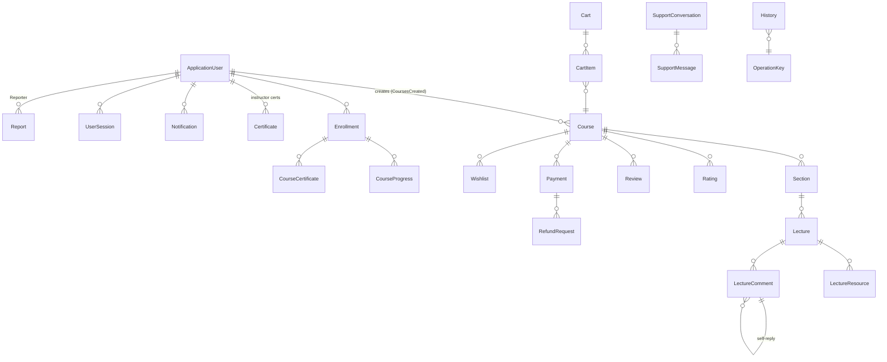

# Domain Entities Reference (EduLab_Domain)

---

## Overview

### Purpose
Complete reference of the persistence model: every entity, enum, and support class in `EduLab_Domain/Entities/`, with fields, defaults, relationships, and source citations.

### Scope
- 29 DB-mapped entities
- 6 enums (embedded + standalone)
- 4 support classes (claims catalog, notification summary)

---

## Folder Structure

```
EduLab_Domain/Entities/
+-- 33 files (entities, enums, claim/support classes)
```

---

## 1. Identity

### ApplicationUser — `ApplicationUser.cs` (:12-111)

| Field | Type | Notes |
|-------|------|-------|
| FullName | string | required |
| Title / Location / About / PostalCode | string? | optional profile |
| ProfileImageUrl | string? | avatar |
| GitHubUrl / LinkedInUrl / TwitterUrl / FacebookUrl | string? | socials |
| Subjects | List<string> | initialized empty (:67) |
| Role | string | **`[NotMapped]`** (:72-73) — set in code, never persisted |
| IsLocked | bool | **computed** `LockoutEnd > UtcNow` (:78-79) |
| IsBanned | bool | default false (:84) |
| PreferredLanguage | string? | detected from Accept-Language at registration (:90) |
| CreatedAt | DateTime | |
| CoursesCreated / Enrollments / Certificates | ICollection | navigation (:100-110) |

Extends `IdentityUser` (Id, Email, PhoneNumber, PasswordHash, LockoutEnd, etc.).

### RefreshToken — `RefreshToken.cs` (:13-25)

| Field | Type | Notes |
|-------|------|-------|
| Id | int | Primary key |
| UserId | string | Foreign key → `ApplicationUser` (:22-23) |
| Token | string | Random 32-byte Base64 token |
| Expiry | DateTime | Expiration timestamp |
| CreatedAt | DateTime | Creation timestamp |
| IsRevoked | bool | Revocation flag (rotated / revoked) |
| User | ApplicationUser | Navigation property |

---

## 2. Catalog (Course / Section / Lecture / Resource)

### Course — `Course.cs` (:17-51)

| Field | Type | Default / Notes |
|-------|------|-----------------|
| Id | int | |
| Title / Description / ShortDescription | string | |
| Price | decimal | |
| Status | `Coursestatus` | **Draft** (:24) |
| Discount | decimal? | |
| ThumbnailUrl | string? | |
| CreatedAt | DateTime | |
| InstructorId / Instructor | string / nav | FK (:28-30) |
| Sections | ICollection | (:31) |
| CategoryId / Category | int / nav | FK (:32-34) |
| Level / Language | string | |
| Duration | int | minutes |
| HasCertificate | bool | |
| RejectionReason | string? | admin feedback (:39) |
| Requirements / Learnings | List<string> | (:40-41) |
| TargetAudience | string | (:42) |
| Ratings / Payments | ICollection | (:43-44) |
| AverageRating / RatingsCount | double / int | **`[NotMapped]`** computed (:46-50) |

**Enum `Coursestatus`** (:10-16): `Draft, Pending, Rejected, Approved`.

### Section — `Section.cs` (:10-20)
Id, Title, Order (1-based), IsFreePreview, CourseId→Course, Lectures.

### Lecture — `Lecture.cs` (:17-35)
Id, Title, VideoUrl?, ArticleContent?, QuizId?, ContentType, Duration, Order, IsFreePreview, Resources (List, initialized :30), SectionId→Section.

**Enum `ContentType`** (:10-15): `Video, Article, Quiz`.

### LectureResource — `LectureResource.cs` (:10-21)
Id, FileName, FileUrl?, FileType, FileSize (long), LectureId→Lecture.

---

## 3. Commerce (Cart / Wishlist / Enrollment / Payment / Refund)

### Cart — `Cart.cs` (:10-25)
Id, UserId?/GuestId? (nullable — either one identifies), CreatedAt = UtcNow (:15), UpdatedAt?, CartItems (init :20), **`TotalPrice` computed** = Σ CartItem.TotalPrice (:22), **`IsGuestCart` computed** = GuestId set && no UserId — `[NotMapped]` (:23-24).

### CartItem — `CartItem.cs` (:10-25)
Id, CartId→Cart, CourseId→Course, AddedAt = UtcNow (:15), **`TotalPrice` computed** = `Max(0, Price - Price × Discount/100)` (:24).

### Wishlist — `Wishlist.cs` (:6-19)
Id, UserId→User, CourseId→Course, AddedAt = UtcNow (:18).

### Enrollment — `Enrollment.cs` (:10-22)
Id, CourseId→Course, UserId→User, EnrolledAt.

### Payment — `Payment.cs` (:10-27)
Id, UserId→User, CourseId→Course, Amount, PaymentMethod, Status, PaidAt, CreatedAt = UtcNow (:19), StripeSessionId.

### RefundRequest — `RefundRequest.cs` (:6-24)
Id, PaymentId→Payment, UserId→User, Reason, **Status = "pending"** (lowercase, :12), CreatedAt = UtcNow (:13), ProcessedAt?, ProcessedBy?, RejectionReason?, StripeRefundId?.

---

## 4. Learning (Progress / Certificates / Comments / Ratings)

### CourseProgress — `CourseProgress.cs` (:10-21)
Id, EnrollmentId→Enrollment, LectureId→Lecture, IsCompleted. **No timestamps.**

### CourseCertificate — `CourseCertificate.cs` (:6-16)
Id, EnrollmentId→Enrollment, CertificateCode, **PdfPath** (:11 — note: download serves PNG; see `CertificatesController.md`), IssuedDate = UtcNow (:12).

### LectureComment — `LectureComment.cs` (:5-22)
Id, LectureId→Lecture, UserId→User, Content, ParentCommentId? (self-FK :19-20), CreatedAt = UtcNow (:12), UpdatedAt?, Replies (init :21) — **self-referencing thread**.

### Rating — `Rating.cs` (:7-23)
Id, CourseId→Course, UserId→User, Value (1-5, Arabic comment :19), Comment?, CreatedAt = UtcNow (:21), UpdatedAt?.

### Review — `Review.cs` (:10-22)
Id, CourseId→Course, UserId→User, Rating (1-5), Comment, CreatedAt. — parallel entity to `Rating` (see Hidden Behaviors).

---

## 5. Communication (Notifications / Support)

### Notification — `Notification.cs` (:20-38)
Id, Title, Message, Type (`NotificationType`), **Status = Unread** (:26), UserId→User, CreatedAt = UtcNow (:28), ReadAt?, RelatedEntityId?/RelatedEntityType?, TitleKey?/MessageKey?/Parameters? (localization keys, :32-34).

**Enums** (:5-18): `NotificationType { System, Promotional, Course, Enrollment, Reminder }`; `NotificationStatus { Unread, Read }`.

### SupportConversation — `SupportConversation.cs` (:13-26)
Id, UserId→User, Subject, **Status = Open** (:18), CreatedAt/UpdatedAt = UtcNow (:19-20), Messages (init :25).

**Enum `SupportConversationStatus`** (:7-11): `Open, Closed`.

### SupportMessage — `SupportMessage.cs` (:12-25)
Id, ConversationId→Conversation, SenderId, SenderRole (`SupportMessageSenderRole`), Content, CreatedAt = UtcNow (:23), IsRead.

**Enum `SupportMessageSenderRole`** (:6-10): `User, Agent`.

---

## 6. Administration (Sessions / Reports / Applications / History / Settings)

### UserSession — `UserSession.cs` (:10-24)
**Id = Guid** (Guid.NewGuid, :13), UserId→User, DeviceInfo, Location, IPAddress, LoginTime = UtcNow (:19), LastActivity?, LogoutTime?, **IsActive = true** (:22), SessionToken.

### Report — `Report.cs` (:6-23)
Id, Type ("Course"|"Comment"|"Review", :9), TargetId, Reason (code), Details?, ReporterId→Reporter, **Status = "pending"** (:14), AdminNote?, ResolvedActions? (comma-separated), HandledById?, CreatedAt = UtcNow (:18), HandledAt?.

### InstructorApplication — `InstructorApplication.cs` (:13-72)
**Id = Guid.NewGuid()** (:18), UserId→User, Specialization, Experience, Skills, CvUrl, **Status = "Pending"** (:54), AppliedDate = UtcNow (:59), ReviewedDate?, ReviewedBy?, RejectionReason?.

### History — `History.cs` (:10-33)
Id, UserId→User, Operation (:19), MessageKey?, Parameters?, OperationKeyId→OperationKey (:25-28), **Date = DateOnly.today** (:30), **Time = TimeOnly.now** (:32).

### OperationKey — `OperationKey.cs` (:5-10)
Id (int, **manual — `DatabaseGenerated.None`** :7), Key. — lookup table for operation kinds.

### SiteSettings — `SiteSettings.cs` (:6-24)
Id (Key), **SiteName = "EduLab"** (:10), SiteDescription?, **DefaultLanguage = "en"** (:12), **Timezone = "UTC"** (:13), **PrimaryColor = "#2563eb"** (:14), **DefaultTheme = "system"** (:15), FaviconUrl?, LogoUrl?, MetaKeywords?, MetaDescription?, MaintenanceMode, MaintenanceMessage?, UpdatedAt = UtcNow (:22), UpdatedBy?.

### Certificate — `Certificate.cs` (:10-19)
Id, Name, Issuer, Year, UserId→User. — **instructor certificates** (credentials shown on profiles), distinct from `CourseCertificate`.

### Category — `Category.cs` (:10-28)
**Category_Id** (int, Key), Category_Name (Required), Category_EnglishName?, CreatedAt, Courses (init :26).

---

## 7. Support Classes

| Class | File | Purpose (verified) |
|-------|------|--------------------|
| `ClaimStore` | ClaimStore.cs (:10+) | **Static claim catalog** — lists of `Claim(type, Arabic label)` e.g. DashboardClaims, CategoryClaims, CourseClaims (:12-30); feeds the permissions UI |
| `ClaimsModel` | ClaimsModel.cs | Role-claims model bound by `RoleController.UpdateClaims` (`[FromBody] ClaimsModel`, RoleController.cs:471) |
| `ClaimSelection` | ClaimSelection.cs | Claims selection helper for the permissions editor |
| `NotificationSummary` | NotificationSummary.cs (:3-9) | Computed counts: Total/Unread/System/Promotional |
| `OperationType` | OperationType.cs (:3-16) | **Enum**: Delete=1, Create=2, View=3, Edit=4, Print=5, Publish=6, Lock=7, Unlock=8, Approve=9, Reject=10, Login=11 |

---

## 8. Relationship Map



---

## Hidden Behaviors & Technical Notes

1. **`Review` duplicates `Rating`** — two entities model the same concept (course feedback); the API surface uses `Rating` (see `RatingsController.md`); `Review` has no controller surface in the verified paths.
2. **`CourseCertificate.PdfPath` vs PNG delivery** — field named PdfPath; the download endpoint serves `image/png` (`CertificatesController.md`).
3. **Status strings are lowercase in some entities** (`RefundRequest "pending"` :12, `Report "pending"` :14) but **PascalCase in others** (`InstructorApplication "Pending"` :54) — string-status comparisons must match exactly.
4. **`ApplicationUser.Role` is `[NotMapped]`** — never persisted; the known `LoginResponseDTO.Role = null` bug chain (MappingConfig.cs:36-37) starts here.
5. **`OperationKey.Id` is manual** (`DatabaseGenerated.None`) — seeding must supply ids (see `OperationType` values 1-11, which align with History BadgeClass maps in the MVC docs).
6. **`Category` uses `Category_Id` naming** — not the conventional `Id`; DTOs and dropdowns map it explicitly (verified in `CategoryController.md`).
7. **`SiteSettings` holds the maintenance flag** read by `MaintenanceModeMiddleware` (MVC) via the API — the single source of truth for downtime UX.

---

## Configuration

| Key | Purpose |
|-----|---------|
| (none — entities are code-first models) | — |

---

## Change Log

**Current functionality (verified):** complete entity model reference — 28 entities, 6 enums, claim/support classes — with defaults, computed fields, and relationship map, all cited to source lines.

**Maintenance notes:** reconcile `Review` vs `Rating`; align status-string casing conventions.