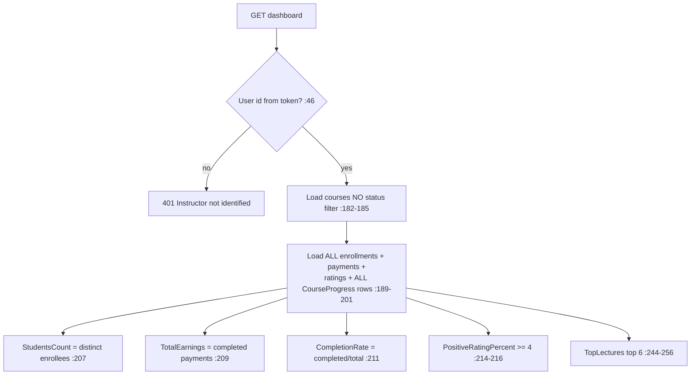

# DashboardController Module Documentation (API — Instructor)

---

## Overview

### Purpose
Instructor analytics: KPIs, revenue by period, top lectures, recent activity, notifications.

### Business Objective
Give instructors a full business overview: earnings, students, completion, ratings.

### Main Functionality
- Aggregated dashboard stats
- Revenue analytics by period (week/7days, month, 3months, year, all)

### Primary User Roles

| Role | Description |
|------|-------------|
| Instructor | Analytics (role-gated) |

---

## Module Architecture

```
Presentation           API controllers (JSON)
Application            IDashboardService
Storage                Courses/Enrollments/Payments/Ratings/CourseProgress reads
```

### Controllers

| Controller | Responsibility |
|-----------|----------------|
| `DashboardController` | 2 actions (`api/instructor/dashboard`) |

### Services

| Service | Responsibility |
|---------|----------------|
| `DashboardService` | Dashboard + revenue aggregation, period resolution |

---

## Endpoints

**Route**: `api/instructor/dashboard`  
**Authorization**: `[Authorize(Roles = SD.Instructor)]` class (:16-18)

| # | Action | HTTP | Route | Description |
|---|--------|------|-------|-------------|
| 1 | GetInstructorDashboard | GET | `api/instructor/dashboard` | KPIs (:42) |
| 2 | GetInstructorRevenue | GET | `api/instructor/dashboard/revenue?period=` | Revenue by period (:82) |

---

## Internal Workflows & Runtime Behavior

### Workflow 1: Dashboard Aggregation



#### Runtime Behavior
- `CoursesCount` includes **Draft/Rejected** courses (no status filter, :182-185).
- Whole-table `CourseProgress` scan then in-memory filter (:199-201) — performance risk.

### Workflow 2: Revenue Period

#### Behavior
- `ResolvePeriod(period ?? "month")` (:333); valid keys `week`/`7days`, `3months`, `year`, `all`; unknown → month (:505-527).
- **Mixed time horizons**: `PayoutDue` = all-time completed payments (:405), `TotalRevenue` = period-scoped (:353).
- `RecentTransactions` = **last 10 payments regardless of completion** (:390-402).

---

## Business Rules

| Rule | Verified in | Why it exists |
|------|-------------|---------------|
| Period keys week/7days, 3months, year, all | DashboardService.cs:505-527 | UI preset contract |
| Completed = status completed/Succeeded/Paid (case-insensitive) | :454-459 | Status vocabulary |
| All identity from token (no client ids) | controller :46 | No IDOR ✅ |

---

## Security Analysis

| Control | Status |
|---------|--------|
| Authentication | ✅ role-gated |
| Scoping | ✅ instructor's own courseIds |
| **Information disclosure** | ❌ 500 handlers return `ex.Message` verbatim (:67-71, :109-113) |
| Status codes | nonstandard 499 for cancellations (:59-63) |

---

## Hidden Behaviors & Technical Notes

1. **Exception messages leaked** to clients in 500s.
2. **Draft courses counted** in KPIs.
3. **`"all"` period has an empty previous-period baseline** — change-percent always "no previous" (:520).
4. **Payout figures are all-time while TotalRevenue is period-scoped** — DTO mixes horizons.

---

## Configuration

| Key | Purpose |
|-----|---------|
| (none module-specific) | — |

---

## Change Log

**Current functionality (verified):** role-gated instructor KPIs + period revenue with correct identity scoping — plus exception-message disclosure and mixed-horizon payout math.

**Maintenance notes:** filter Draft/Rejected from CoursesCount; stop leaking ex.Message; align payout/period horizons.