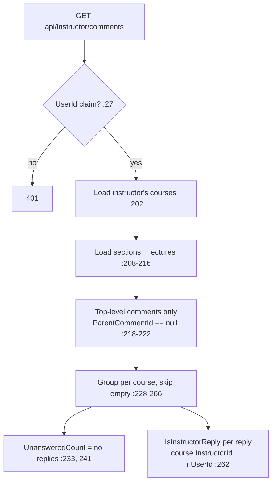

# InstructorCommentsController Module Documentation (API — Instructor)

---

## Overview

### Purpose
Instructor Q&A inbox: all top-level lecture comments across the instructor's courses, grouped per course with reply counts.

### Business Objective
One place for instructors to see and answer student questions.

### Main Functionality
- Get instructor comments grouped by course (with unanswered counts)

### Primary User Roles

| Role | Description |
|------|-------------|
| Instructor | Read questions |

---

## Module Architecture

```
Presentation           API controllers (JSON)
Application            ILectureCommentService
Storage                LectureComments (+User, +Lecture.Section, +Replies.User)
```

### Controllers

| Controller | Responsibility |
|-----------|----------------|
| `InstructorCommentsController` | 1 action (`api/instructor/comments`) |

### Services

| Service | Responsibility |
|---------|----------------|
| `LectureCommentService` | `GetInstructorCommentsAsync` (:200-269) — grouping, unanswered counts, instructor-reply flags |

---

## Endpoints

**Route**: `api/instructor/comments`  
**Authorization**: `[Authorize(Roles = "Instructor")]` class (:10) — **hardcoded string, not `SD.Instructor`**

| # | Action | HTTP | Route | Description |
|---|--------|------|-------|-------------|
| 1 | GetInstructorComments | GET | `api/instructor/comments` | Grouped questions (:23) |

---

## Internal Workflows & Runtime Behavior

### Workflow 1: Load Questions



#### Runtime Behavior
- Presentation logic (icon/color/`TimeAgo`) computed **inside the service** (:271-303).
- Errors → generic Arabic 500 (:37).

---

## Business Rules

| Rule | Verified in | Why it exists |
|------|-------------|---------------|
| Instructor-scoped | service filters by token-derived id (:202) | Privacy |
| Questions = top-level comments only | :218-222 | Threads vs questions |
| Answered = has ≥1 reply | :252 | Inbox semantics |

---

## Security Analysis

| Control | Status |
|---------|--------|
| Authentication | ✅ role-gated |
| Scoping | ✅ service filters by the instructor's own courses — no IDOR |
| Consistency risk | hardcoded `"Instructor"` role string (:10) vs `SD.Instructor` elsewhere |

---

## Hidden Behaviors & Technical Notes

1. **Hardcoded role string** (:10) — breaks if the role is ever renamed.
2. **N+1-ish loading** across courses → sections → lectures → comments with user/section includes.
3. **Generic Arabic error** hides details (:37).

---

## Configuration

| Key | Purpose |
|-----|---------|
| (none module-specific) | — |

---

## Change Log

**Current functionality (verified):** correctly-scoped instructor question inbox with grouping and unanswered counts.

**Maintenance notes:** use `SD.Instructor`; move presentation logic out of the service.