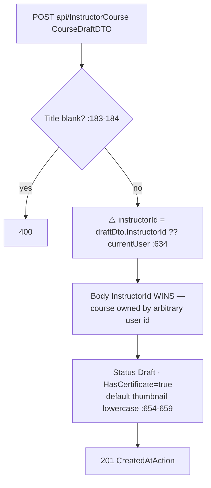
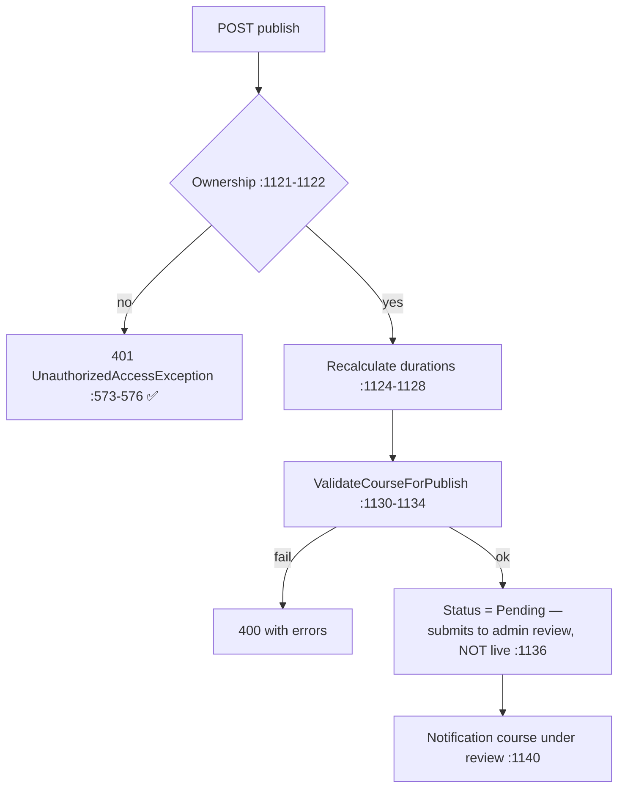
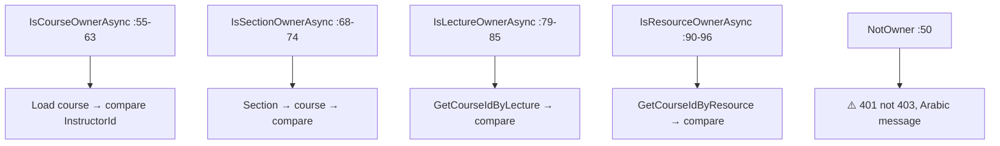

# InstructorCourseController Module Documentation (API — Instructor)

---

## Overview

### Purpose
The instructor's course lifecycle API: create/update drafts, curriculum (sections/lectures/resources/reorder), publish, delete (single/bulk).

### Business Objective
Full course authoring with ownership checks and publish validation (submit → admin review).

### Main Functionality
- Course CRUD + ownership checks
- Section/lecture/resource management + reordering
- Publish (sets Pending for review)
- Bulk delete (owned only)

### Primary User Roles

| Role | Description |
|------|-------------|
| Instructor | Authoring (role-gated) |

---

## Module Architecture

```
Presentation           API controllers (JSON)
Application            ICourseService + file storage
Storage                Courses/Sections/Lectures/Resources + Videos/Courses,
                       Images/Courses uploads
```

### Controllers

| Controller | Responsibility |
|-----------|----------------|
| `InstructorCourseController` | 18 actions (`api/InstructorCourse`) + 4 ownership helpers |

### Services

| Service | Responsibility |
|---------|----------------|
| `CourseService` | Draft create/update, sections/lectures/reorder, publish validation, delete |
| `FileStorageService` | Uploads (video/image) |

---

## Endpoints

**Route**: `api/InstructorCourse` (auto from `[controller]`)  
**Authorization**: `[Authorize(Roles = SD.Instructor)]` class (:22)

| # | Action | HTTP | Route | Description |
|---|--------|------|-------|-------------|
| 1 | GetInstructorCourses | GET | `api/InstructorCourse/instructor-courses` | ⚠️ 404 when empty (:115) |
| 2 | GetCourseById | GET | `api/InstructorCourse/{id:int}` | Ownership-checked (:136) |
| 3 | CreateCourseDraft | POST | `api/InstructorCourse` | ⚠️ IDOR — trusts body InstructorId (:177) |
| 4 | UpdateCourseDraft | PUT | `api/InstructorCourse/{id:int}` | ⚠️ upload-before-ownership → 500 (:207) |
| 5 | AddSection | POST | `api/InstructorCourse/{courseId:int}/sections` | ⚠️ body/route mismatch bypass (:245) |
| 6 | GetSection | GET | `api/InstructorCourse/sections/{sectionId:int}` | Ownership-checked (:274) |
| 7 | UpdateSection | PUT | `api/InstructorCourse/sections/{sectionId:int}` | Ownership-checked (:296) |
| 8 | DeleteSection | DELETE | `api/InstructorCourse/sections/{sectionId:int}` | Ownership-checked (:324) |
| 9 | ReorderSections | PUT | `api/InstructorCourse/sections/reorder` | Ownership on body CourseId (:348) |
| 10 | AddLecture | POST | `api/InstructorCourse/sections/{sectionId:int}/lectures` | Ownership via section (:374) |
| 11 | GetLecture | GET | `api/InstructorCourse/lectures/{lectureId:int}` | Ownership-checked (:403) |
| 12 | UpdateLecture | PUT | `api/InstructorCourse/lectures/{lectureId:int}` | ⚠️ 500-on-401 (:426) |
| 13 | DeleteLecture | DELETE | `api/InstructorCourse/lectures/{lectureId:int}` | Ownership-checked (:454) |
| 14 | ReorderLectures | PUT | `api/InstructorCourse/lectures/reorder` | Ownership on body SectionId (:478) |
| 15 | AddResourceToLecture | POST | `api/InstructorCourse/lecture/{lectureId}/resources` | ⚠️ no :int constraint; null file → 500 (:503) |
| 16 | DeleteResource | DELETE | `api/InstructorCourse/resources/{resourceId}` | success=false, no 404 (:532) |
| 17 | PublishCourse | POST | `api/InstructorCourse/{courseId:int}/publish` | ✅ 401 mapped (:557) |
| 18 | DeleteCourseAsInstructor | DELETE | `api/InstructorCourse/instructor/{id:int}` | ⚠️ bypasses enrollment guard (:594) |
| 19 | BulkDeleteCoursesAsInstructor | POST | `api/InstructorCourse/instructor/BulkDelete` | Owned-only filter (:633) |

---

## Internal Workflows & Runtime Behavior

### Workflow 1: Create Draft (IDOR)



#### Runtime Behavior
- **Critical IDOR**: the request body can set `InstructorId` to any user id (CourseService.cs:634) — the controller never clears it (:177-191).

### Workflow 2: Publish Validation



#### Validation rules (CourseService.cs:1004-1107)
Title, short description, category, thumbnail required; **≥ 3 sections**; **exactly one free section** with **5–10 video lectures**; each section ≥ 2 lectures; videos ≥ 60s; ≥ 3 requirements; ≥ 3 learnings; target audience; non-negative price.

### Workflow 3: Ownership Helpers



### Workflow 4: Delete (data-integrity risk)

#### Behavior
- `DeleteCourseAsInstructorAsync` (:582-622) checks ownership (:603-605) but **NOT enrollments** — the admin delete path does (`DeleteCourseAsync` throws if enrolled, :544-550). With cascade FKs (Payment/Rating/Section → Course cascade, ApplicationDbContext.cs:94-98, 125-147), deleting a course with paying students can **cascade-delete financial records** or fail with FK restrictions (CourseProgress → Enrollment Restrict, :56-60) → 500.

---

## Business Rules

| Rule | Verified in | Why it exists |
|------|-------------|---------------|
| Video ≥ 60 seconds | CourseService.cs:855-856, 901-902 | Content quality |
| One free-preview section | :769-772 + CourseRepository.cs:337-355 | Marketing structure |
| Publish → Pending (review) | :1136 | Admin approval gate |
| HasCertificate always true | :654, 704 | Platform policy |
| Auto order (max+1) | CourseRepository.cs:285-308, 440-463 | Deterministic ordering |

---

## Security Analysis

| Control | Status |
|---------|--------|
| **Create-IDOR (critical)** | ❌ body `InstructorId` overrides identity (CourseService.cs:634) |
| **AddSection bypass** | ❌ ownership checked on body CourseId, insert uses route CourseId (:254-257) — a caller owning course A can add sections to course B |
| **Delete enrollment guard bypass** | ❌ instructor path lacks the admin path's enrolled-students guard (:582-622 vs :544-550) — cascade-deletes payments |
| Ownership checks | ✅ present on get/update/delete/publish of sections/lectures/resources |
| **Status codes** | ❌ 500 instead of 401 on UpdateCourseDraft (:232-236) and UpdateLecture (:445-448) |
| **Orphaned files** | ❌ image upload happens BEFORE the ownership check (:216-222) — non-owner requests leave files on disk |
| Case mismatch | default thumbnail written `/images/...` lowercase (:638) but compared `/Images/...` uppercase (:673) — default file may be deleted or skipped inconsistently |

---

## Hidden Behaviors & Technical Notes

1. **Critical**: create-draft IDOR + AddSection bypass.
2. **Route inconsistency**: `lecture/{lectureId}` and `resources/{resourceId}` lack `:int` constraints (:501, :530).
3. **`AddResourceToLecture` null file → 500** instead of 400 (:519-527).
4. **`DeleteResource` success=false, no 404** (:541-542).
5. **`GetInstructorCourses` 404 for empty list** (:115-116) — arguably wrong status.
6. **BulkDelete mixed ownership**: only owned ids deleted, count = owned count, no error for the rest (:649-662).
7. **Heavy mapping**: ownership checks pay the full `MapToCourseDTOAsync` cost (rating summary, enrollment count, per-lecture resources — :1682-1741) on every guard call.

---

## Configuration

| Key | Purpose |
|-----|---------|
| `wwwroot/Videos/Courses`, `Images/Courses` | upload storage |

---

## Change Log

**Current functionality (verified):** ownership-checked course lifecycle with strict publish validation — plus the create-IDOR, AddSection bypass, enrollment-guard bypass on delete, and wrong 500-on-401 statuses.

**Maintenance notes:**
- Ignore/clear `draftDto.InstructorId` server-side.
- Validate ownership against the ROUTE course id in AddSection.
- Add the enrollment guard to instructor delete; fix status codes; clean orphaned files.