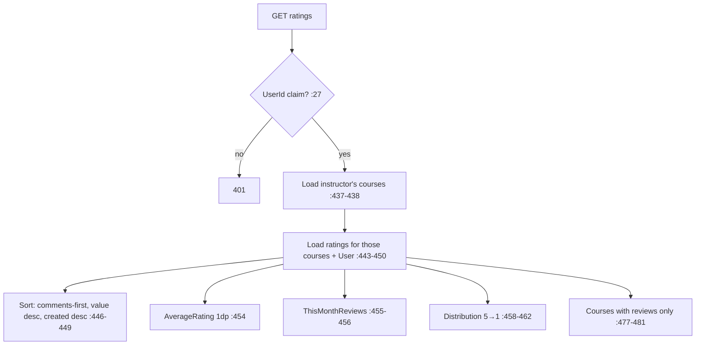

# InstructorRatingsController Module Documentation (API — Instructor)

---

## Overview

### Purpose
Ratings analytics for instructors: own overview + public ratings for any instructor.

### Business Objective
Show instructors review stats (average, distribution, monthly) and make them public for marketing.

### Main Functionality
- Own ratings overview (authenticated)
- Public ratings overview by instructor id (anonymous)

### Primary User Roles

| Role | Description |
|------|-------------|
| Instructor | Own ratings |
| Anonymous | Public ratings for any instructor |

---

## Module Architecture

```
Presentation           API controllers (JSON)
Application            IRatingService
Storage                Ratings (+User) aggregates
```

### Controllers

| Controller | Responsibility |
|-----------|----------------|
| `InstructorRatingsController` | 2 actions (`api/instructor/ratings`) |

### Services

| Service | Responsibility |
|---------|----------------|
| `RatingService` | `GetInstructorRatingsAsync` (:429-504) |

---

## Endpoints

**Route**: `api/instructor/ratings`  
**Authorization**: `[Authorize(Roles = "Instructor")]` class (:10, **hardcoded string**); one action `[AllowAnonymous]`

| # | Action | HTTP | Route | Auth | Description |
|---|--------|------|-------|------|-------------|
| 1 | GetInstructorRatings | GET | `api/instructor/ratings` | 🎓 Instructor | Own overview (:23) |
| 2 | GetPublicInstructorRatings | GET | `api/instructor/ratings/{instructorId}` | 🔓 (:45) | ⚠️ Public student PII (:46) |

---

## Internal Workflows & Runtime Behavior

### Workflow 1: Aggregation



#### Runtime Behavior
- **`Reviews` expose `StudentName = r.User?.FullName` and `StudentAvatar`** (:487-488) — on the PUBLIC endpoint too.
- Public endpoint accepts any string as instructorId; non-existent users → empty overview (no 404).
- Errors → generic Arabic 500 (:37, :59).

---

## Business Rules

| Rule | Verified in | Why it exists |
|------|-------------|---------------|
| Ratings over instructor's own courses | :437-450 | Correct scoping |
| Reviews-with-comments first | :446-449 | Quality ordering |

---

## Security Analysis

| Control | Status |
|---------|--------|
| Authentication | ✅ own view; 🔓 public view by design |
| **Public student PII** | ⚠️ full names/avatars enumerable via `{instructorId}` without auth (:487-488) — privacy concern |
| Scoping | ✅ ratings aggregated over the instructor's courses |

---

## Hidden Behaviors & Technical Notes

1. **Public endpoint duplicates the authenticated call** — only auth + the blank check differ (:53 vs :31).
2. **Hardcoded role string** `"Instructor"` (:10).
3. **No 404** for unknown instructors — silent empty overview.

---

## Configuration

| Key | Purpose |
|-----|---------|
| (none module-specific) | — |

---

## Change Log

**Current functionality (verified):** scoped ratings aggregation for instructors + anonymous public variant — with student-name PII exposure on the public endpoint.

**Maintenance notes:** scrub student names/avatars from the public payload; use `SD.Instructor`.