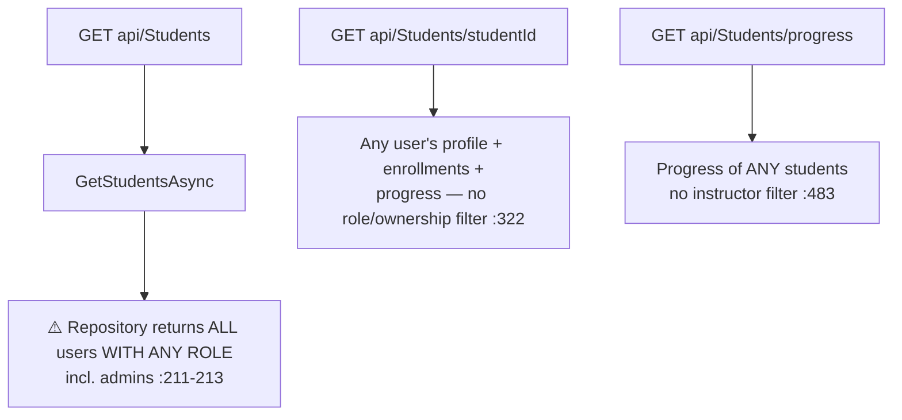

# StudentsController Module Documentation (API — Instructor)

---

## Overview

### Purpose
Instructor's student management: list students, summaries, progress, notifications, bulk messages.

### Business Objective
Instructors engage their audience: see who enrolled, track progress, send announcements.

### Main Functionality
- Students list / my-students / summary / progress
- Student details
- Send notification (scoped ✅) / bulk message (⚠️ unscoped)
- Notification recipient picker + summary

### Primary User Roles

| Role | Description |
|------|-------------|
| Instructor | Manage own students (role-gated) |

---

## Module Architecture

```
Presentation           API controllers (JSON, ApiResponse<T> envelope)
Application            INotificationService + IStudentService
Storage                Users/Enrollments/CourseProgress reads
```

### Controllers

| Controller | Responsibility |
|-----------|----------------|
| `StudentsController` | 9 actions (`api/Students`) |

### Services

| Service | Responsibility |
|---------|----------------|
| `StudentService` | Scoped (by-instructor) + unscoped (all-users) queries |
| `NotificationService` | `SendInstructorNotificationAsync` (validated), recipient picker, summary |

---

## Endpoints

**Route**: `api/Students` (auto from `[controller]`)  
**Authorization**: `[Authorize(Roles = SD.Instructor)]` class (:21)

| # | Action | HTTP | Route | Scoping | Description |
|---|--------|------|-------|---------|-------------|
| 1 | SendNotification | POST | `api/Students/send-notification` | ✅ service-validated (:562-571) | Announcement |
| 2 | GetStudentsForNotification | GET | `api/Students/notification-students` | ✅ instructor-scoped (:147) | Picker |
| 3 | GetNotificationSummary | GET | `api/Students/notification-summary` | ✅ instructor-scoped (:193) | Summary |
| 4 | GetStudents | GET | `api/Students` | ❌ **ALL users** (:222) | ⚠️ IDOR |
| 5 | GetStudentsSummary | GET | `api/Students/summary` | ✅ instructor-scoped (:277) | KPIs |
| 6 | GetStudentDetails | GET | `api/Students/{studentId}` | ❌ **any user** (:306) | ⚠️ IDOR |
| 7 | SendBulkMessage | POST | `api/Students/bulk-message` | ❌ **any ids** (:357) | ⚠️ IDOR + dead email |
| 8 | GetMyStudents | GET | `api/Students/my-students` | ✅ instructor-scoped (:437) | Own list |
| 9 | GetStudentsProgress | GET | `api/Students/progress?studentIds=` | ❌ **any ids** (:466) | ⚠️ IDOR |

---

## Internal Workflows & Runtime Behavior

### Workflow 1: Unscoped Reads (IDOR cluster)



#### Runtime Behavior
- `GetStudents` returns users with **any** role (instructors, admins, support included) — mass PII exposure (StudentRepository.cs:203-231).
- `GetStudentDetails` exposes full enrollments + progress for any user id.
- `GetStudentsProgress` unbounded `studentIds` list + no scoping.

### Workflow 2: Bulk Message (spam + dead email)

```mermaid
flowchart TD
    A[POST bulk-message BulkMessageDto] --> B{null / no students /<br/>missing subject-message :368-384}
    B -->|invalid| C[400]
    B -->|ok| D[Create notifications for ids<br/>NO instructor verification :434-446]
    D --> E{SendEmail? :449-453}
    E -->|yes| F[⚠️ DEAD — only logs "would be implemented"<br/>then returns true :458]
    F --> G[Controller reports sent successfully :391]
```

### Workflow 3: Send Notification (correct pattern)

#### Behavior
- `SendInstructorNotificationAsync` (:532-629): Title/Message validation (:545-553); when `StudentIds` non-empty → `ValidateStudentsBelongToInstructorAsync` (:562-571) — **duplicate ids fail the equality check** (StudentRepository.cs:127); empty ids → send to ALL instructor students (:574-584).
- **Partial failures → 400** (per-recipient errors, IsSuccess = no errors).
- Email subject = `Title.Trim()` (:770).

---

## Service Layer

| Service | Key logic (verified) |
|---------|----------------------|
| `StudentService` | `GetStudentDetailsAsync` hardcodes `TotalTimeSpent=0`, `AverageGrade=0` (:198-199) — placeholder data; progress % = completed/total (:230-254); `SendBulkMessageAsync` email stubbed (:449-453); duplicate implementations of `GetStudentsForNotificationAsync`/`GetNotificationSummaryAsync` (:475-508) **never used by this controller** — dead code |

---

## Business Rules

| Rule | Verified in | Why it exists |
|------|-------------|---------------|
| Notifications need Title + Message | NotificationService.cs:545-553 | Payload quality |
| Selected students must be the instructor's | :562-571 + StudentRepository.cs:97-146 | Scoping (✅ where enforced) |
| Empty StudentIds → all students | :574-584 | Convenience |
| Completed = 100%, Active = 1-99% | StudentService.cs:235-240, 376-381 | Status semantics |

---

## Security Analysis

| Control | Status |
|---------|--------|
| **IDOR: all-users list** | ❌ `GetStudents` exposes every user incl. admins |
| **IDOR: details** | ❌ any user's profile/enrollments/progress |
| **IDOR: progress** | ❌ any students' progress |
| **Spam: bulk message** | ❌ arbitrary recipient ids, no validation |
| **Dead email** | `SendEmail` logs only, still reports success |
| Scoped actions | ✅ SendNotification, GetMyStudents, summaries |
| **Info disclosure** | ❌ raw `ex.Message` in 500s (:114-116) |
| Route fragility | `{studentId}` unconstrained string route (:302) — literals win, typos silently 404 |

---

## Hidden Behaviors & Technical Notes

1. **The most severe IDOR cluster in the API**: list-all-users + any-user details + any-student progress + arbitrary-notification bulk send.
2. **Hardcoded zero stats** (`TotalTimeSpent`, `AverageGrade`) returned to clients.
3. **Duplicate service methods** never called (dead code, :475-508).
4. **`activeStudents` definition**: distinct users with any `CourseProgress` row having a non-null Lecture (:504-508) — weak "active" metric.
5. All responses use the `ApiResponse<T>` envelope; `FailResponse` sets `StatusCode=BadRequest` even on 500/401 HTTP statuses — misleading body/status combos.

---

## Configuration

| Key | Purpose |
|-----|---------|
| (none module-specific) | — |

---

## Change Log

**Current functionality (verified):** scoped notification + summary flows coexist with a critical unscoped cluster (all-users list, any-user details/progress, unvalidated bulk messages, stubbed email).

**Maintenance notes:**
- Scope `GetStudents`/`GetStudentDetails`/`GetStudentsProgress`/`SendBulkMessage` to the instructor's enrollments.
- Implement or remove the email branch; remove duplicate dead methods.