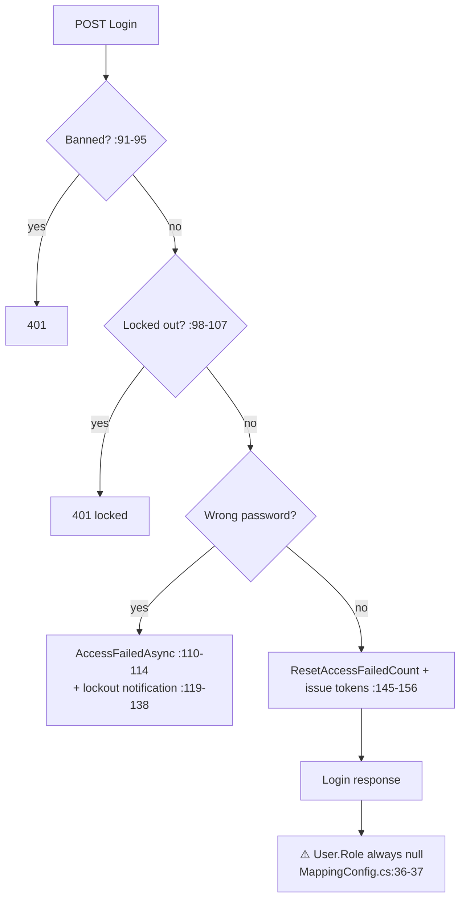
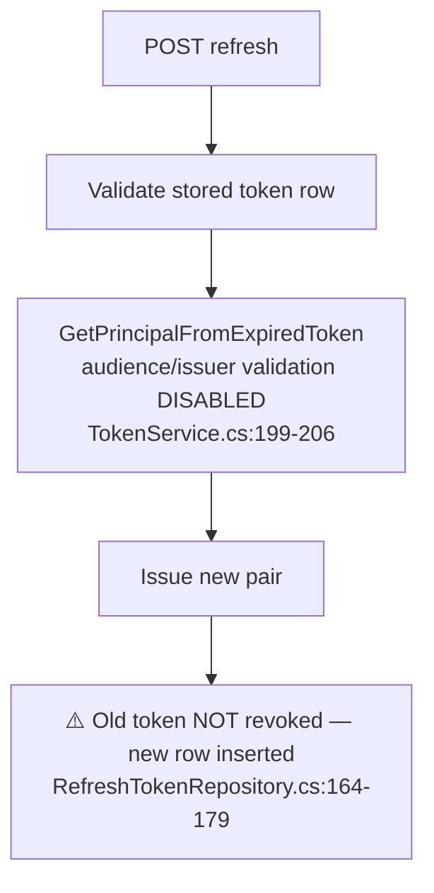

# AuthController Module Documentation (API)

---

## Overview

### Purpose
Authentication surface: local login/register, email verification, password reset, refresh/revoke tokens, and OAuth external login (Facebook/Google/Microsoft).

### Business Objective
Secure identity lifecycle with JWT access tokens + refresh tokens, email-gated registration, and social login.

### Main Functionality
- Login / register (email OTP-gated)
- Forgot password flow (code → verify → reset)
- Refresh / revoke tokens
- Email verification + resend code
- External OAuth login + (broken) confirmation flow

### Primary User Roles

| Role | Description |
|------|-------------|
| Anonymous | Login/register/verify/reset/external login |
| Authenticated | Token refresh/revoke |

---

## Module Architecture

```
Presentation           API controllers (JSON)
Application            IAuthService + IUserService + IExternalLoginService
External               ASP.NET Identity (UserManager), OAuth providers (FB/Google/MS),
                       Redis/cache (OTP flags), SMTP (verification emails)
```

### Controllers

| Controller | Responsibility |
|-----------|----------------|
| `AuthController` | 12 actions (`api/Auth`) — namespace `EduLab_API.Controllers.Customer` (anomaly, AuthController.cs:16) |

### Services

| Service | Responsibility |
|---------|----------------|
| `AuthService` | Login, refresh, revoke, token issuance |
| `UserService` | Register, OTP send/verify, password reset, user creation |
| `ExternalLoginService` | OAuth callback + auto-creation |

---

## Folder Structure

```
Controllers/Learner/
+-- AuthController.cs                 # 12 actions (499 lines) — namespace Customer

Services/
+-- AuthService.cs
+-- UserService.cs
+-- ExternalLoginService.cs
+-- TokenService.cs                   # JWT issuance (HMAC-SHA256)

Models/ (DTOs)
+-- LoginRequestDTO.cs, RegisterRequestDTO.cs, ForgotPasswordDTO.cs,
    VerifyEmailDTO.cs, SendCodeDTO.cs, ResetPasswordDTO.cs,
    RefreshTokenRequestDTO.cs, ExternalLoginConfirmationDto.cs
```

---

## Database Design

None directly (Identity tables: Users, Roles, RefreshTokens, RoleClaims via EF).

---

## Endpoints

**Route**: `api/Auth`  
**Authorization**: none class-level

| # | Action | HTTP | Route | Auth | Description |
|---|--------|------|-------|------|-------------|
| 1 | Login | POST | `api/Auth/Login` | 🔓 | Password login → tokens (:48) |
| 2 | ForgotPassword | POST | `api/Auth/forgot-password` | 🔓 | Email reset code (:92) |
| 3 | VerifyResetCode | POST | `api/Auth/verify-reset-code` | 🔓 | Validate reset code (:125) |
| 4 | ResetPassword | POST | `api/Auth/reset-password` | 🔓 | Set new password (:158) |
| 5 | RefreshToken | POST | `api/Auth/refresh` | 🔓 | New token pair (:191) |
| 6 | RevokeToken | POST | `api/Auth/revoke` | 🔐 | Revoke refresh token (:237) |
| 7 | Register | POST | `api/Auth/Register` | 🔓 | Create account (:281) |
| 8 | VerifyEmail | POST | `api/Auth/verify-email` | 🔓 | Confirm email (:325) |
| 9 | SendCode | POST | `api/Auth/send-code` | 🔓 | Resend OTP (:358) |
| 10 | ExternalLogin | GET | `api/Auth/ExternalLogin?provider&returnUrl` | 🔓 | OAuth challenge (:400) |
| 11 | ExternalLoginCallback | GET | `api/Auth/ExternalLoginCallback` | 🔓 | OAuth redirect w/ tokens (:428) |
| 12 | ExternalLoginConfirmation | POST | `api/Auth/ExternalLoginConfirmation` | 🔓 | Confirmation (dead flow) (:460) |

---

## Internal Workflows & Runtime Behavior

### Workflow 1: Login



### Workflow 2: Registration (OTP-gated)

```mermaid
flowchart TD
    A[POST Register] --> B{emailConfirmed:{email}<br/>cache flag set? :222-228}
    B -->|no| C[Reject]
    B -->|yes| D[Duplicate checks :230-244]
    D --> E[Create user EmailConfirmed=true :246-253]
    F[POST send-code] --> G{email already registered? :324-330}
    G -->|no| H[Store verify:{email} 10min :333]
    H --> I[Email OTP — 6-digit via new Random() :983 ⚠️]
```

### Workflow 3: Password Reset

```mermaid
flowchart TD
    A[forgot-password] --> B[Uniform message<br/>no user enumeration :88-97]
    B --> C[passwordReset:{email} 10min :100]
    D[verify-reset-code] --> E[passwordResetVerified:{email} 10min :146]
    F[reset-password] --> G{Verified flag? :170-176}
    G -->|yes| H[GeneratePasswordResetTokenAsync :187]
```

### Workflow 4: Token Refresh



---

## Service Layer

| Service | Key logic (verified) |
|---------|----------------------|
| `TokenService` | Access token: `sub`=userId, `email`, `jti` + roles as `ClaimTypes.Role` (:79-101); expiry 7 days (:105-107); HMAC-SHA256 (:120-122); refresh = 32 random bytes (:153-173) |
| `AuthService` | Lockout-before-password-check ordering; `user.Role = roles.FirstOrDefault()` (:147-148) but lost in mapping |
| `UserService` | OTP flags keyed by **email string only** (not user) — :222-228, :302; `CreateUserAsync` auto-creates roles incl. `Moderator ` trailing space (:918-925) |

---

## Business Rules

| Rule | Verified in | Why it exists |
|------|-------------|---------------|
| Password: 8+ chars, digit, uppercase | InfrastructureContainer.cs:25-30 | Identity policy |
| Lockout: 10 attempts / 2h | InfrastructureContainer.cs:33-35 | Brute-force defense |
| Register requires verified email flag | UserService.cs:222-228 | Prevents fake accounts |
| OTP valid 10 min | UserService.cs:333 | Expiry hygiene |
| Uniform forgot-password response | UserService.cs:88-97 | Anti-enumeration |
| Token expiry 7 days | TokenService.cs:105-107 | Session lifetime |

---

## Security Analysis

| Control | Status |
|---------|--------|
| JWT validation | ✅ audience/issuer/key/lifetime all validated (Program.cs:64-78) |
| **OTP strength** | ❌ `new Random().Next(100000,999999)` (UserService.cs:983) — predictable |
| **Rate limiting** | ❌ none on send-code / verify-code / login |
| **Token rotation** | ❌ old refresh tokens stay valid (RefreshTokenRepository.cs:164-179) |
| **Token leakage** | ❌ OAuth callback puts tokens in query string (AuthController.cs:444-447) |
| **Account takeover vector** | OTP keyed by email only + weak PRNG — if SMTP is breached, codes are forgeable |
| DTO validation gaps | `VerifyEmailDTO`/`SendCodeDTO` have no attributes (:125-129, :358-362); `RefreshTokenRequestDTO` lacks `[Required]` |

---

## Hidden Behaviors & Technical Notes

1. **`LoginResponseDTO.User.Role` is always null** — mapping ignores Role (MappingConfig.cs:36-37) despite `AuthService` setting it (:147-148). Consumers cannot trust the login payload for role detection.
2. **External-login confirmation flow is dead**: `IsNewUser` is `false` in every return path (ExternalLoginService.cs:104/136/164/258) — the service auto-creates the user (:145-170), so `ExternalLoginConfirmation` always hits "Email is already registered".
3. **`RevokeToken` binds a bare string body** (`[FromBody] string`, :242) — unique pattern in the API.
4. **`ConfigureExternalAuthProperties` does not validate the provider string** — arbitrary provider names accepted.
5. **Namespace anomaly**: file in `Controllers/Learner/`, namespace `EduLab_API.Controllers.Customer` (AuthController.cs:16).
6. **Hardcoded seeded credentials** `Admin@123` for admin/instructor/student (DbInitializer.cs:102/173/195) and **live secrets in appsettings.json** (connection string :13, SMTP :23-29, OAuth :30-43, Stripe :44-47) — committed to the repo.

---

## Configuration

| Key | Purpose |
|-----|---------|
| `JWT:Key/Issuer/Audience/AccessTokenExpiryDays` | Token signing (appsettings.json:17-22) |
| `Stripe:SecretKey`, SMTP, OAuth client ids/secrets | External integrations (appsettings.json:23-47) |

---

## Change Log

**Current functionality (verified):** full auth lifecycle with JWT + refresh rotation (non-revoking), email-OTP registration gate, password reset, OAuth — plus the identified security gaps (weak OTP PRNG, no rate limiting, token leakage in callback, dead confirmation flow).

**Maintenance notes:**
- Replace `Random` with `RandomNumberGenerator` for OTPs; add rate limiting.
- Revoke old refresh tokens on rotation.
- Move tokens out of the callback query string (postMessage/code exchange).
- Fix `UserDTO.Role` mapping; remove committed secrets from appsettings.json.