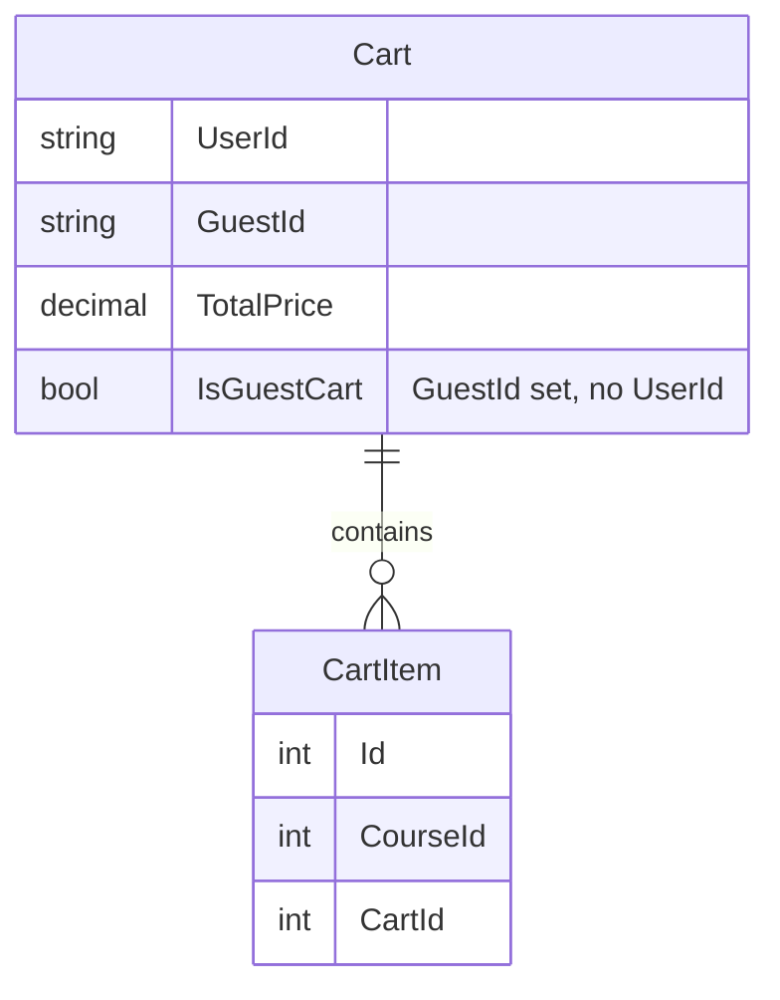
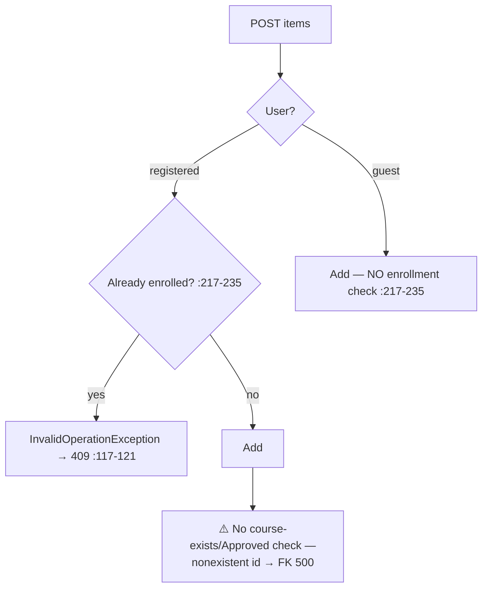
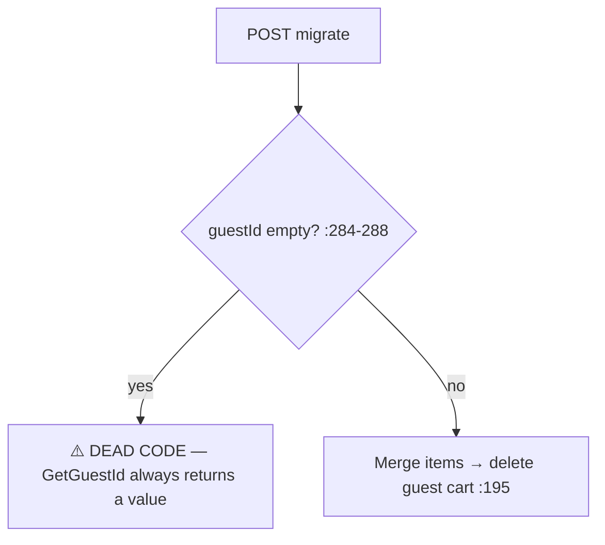

# CartController Module Documentation (API)

---

## Overview

### Purpose
Shopping cart for courses: guest cart (cookie-based) + user cart with migration, add/remove/clear.

### Business Objective
Let visitors accumulate courses before checkout (guest cart), then merge into their account cart at login.

### Main Functionality
- Get cart (user or guest)
- Add item (enrollment-guarded for users)
- Remove item / clear cart
- Migrate guest cart → user cart

### Primary User Roles

| Role | Description |
|------|-------------|
| Anonymous | Guest cart via cookie |
| Authenticated | Persistent user cart |

---

## Module Architecture

```
Presentation           API controllers (JSON)
Application            ICartService
Storage                Cookie (guest id), DB (Cart/CartItem tables)
```

### Controllers

| Controller | Responsibility |
|-----------|----------------|
| `CartController` | 5 actions (`api/Cart`) |

### Services

| Service | Responsibility |
|---------|----------------|
| `CartService` | Cart CRUD + guest-id cookie + migration |

---

## Folder Structure

```
Controllers/Learner/
+-- CartController.cs                 # 5 actions (230 lines)

Services/
+-- CartService.cs

Models/Entities/
+-- Cart.cs                           # UserId/GuestId nullable, TotalPrice = sum
+-- CartItem.cs
```

---

## Database Design



---

## Endpoints

**Route**: `api/Cart`  
**Authorization**: none class-level; only migrate is `[Authorize]`

| # | Action | HTTP | Route | Auth | Description |
|---|--------|------|-------|------|-------------|
| 1 | GetCart | GET | `api/Cart` | 🔓 | User cart, else guest cart (:57) |
| 2 | AddItemToCart | POST | `api/Cart/items` | 🔓 | Add course (body) (:98) |
| 3 | RemoveItemFromCart | DELETE | `api/Cart/items/{cartItemId:int}` | 🔓 | Remove item (:139) |
| 4 | ClearCart | DELETE | `api/Cart/clear` | 🔓 | Empty cart → 204 (:171) |
| 5 | MigrateGuestCart | POST | `api/Cart/migrate` | 🔐 | Merge guest → user (:203) |

---

## Internal Workflows & Runtime Behavior

### Workflow 1: Get Cart (user vs guest)

```mermaid
flowchart TD
    A[GET api/Cart] --> B{NameIdentifier claim? :41-44}
    B -->|yes| C[User cart via GetOrCreateUserCart]
    B -->|no| D[GetGuestId → guest cookie cart]
    C --> E[MapToCartDto(null) → empty CartDto :116]
```

### Workflow 2: Add Item



### Workflow 3: Migrate



---

## Service Layer

| Service | Key logic (verified) |
|---------|----------------------|
| `CartService` | Guest cookie `Secure=true` + `HttpOnly=true` (:67-74); migration deletes the guest cart after merge (:195) |

---

## Business Rules

| Rule | Verified in | Why it exists |
|------|-------------|---------------|
| Registered users cannot add already-enrolled courses | CartService.cs:217-235 | Prevent double-purchase intent |
| Guests bypass the enrollment check | CartService.cs:217-235 | No account to check against |
| `IsGuestCart` = GuestId without UserId | Cart.cs:24 | Cart identity model |

---

## Security Analysis

| Control | Status |
|---------|--------|
| **IDOR delete** | ❌ registered-user path does NO ownership check (CartService.cs:331) — any authenticated user can delete any `cartItemId` |
| Course validation | ❌ no existence/Approved check on add (both paths) |
| Guest cookie over HTTP | ❌ `Secure=true` cookie silently fails on `http://localhost:5154` (allowed origin, Program.cs:184) — guest cart breaks in local dev |
| Exception mapping | InvalidOperationException→409, KeyNotFoundException→404 only |

---

## Hidden Behaviors & Technical Notes

1. **IDOR delete** is the critical finding (CartService.cs:331).
2. **Nonexistent course id → FK-violation 500** instead of a clean 4xx (course existence never validated).
3. **Dead null-guard** in migration (CartService.cs:284-288).
4. **ClearCart creates-then-clears**: users with no cart get one created (then emptied) — 204 always.
5. **Guest + paid-course flow**: nothing in the API blocks guest checkout of paid courses at the cart layer (payment gating lives in PaymentService; see Enrollment doc for the bypass).

---

## Configuration

| Key | Purpose |
|-----|---------|
| (cookie) | guest cart identity |
| `EduLab:ApiBaseUrl`-equivalent API base | n/a (API side) |

---

## Change Log

**Current functionality (verified):** dual guest/user cart with migration, add/remove/clear — with an IDOR delete gap and no course validation.

**Maintenance notes:**
- Ownership-check `RemoveItemFromCart` for registered users.
- Validate course existence + Approved status on add.
- Drop `Secure` (or force HTTPS) for the guest cookie.