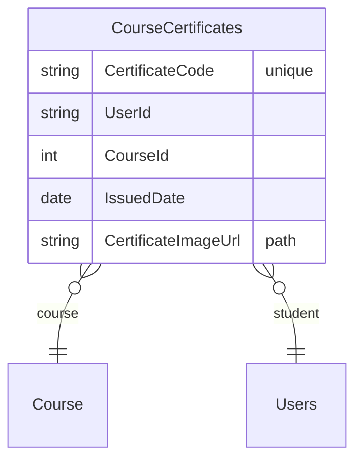
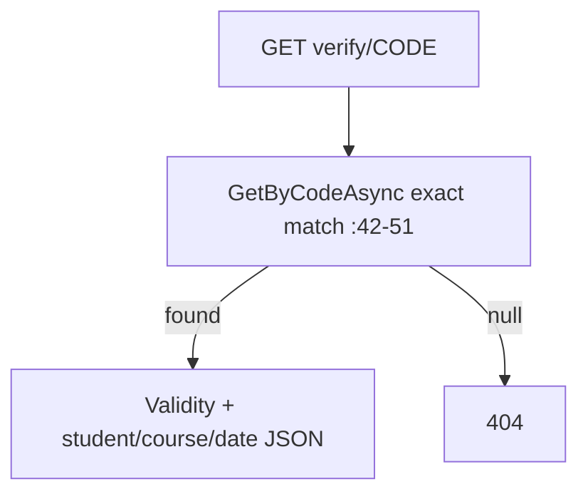
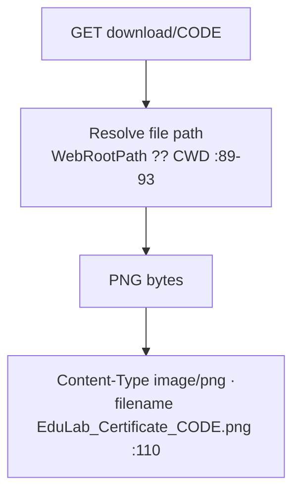

# CertificatesController Module Documentation (API)

---

## Overview

### Purpose
Certificate lifecycle: my certificates, public verification by code, and PNG download.

### Business Objective
Issue verifiable completion certificates and let anyone validate them by code (employers/schools).

### Main Functionality
- My certificates (authorized)
- Verify by code (anonymous)
- Download PNG by code (anonymous)

### Primary User Roles

| Role | Description |
|------|-------------|
| Authenticated | Own certificates |
| Anonymous | Verify + download |

---

## Module Architecture

```
Presentation           API controllers (JSON / image/png)
Application            ICertificateService + ICourseCertificateRepository
Storage                wwwroot/uploads/certificates/Certificate_{code}.png
```

### Controllers

| Controller | Responsibility |
|-----------|----------------|
| `CertificatesController` | 3 actions (`api/Certificates`) |

### Services

| Service | Responsibility |
|---------|----------------|
| `CertificateService` | File path resolution (WebRootPath-safe, :89-93), generation, notifications |
| `CourseCertificateRepository` | GetByCodeAsync (exact, case-sensitive, :42-51) |

---

## Folder Structure

```
Controllers/Learner/
+-- CertificatesController.cs         # 3 actions (119 lines)

Services/
+-- CertificateService.cs

wwwroot/uploads/certificates/         # Generated PNGs
```

---

## Database Design



---

## Endpoints

**Route**: `api/Certificates`  
**Authorization**: none class-level

| # | Action | HTTP | Route | Auth | Description |
|---|--------|------|-------|------|-------------|
| 1 | GetMyCertificates | GET | `api/Certificates/my` | 🔐 | Own certificates (:35) |
| 2 | VerifyCertificate | GET | `api/Certificates/verify/{code}` | 🔓 | Validity + metadata (:60) |
| 3 | DownloadCertificate | GET | `api/Certificates/download/{code}` | 🔓 | PNG bytes (:91) |

---

## Internal Workflows & Runtime Behavior

### Workflow 1: Verify



### Workflow 2: Download



#### Runtime Behavior
- Download returns **PNG** — the XML doc comment claims "PDF" (:89) — docs/behavior mismatch.

---

## Business Rules

| Rule | Verified in | Why it exists |
|------|-------------|---------------|
| Verification anonymous | `[AllowAnonymous]` :61 | Employer trust check without login |
| Code exact-match + case-sensitive | CourseCertificateRepository.cs:42-51 | Uniqueness of credential |
| My-certificates requires auth + user-scoped | `[Authorize]` :36 + CurrentUserService filter | Privacy |

---

## Security Analysis

| Control | Status |
|---------|--------|
| Auth on my-certificates | ✅ |
| **Download exposure** | ⚠️ anyone with the code can fetch the PNG — by design for shareability, but no ownership guard or rate limit |
| Brute-force | codes are 16-hex (unguessable); no rate limiting though |
| Identity | `ICurrentUserService` resolves the caller (:42-45) |

---

## Hidden Behaviors & Technical Notes

1. **PNG vs PDF doc mismatch** (:89 vs :110).
2. **No rate limiting** on verify/download — acceptable given code entropy, but flag for abuse monitoring.
3. **File path null-safe** (`WebRootPath ?? Directory.GetCurrentDirectory()`) — contrast with `InstructorApplicationService.SaveFile` which is not null-guarded.
4. **Code in URL for download** — certificates shared in forums/emails can be downloaded by anyone who has the code (the code IS the credential proof).

---

## Configuration

| Key | Purpose |
|-----|---------|
| `wwwroot/uploads/certificates/` | Certificate storage |

---

## Change Log

**Current functionality (verified):** authorized my-certificates, anonymous verify + PNG download.

**Maintenance notes:** align the XML doc (PNG); optionally add download rate limiting.