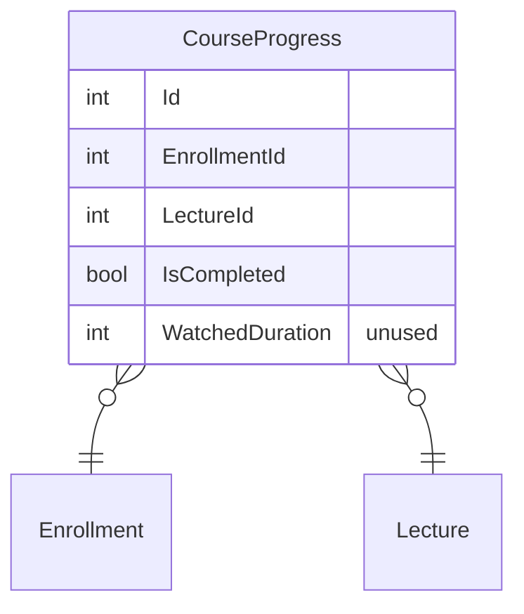
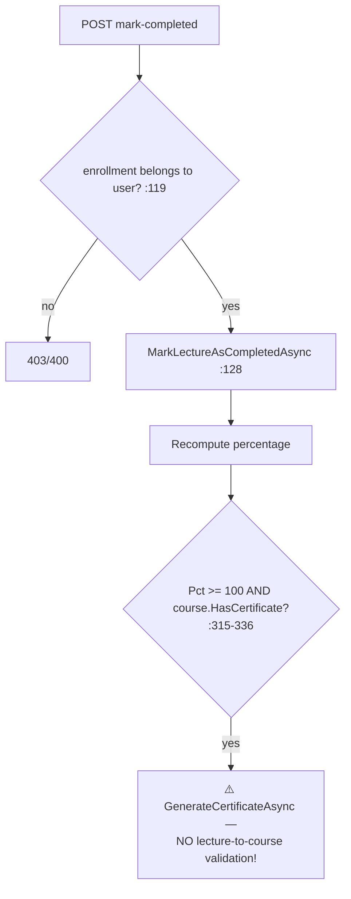

# CourseProgressController Module Documentation (API)

---

## Overview

### Purpose
Lecture progress tracking: mark complete/incomplete, per-course progress, summaries, and per-lecture status.

### Business Objective
Drive the learning experience: percentage completion, automatic certificate issuance at 100%.

### Main Functionality
- Mark lecture completed / incomplete
- Progress by enrollment / by course / summary
- Lecture status + all statuses for a course

### Primary User Roles

| Role | Description |
|------|-------------|
| Enrolled learner | Track progress (authorized) |

---

## Module Architecture

```
Presentation           API controllers (JSON)
Application            ICourseProgressService + IEnrollmentRepository + ICourseRepository
Storage                CourseProgress rows (enrollment × lecture)
```

### Controllers

| Controller | Responsibility |
|-----------|----------------|
| `CourseProgressController` | 7 actions (`api/CourseProgress`) — class-level `[Authorize]` |

### Services

| Service | Responsibility |
|---------|----------------|
| `CourseProgressService` | Mark complete/incomplete, summaries, certificate issuance hook |
| `CourseProgressRepository` | Percent math + include graph |

---

## Folder Structure

```
Controllers/Learner/
+-- CourseProgressController.cs       # 7 actions (496 lines)

Services/
+-- CourseProgressService.cs

Models/Entities/
+-- CourseProgress.cs
```

---

## Database Design



---

## Endpoints

**Route**: `api/CourseProgress`  
**Authorization**: class-level `[Authorize]` (:16-18)

| # | Action | HTTP | Route | Description |
|---|--------|------|-------|-------------|
| 1 | MarkLectureCompleted | POST | `api/CourseProgress/mark-completed` | Mark done (:71) |
| 2 | MarkLectureIncomplete | POST | `api/CourseProgress/mark-incomplete` | Mark undone (:160) |
| 3 | GetProgressByEnrollment | GET | `api/CourseProgress/enrollment/{enrollmentId}` | ⚠️ IDOR read (:258) |
| 4 | GetCourseProgress | GET | `api/CourseProgress/course/{courseId}/progress` | Enrollment-checked (:297) |
| 5 | GetProgressSummary | GET | `api/CourseProgress/enrollment/{enrollmentId}/summary` | ⚠️ IDOR read (:369) |
| 6 | GetLectureStatus | GET | `api/CourseProgress/lecture/{lectureId}/status?courseId=` | `courseId` **from query** (:415) |
| 7 | GetAllLectureStatuses | GET | `api/CourseProgress/course/{courseId}/lecture-statuses` | All statuses (:471) |

---

## Internal Workflows & Runtime Behavior

### Workflow 1: Mark Completed → Auto-Certificate



#### Runtime Behavior
- **`lectureId` is never validated against the enrolled course's sections** — arbitrary lecture ids accepted; since percentage = (all progress records)/(course lecture count) (CourseProgressRepository.cs:308-309), a user can exceed 100% and **receive a certificate for an unfinished course** — CourseProgressService.cs:158/180 + :315-336.

### Workflow 2: Mark Incomplete

#### Behavior
- **Never returns null** — creates a record with `IsCompleted=false` when none exists (:227-242) → the controller's null branch (:220-225) is **dead code**.

### Workflow 3: Status Reads

#### Behavior
- Actions 3 & 5 have **no ownership check** (IDOR — any authenticated user reads anyone's progress by enrollment id).
- `GetAllLectureStatuses` returns only records with progress entries — cannot distinguish "not completed" from "never attempted".
- `GetCourseProgressPercentageAsync`/`GetAllLectureStatusesAsync` **swallow exceptions → 200 OK with 0%/empty** (:506-510, :533-537).

---

## Service Layer

| Service | Key logic (verified) |
|---------|----------------------|
| `CourseProgressService` | Percent = completed/total×100; auto-issue at ≥100% + HasCertificate (:315-336) |
| `CourseProgressRepository` | `GetProgressByEnrollmentAsync` includes only `Lecture`, **not `Lecture.Section`** (:187) → `SectionTitle` always null in `GET enrollment/{id}` (MappingConfig.cs:242-247) |

---

## Business Rules

| Rule | Verified in | Why it exists |
|------|-------------|---------------|
| Marking requires enrollment ownership | controller checks :119, :203-208 | Progress is private |
| Certificate at 100% | CourseProgressService.cs:315-336 | Completion reward |
| Ids must be > 0 | :114-119 | Validation hygiene |

---

## Security Analysis

| Control | Status |
|---------|--------|
| Authentication | ✅ class-level |
| **IDOR** | ❌ actions 3 + 5 (reads by enrollment id without ownership) |
| **Certificate fraud** | ❌ arbitrary lecture marking → 100%+ → auto-issue (critical) |
| Error handling | ❌ swallowed exceptions → misleading success payloads |

---

## Hidden Behaviors & Technical Notes

1. **Critical**: certificate fraud path (arbitrary `lectureId`, no course membership validation).
2. **Dead branch** (:220-225) — service never returns null.
3. **Dead fields**: `WatchedDuration`/`TotalDuration` accepted but never read.
4. **`courseId` as `[FromQuery]`** on GetLectureStatus — inconsistent with route-style ids elsewhere.
5. **SectionTitle always null** in enrollment progress payloads (include-graph gap).

---

## Configuration

| Key | Purpose |
|-----|---------|
| (none module-specific) | — |

---

## Change Log

**Current functionality (verified):** complete/incomplete marking with percentage recompute and auto-certificate — plus critical validation gaps enabling certificate fraud and IDOR reads.

**Maintenance notes:**
- Validate `lectureId ∈ course.Sections[].Lectures` before marking.
- Ownership-check actions 3 + 5.
- Remove swallowed exceptions (or return 500).