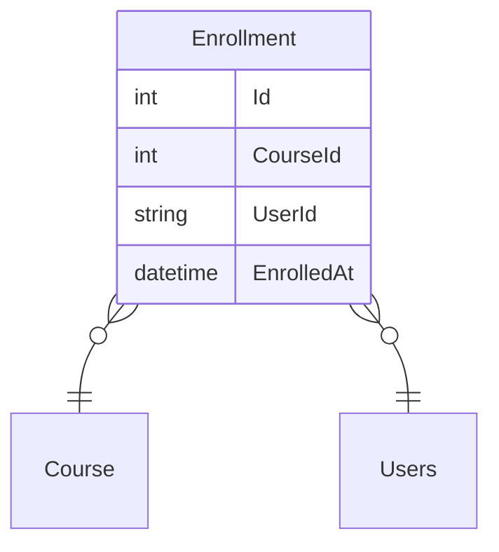
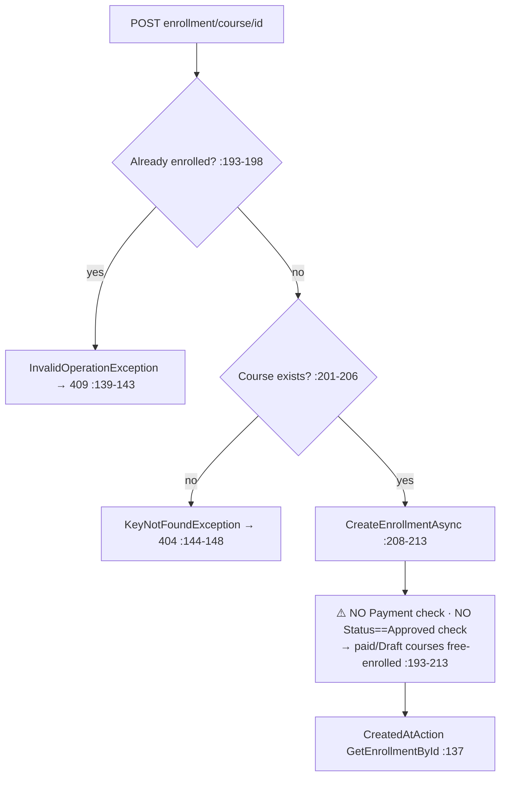

# EnrollmentController Module Documentation (API)

---

## Overview

### Purpose
Course enrollment lifecycle: list, detail, enroll, unenroll, counts, and check.

### Business Objective
Manage the student↔course relationship that gates learning, progress, ratings, and comments.

### Main Functionality
- Enrollments list (user-scoped)
- Enrollment by id / by course
- Enroll in course / unenroll
- Count + check endpoints

### Primary User Roles

| Role | Description |
|------|-------------|
| Authenticated | Enroll/manage own enrollments |

---

## Module Architecture

```
Presentation           API controllers (JSON)
Application            IEnrollmentService
Storage                Enrollment rows (UserId × CourseId)
```

### Controllers

| Controller | Responsibility |
|-----------|----------------|
| `EnrollmentController` | 7 actions (`api/Enrollment`) — class-level `[Authorize]` |

### Services

| Service | Responsibility |
|---------|----------------|
| `EnrollmentService` | CRUD + bulk creation (used by payment flow) |

---

## Folder Structure

```
Controllers/Learner/
+-- EnrollmentController.cs           # 7 actions (234 lines)

Services/
+-- EnrollmentService.cs

Models/Entities/
+-- Enrollment.cs                     # CourseId, UserId, EnrolledAt
```

---

## Database Design



---

## Endpoints

**Route**: `api/Enrollment`  
**Authorization**: class-level `[Authorize]` (:17)

| # | Action | HTTP | Route | Description |
|---|--------|------|-------|-------------|
| 1 | GetEnrollments | GET | `api/Enrollment` | My enrollments (:36, user-scoped ✅) |
| 2 | GetEnrollmentById | GET | `api/Enrollment/{enrollmentId:int}` | ⚠️ IDOR + NRE→500 (:60) |
| 3 | GetCourseEnrollment | GET | `api/Enrollment/course/{courseId:int}` | My enrollment for course (:90) |
| 4 | EnrollInCourse | POST | `api/Enrollment/course/{courseId:int}` | ⚠️ payment bypass (:120) |
| 5 | Unenroll | DELETE | `api/Enrollment/{enrollmentId:int}` | ⚠️ IDOR delete (:156) |
| 6 | GetEnrollmentsCount | GET | `api/Enrollment/count` | Count (user-scoped) (:186) |
| 7 | CheckEnrollment | GET | `api/Enrollment/check/{courseId:int}` | Boolean (user-scoped) (:210) |

---

## Internal Workflows & Runtime Behavior

### Workflow 1: Enroll



### Workflow 2: Get By Id (broken 404)

```mermaid
flowchart TD
    A[GET enrollment/id] --> B[Service maps missing enrollment<br/>→ NRE at dto.CourseId :52-57]
    B --> C[500 — controller NotFound() :76-79 is DEAD CODE]
```

### Workflow 3: Unenroll

```mermaid
flowchart TD
    A[DELETE enrollment/id] --> B[DeleteAsync(id) — NO ownership check<br/>EnrollmentService.cs:229-242]
    B --> C[⚠️ any authenticated user unenrolls anyone]
```

---

## Service Layer

| Service | Key logic (verified) |
|---------|----------------------|
| `EnrollmentService` | `GetEnrollmentByIdAsync` NREs on missing row (:52-57); `CreateEnrollmentAsync` checks only already-enrolled + course exists (:193-213); `DeleteEnrollmentAsync` raw delete (:229-242); `CreateBulkEnrollmentsAsync` exists for the payment flow (:244-269) |

---

## Business Rules

| Rule | Verified in | Why it exists |
|------|-------------|---------------|
| Duplicate enrollment rejected | EnrollmentService.cs:193-198 | One seat per student |
| Course must exist | :201-206 | FK integrity |
| **Paid courses require payment** | ❌ **NOT enforced here** — the payment flow calls `CreateBulkEnrollmentsAsync`; the direct endpoint bypasses it entirely | |

---

## Security Analysis

| Control | Status |
|---------|--------|
| Authentication | ✅ class-level |
| **Payment bypass (critical)** | ❌ `POST api/Enrollment/course/{courseId}` enrolls without payment or Approved status (EnrollmentService.cs:193-213) — Stripe never invoked |
| **IDOR** | ❌ read (action 2) + delete (action 5) without ownership |
| Error handling | NRE → 500 instead of 404; controller null-branch dead |

---

## Hidden Behaviors & Technical Notes

1. **Critical**: the direct enroll endpoint gives free access to paid/Draft/Rejected courses — the checkout bypass exists at the API surface, not just the UI.
2. **NRE → 500** on missing enrollment (EnrollmentService.cs:52-57).
3. **Dead NotFound branch** (EnrollmentController.cs:76-79).
4. `CreateBulkEnrollmentsAsync` (:244-269) is the payment-flow entry point — the two paths have divergent checks (payment path enforced by PaymentService, direct path not).

---

## Configuration

| Key | Purpose |
|-----|---------|
| (none module-specific) | — |

---

## Change Log

**Current functionality (verified):** user-scoped list/count/check, enroll/unenroll — with a critical payment-bypass enrollment path and IDOR read/delete.

**Maintenance notes:**
- Require payment (or approved-free flag) in `CreateEnrollmentAsync`.
- Ownership-check read + delete; fix the NRE→404.