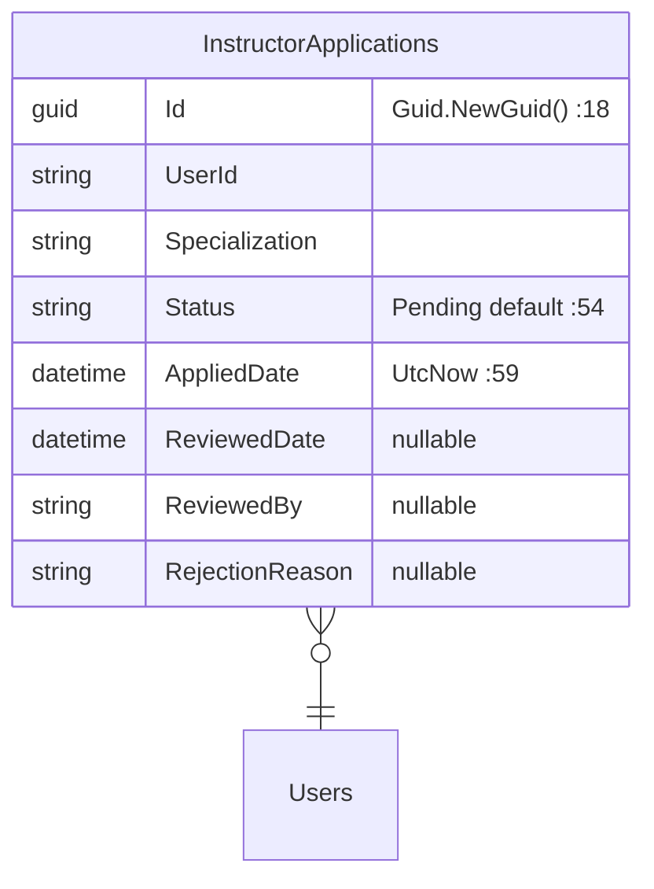

# InstructorApplicationController Module Documentation (API)

---

## Overview

### Purpose
Instructor onboarding: apply with CV + profile image, list my applications, view details.

### Business Objective
Convert interested students into `InstructorPending` applicants; admins review and approve.

### Main Functionality
- Apply (multipart: CV + image + profile fields)
- My applications list
- Application details (ownership-enforced)

### Primary User Roles

| Role | Description |
|------|-------------|
| Student | Apply (role-gated) |
| Authenticated | Track applications |

---

## Module Architecture

```
Presentation           API controllers (JSON)
Application            IInstructorApplicationService
Storage                wwwroot/Images/cv-files + profile images
```

### Controllers

| Controller | Responsibility |
|-----------|----------------|
| `InstructorApplicationController` | 3 actions (`api/InstructorApplication`) — class-level `[Authorize]` |

### Services

| Service | Responsibility |
|---------|----------------|
| `InstructorApplicationService` | Apply flow (role strip → InstructorPending → files → create), my-applications, details (ownership-enforced :260-264), admin review methods, `SaveFile` helper |

---

## Folder Structure

```
Controllers/Learner/
+-- InstructorApplicationController.cs   # 3 actions (197 lines)

Services/
+-- InstructorApplicationService.cs

wwwroot/Images/cv-files/                # CV storage
```

---

## Database Design



---

## Endpoints

**Route**: `api/InstructorApplication`  
**Authorization**: class-level `[Authorize]` (:22)

| # | Action | HTTP | Route | Auth | Description |
|---|--------|------|-------|------|-------------|
| 1 | Apply | POST | `api/InstructorApplication/apply` | 🎓 `[Authorize(Roles=SD.Student)]` (:59) | Multipart apply (:58) |
| 2 | GetMyApplications | GET | `api/InstructorApplication/my-applications` | 🔐 | Own applications (:113) |
| 3 | GetApplicationDetails | GET | `api/InstructorApplication/application-details/{id}` | 🔐 | Details, **ownership-checked** (:155) |

---

## Internal Workflows & Runtime Behavior

### Workflow 1: Apply

```mermaid
flowchart TD
    A[POST apply multipart<br/>[Consumes] :60 · [FromForm] DTO :65] --> B{Existing Pending/Approved? :99-109}
    B -->|yes| C[Block re-application]
    B -->|no| D[Update profile FullName/Phone/About :112-114]
    D --> E[Save profile image :116-119]
    E --> F[⚠️ REMOVE ALL current roles :129-138]
    F --> G[Add InstructorPending :141-146]
    G --> H[Save CV :154-158]
    H --> I[Create application Status=Pending :161-171]
    I --> J[200 message / 400 on failure]
    I -->|client cancel| K[HTTP 499 :79-86 ⚠️ non-standard]
```

### Workflow 2: Rejection → Role Reset

#### Behavior
- On rejection the service resets roles to `Student` (:485-496).

---

## Service Layer

| Service | Key logic (verified) |
|---------|----------------------|
| `InstructorApplicationService` | Duplicate guard only for Pending/Approved (:99-109) — rejected applicants may re-apply (intended); **role stripping removes ALL roles incl. non-Student ones** (:129-138); `SaveFile` (:548-579) with **no size/content-type/extension whitelist** — filename = `Guid + "_" + originalFileName` (:559), path traversal risk via `..\` in the original name |

---

## Business Rules

| Rule | Verified in | Why it exists |
|------|-------------|---------------|
| Only Students can apply | `[Authorize(Roles=SD.Student)]` :59 | Role ladder integrity |
| One active application | :99-109 | Prevent spam |
| Re-apply after rejection allowed | :99-109 | Second chances |
| Details ownership-enforced | :260-264 | Privacy (correct pattern) |

---

## Security Analysis

| Control | Status |
|---------|--------|
| Authentication | ✅ class-level + role gate |
| Ownership | ✅ details endpoint (the correct pattern — contrast Enrollment/CourseProgress IDORs) |
| **File upload validation** | ❌ no type/size whitelist; only the global 500MB cap (Program.cs:32-35) |
| **Path traversal** | ⚠️ original filename embedded in stored path (`Guid_originalFileName`) — `..\` injection risk (:559) |
| **WebRootPath null** | ❌ `SaveFile` does not guard `WebRootPath == null` (contrast CertificateService :89-93) |
| Status codes | ❌ HTTP 499 for client cancellation (:79-86) — non-standard |

---

## Hidden Behaviors & Technical Notes

1. **Role-stripping side effect**: a multi-role user (e.g., Student + Support) loses all roles while pending; on rejection resets to Student only.
2. **Rejected applicants re-apply freely** (no cool-down).
3. **Validation**: only `Specialization` required; FullName/Phone/Bio ≤ 200; Email optional.
4. **CV accept is client-side** in the MVC UI; the API accepts anything.

---

## Configuration

| Key | Purpose |
|-----|---------|
| `wwwroot/Images/cv-files/` | CV storage |

---

## Change Log

**Current functionality (verified):** role-gated apply flow with profile update + role transition, ownership-enforced details — with unvalidated file uploads (traversal risk) and the role-strip side effect.

**Maintenance notes:**
- Whitelist file types/sizes; sanitize filenames (drop path separators).
- Reconsider full role stripping; preserve unrelated roles.