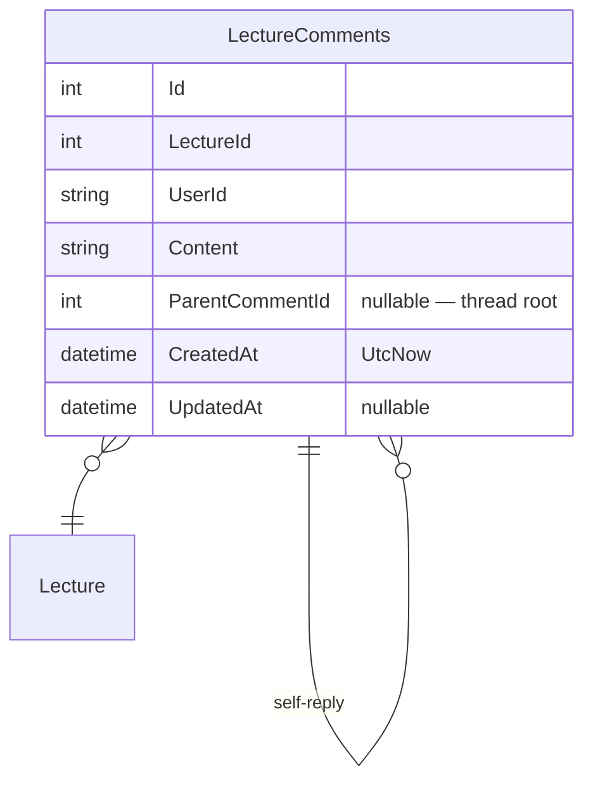
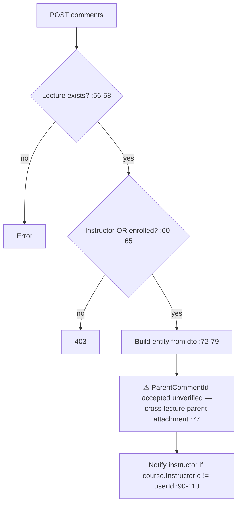
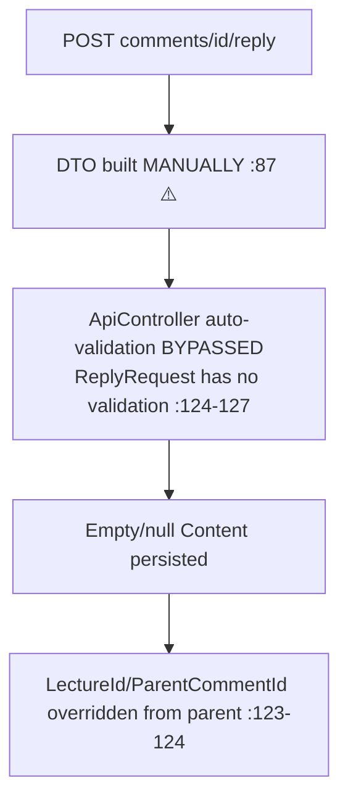

# LectureCommentsController Module Documentation (API)

---

## Overview

### Purpose
Lecture discussion threads: read comments, add, reply, delete own.

### Business Objective
Course Q&A: enrolled students + the instructor discuss lectures; instructor replies are flagged.

### Main Functionality
- Get comments for a lecture (public read)
- Add comment (enrolled/instructor gate)
- Reply (⚠️ ungated)
- Delete own comment

### Primary User Roles

| Role | Description |
|------|-------------|
| Anonymous | Read |
| Enrolled learners + course instructor | Comment, reply, delete own |

---

## Module Architecture

```
Presentation           API controllers (JSON)
Application            ILectureCommentService
Storage                LectureComments (threaded via ParentCommentId)
```

### Controllers

| Controller | Responsibility |
|-----------|----------------|
| `LectureCommentsController` | 4 actions (`api/comments` — literal route, not `[controller]`) |

### Services

| Service | Responsibility |
|---------|----------------|
| `LectureCommentService` | Add (parent verification, instructor notify), list (N+1 instructor flags), delete (author-only) |

---

## Folder Structure

```
Controllers/Learner/
+-- LectureCommentsController.cs      # 4 actions (128 lines)

Services/
+-- LectureCommentService.cs

Models/Entities/
+-- LectureComment.cs                 # ParentCommentId?, Replies initialized :21
```

---

## Database Design



---

## Endpoints

**Route**: `api/comments`  
**Authorization**: none class-level — per-action

| # | Action | HTTP | Route | Auth | Description |
|---|--------|------|-------|------|-------------|
| 1 | GetComments | GET | `api/comments/lecture/{lectureId}` | 🔓 | Thread read (:31) |
| 2 | AddComment | POST | `api/comments` | 🔐 | Add (enrolled/instructor gate :60-65) |
| 3 | ReplyToComment | POST | `api/comments/{commentId}/reply` | 🔐 | ⚠️ NO enrollment check (:78) |
| 4 | DeleteComment | DELETE | `api/comments/{commentId}` | 🔐 | Author-only (:101) |

---

## Internal Workflows & Runtime Behavior

### Workflow 1: Add Comment



### Workflow 2: Reply (ungated)



#### Runtime Behavior
- **No enrollment/instructor check on reply** — any authenticated user can reply to any comment in any course (LectureCommentsController.cs:78-95).
- **Validation bypass**: `ReplyRequest.Content` has no `[Required]`/length; manual DTO construction skips `[ApiController]` validation — empty content can be saved.

### Workflow 3: Delete

#### Behavior
- Service enforces `comment.UserId == userId` (LectureCommentService.cs:183) — author-only; deletes replies then the comment (:186-190).
- **No instructor/admin moderation path** — only authors can delete.

---

## Service Layer

| Service | Key logic (verified) |
|---------|----------------------|
| `LectureCommentService` | N+1 `IsUserInstructor` per comment + reply (:53-64); parent-comment not verified against the lecture (:77); author-only delete (:183) |

---

## Business Rules

| Rule | Verified in | Why it exists |
|------|-------------|---------------|
| Add requires enrolled or instructor | :60-65 | Comment walls |
| Delete author-only | LectureCommentService.cs:183 | Ownership |
| Content 1–1000 (add only) | `CreateLectureCommentDTO` | Length control (bypassed on reply) |
| Replies inherit parent's LectureId | :123-124 | Thread integrity (safe axis) |

---

## Security Analysis

| Control | Status |
|---------|--------|
| **Reply authorization gap** | ❌ any authenticated user replies anywhere (critical) |
| **Validation bypass** | ❌ empty content persistable via manual DTO (verified) |
| Cross-lecture parent | ⚠️ `ParentCommentId` from client unverified (LectureCommentService.cs:77) |
| Public reads | mild exposure of discussions; enrollment-gated writing only |
| Moderation | ❌ no admin/instructor delete path |
| Performance | N+1 queries per thread |

---

## Hidden Behaviors & Technical Notes

1. **Critical**: ungated reply endpoint + validation bypass — spam/injection surface.
2. **Cross-lecture reply attachment** possible via `AddCommentAsync` (LectureCommentService.cs:77).
3. **Literal route** `api/comments` (not `api/LectureComments`) — callers must know the alias.
4. **Instructor flag N+1** — each comment + reply triggers 2 extra DB round-trips.

---

## Configuration

| Key | Purpose |
|-----|---------|
| (none module-specific) | — |

---

## Change Log

**Current functionality (verified):** public thread reads, gated adds, author-only deletes — with an ungated reply endpoint and bypassed validation.

**Maintenance notes:**
- Gate replies with the same enrolled/instructor check as AddComment.
- Restore `[ApiController]` validation (annotate `ReplyRequest`, bind it directly).
- Verify parent comment belongs to the lecture; add a moderation delete path.