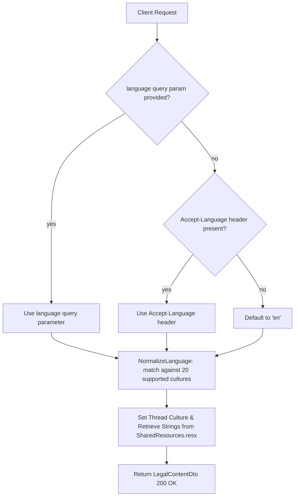

# LegalController Module Documentation (API)

---

## Overview

### Purpose
Controller providing localized platform information, About Us, Privacy Policy, and Terms of Service for web, mobile, and third-party clients.

### Business Objective
Deliver localized, legally compliant platform documentation and disclosures (About EduLab, Terms of Service, Privacy Policy) without requiring user authentication.

### Main Functionality
- `GET api/Legal/about` → About Us platform info (`LegalContentDto`)
- `GET api/Legal/privacy-policy` → Privacy policy document (`LegalContentDto`)
- `GET api/Legal/terms` → Terms of service document (`LegalContentDto`)
- `GET api/Legal/all` → All legal documents bundled in a dictionary (`Dictionary<string, LegalContentDto>`)

### Primary User Roles

| Role | Description |
|------|-------------|
| Anonymous / All | Public access to platform disclosures and legal documentation |

---

## Module Architecture

```
Presentation           LegalController.cs (JSON)
Application            ILegalService / LegalService
Localization           SharedResources (.resx files for 20 cultures)
```

### Controllers

| Controller | Responsibility |
|-----------|----------------|
| `LegalController` | 4 actions (`api/Legal`) — class `[AllowAnonymous]` |

### Services

| Service | Responsibility |
|---------|----------------|
| `LegalService` | Resolves localized text sections from `IStringLocalizer<SharedResources>`, handles culture fallback, builds section bullet points |

---

## Folder Structure

```
Controllers/Learner/
+-- LegalController.cs                # 4 actions (87 lines)

Services (Application layer)
+-- LegalService.cs                   # Localization resolution (257 lines)

DTOs/Legal/
+-- LegalContentDto.cs                # Document title, subtitle, sections
+-- LegalSectionDto.cs                # Section title, content, icon, bullet points
```

---

## Endpoints

**Route**: `api/Legal`  
**Authorization**: `[AllowAnonymous]` (:18)

| # | Action | HTTP | Route | Auth | Description |
|---|--------|------|-------|------|-------------|
| 1 | GetAbout | GET | `api/Legal/about?language=` | 🔓 | About EduLab information (:35) |
| 2 | GetPrivacyPolicy | GET | `api/Legal/privacy-policy?language=` | 🔓 | Privacy policy document (:49) |
| 3 | GetTerms | GET | `api/Legal/terms?language=` | 🔓 | Terms of service document (:63) |
| 4 | GetAll | GET | `api/Legal/all?language=` | 🔓 | All legal documents at once (:77) |

---

## Internal Workflows & Runtime Behavior

### Workflow 1: Language Detection & Resolution



#### Runtime Behavior
- Fallback chain: `query param` → `Accept-Language header` → `'en'`.
- Supported cultures (20): `ar`, `en`, `de`, `es`, `fr`, `hi`, `id`, `it`, `ja`, `ko`, `ms`, `nl`, `pl`, `pt`, `ru`, `tr`, `uk`, `ur`, `vi`, `zh`.
- If an unsupported language code is passed, it falls back to Arabic (`ar`) if starting with `ar`, otherwise English (`en`).
- All documents contain metadata: `Type`, `Title`, `Subtitle`, `LastUpdated`, `AppVersion`, `ContactEmail`, `WebsiteUrl`, and a list of `Sections` with optional bullet points and icon indicators.

---

## Business Rules

| Rule | Verified in | Why it exists |
|------|-------------|---------------|
| Publicly accessible without auth | `LegalController.cs:18` | Compliance requirements dictate terms & policies must be readable before registration |
| 20 supported languages | `LegalService.cs:26-30` | Matches platform-wide internationalization scope |

---

## Security Analysis

| Control | Status |
|---------|--------|
| Authentication | 🔓 Completely open (`[AllowAnonymous]`) |
| Data sensitivity | Zero PII; read-only static/localized content |
| Injection risk | Language code is strictly matched against whitelist (`SupportedLanguages`); safe from culture injection |

---

## Change Log

**Current functionality (verified):** Dedicated controller providing About Us, Privacy Policy, Terms of Service, and bulk retrieval for web and mobile clients with 20-language localization.
