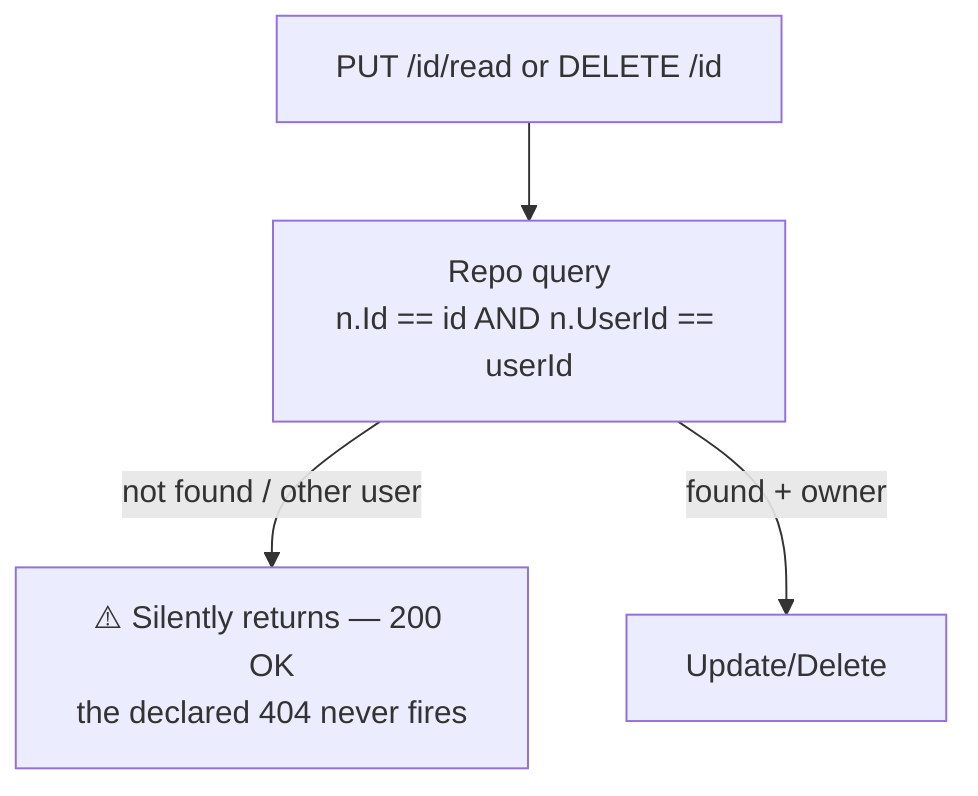

# NotificationsController Module Documentation (API)

---

## Overview

### Purpose
User notification inbox: list, summary, read/unread, mark-all-read, delete, and the admin bulk-send surface.

### Business Objective
Keep users informed (certificates, course events, promotions) in-app (+ optional email for bulk).

### Main Functionality
- Paginated notifications with type/status filters
- Summary + unread count
- Mark one / all read
- Delete one / all
- Bulk send (admin policy)

### Primary User Roles

| Role | Description |
|------|-------------|
| Authenticated | Own inbox (self-scoped) |
| Admin (AdminArea policy) | Bulk send |

---

## Module Architecture

```
Presentation           API controllers (JSON)
Application            INotificationService
Storage                Notifications table (UserId-scoped)
```

### Controllers

| Controller | Responsibility |
|-----------|----------------|
| `NotificationsController` | 8 actions (`api/Notifications`) — class `[Authorize]` |

### Services

| Service | Responsibility |
|---------|----------------|
| `NotificationService` | User-scoped queries, bulk send loops, email integration |

---

## Folder Structure

```
Controllers/Learner/
+-- NotificationsController.cs        # 8 actions

Services (Application layer)
+-- NotificationService.cs            # bulk :405-479, per-user email :814-901
```

---

## Endpoints

**Route**: `api/Notifications`  
**Authorization**: class `[Authorize]` (:14-17)

| # | Action | HTTP | Route | Auth | Description |
|---|--------|------|-------|------|-------------|
| 1 | GetNotifications | GET | `api/Notifications` | 🔐 | Filtered list (PageNumber=1, PageSize=10) |
| 2 | GetNotificationSummary | GET | `api/Notifications/summary` | 🔐 | Counts by type/status |
| 3 | GetUnreadCount | GET | `api/Notifications/unread-count` | 🔐 | Int |
| 4 | MarkAllAsRead | POST | `api/Notifications/mark-all-read` | 🔐 | All → read |
| 5 | MarkAsRead | PUT | `api/Notifications/{id}/read` | 🔐 | One → read (:312) |
| 6 | SendBulkNotification | POST | `api/Notifications/send-bulk` | 🛡️ AdminArea policy (:384) | Bulk push/email |
| 7 | DeleteNotification | DELETE | `api/Notifications/{id}` | 🔐 | One delete (:463) |
| 8 | DeleteAllNotifications | DELETE | `api/Notifications/delete-all` | 🔐 | All delete (:537) |

---

## Internal Workflows & Runtime Behavior

### Workflow 1: Mark Read / Delete (silent no-op)



#### Runtime Behavior
- `MarkNotificationAsReadAsync`/`DeleteNotificationAsync` swallow "not found" (NotificationRepository.cs:301-306; NotificationService.cs:304-318) — the controller's 404 responses (declared :316, :467) are **unreachable**.
- Cross-user access is blocked (correct), but no 404 is ever emitted.

### Workflow 2: Bulk Send

```mermaid
flowchart TD
    A[POST send-bulk AdminNotificationRequestDto] --> B[Targets: Student / Instructor roles<br/>or all users :814-901]
    B --> C[Per-user create + email loop]
    C --> D[Partial failures collected in Errors]
    D --> E[Ok(result) — ⚠️ 200 even with errors<br/>IsSuccess never used :446-451]
```

#### Runtime Behavior
- `GetUsersByTargetAsync` swallows all exceptions → empty list (NotificationService.cs:522-526).
- **Arabic error messages** in an otherwise English controller (:402-435).
- Email subject = `request.Title.Trim()` (NotificationService.cs:883).

---

## Business Rules

| Rule | Verified in | Why it exists |
|------|-------------|---------------|
| All user actions self-scoped | repo `UserId == userId` filters | Privacy (no IDOR ✅) |
| Admin-only bulk | `[Authorize(Policy="AdminArea")]` :384 | Broadcast authority |
| Status Unread→Read only | NotificationService.cs:192 | Simple lifecycle |

---

## Security Analysis

| Control | Status |
|---------|--------|
| Ownership | ✅ user-scoped queries throughout |
| **Bulk-send policy** | ⚠️ coarse: ANY single admin claim authorizes email to ALL users (Program.cs:42-47) |
| **Failure masking** | ❌ failed sends return 200 (IsSuccess computed but unused) |
| Identity | `NameIdentifier` claim; missing → 401 via `UnauthorizedAccessException` (:46-55) |
| Status codes | nonstandard 499 for cancellations (:112-117) |

---

## Hidden Behaviors & Technical Notes

1. **Never-404 read/delete**: "not found" and "not yours" both return 200 — documented API contract (404 `ProducesResponseType`) is violated.
2. **Failed bulk sends look successful** — `BulkNotificationResultDto.IsSuccess` is never consulted for the HTTP status.
3. **No CancellationToken** on `SendBulkNotification` — client disconnect aborts mid-loop (unhandled).
4. **`MarkAllAsRead`/`DeleteAll`** are fully user-scoped (no surprises).

---

## Configuration

| Key | Purpose |
|-----|---------|
| SMTP | bulk email delivery (appsettings.json:23-29) |

---

## Change Log

**Current functionality (verified):** self-scoped inbox with read/delete semantics that never 404, and a coarse-policy bulk broadcast that masks partial failures.

**Maintenance notes:**
- Return 404 for missing/foreign ids.
- Honor `IsSuccess` in the HTTP status; use per-claim policy for bulk send.