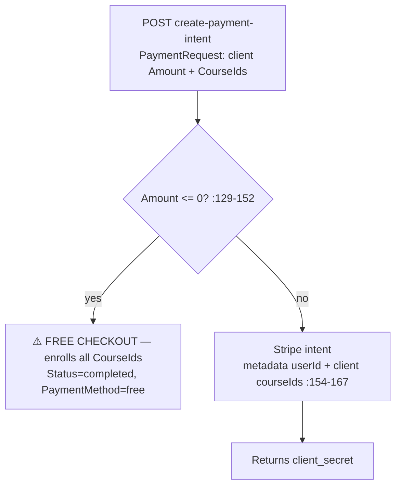
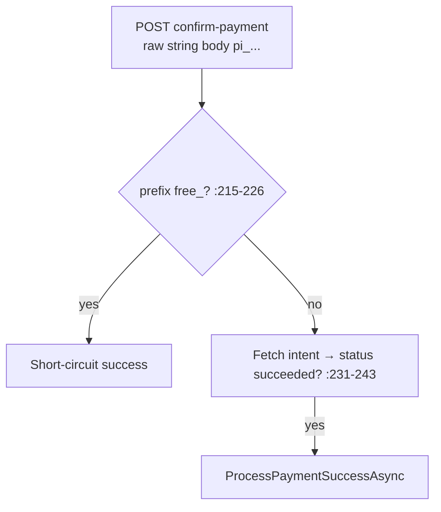
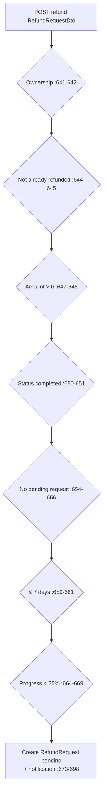

# PaymentController Module Documentation (API)

---

## Overview

### Purpose
Monetization surface: Stripe payment intents, checkout sessions, confirmation, refunds, and payment history.

### Business Objective
Charge for courses via Stripe, enroll on success, and support the 7-day refund policy with admin review.

### Main Functionality
- Create payment intent (paid + free-checkout branch)
- Confirm payment / checkout session
- Success/cancel callbacks
- Refund request (policy-gated)
- Payment history with refundability flags

### Primary User Roles

| Role | Description |
|------|-------------|
| Authenticated | Pay / request refunds |
| Anonymous | Success/cancel callbacks (side-effectful!) |

---

## Module Architecture

```
Presentation           API controllers (JSON)
Application            IPaymentService + ICartService (unused!)
External               Stripe (PaymentIntents + Checkout Sessions),
                       SMTP (receipts), SignalR (none)
```

### Controllers

| Controller | Responsibility |
|-----------|----------------|
| `PaymentController` | 8 actions (`api/Payment`) — class `[Authorize]`, callbacks `[AllowAnonymous]` |

### Services

| Service | Responsibility |
|---------|----------------|
| `PaymentService` | Intent/checkout creation, success processing, refunds (7-day/25% gates), history |

---

## Folder Structure

```
Controllers/Learner/
+-- PaymentController.cs              # 8 actions

Services (Application layer)
+-- PaymentService.cs                 # ~960 lines
```

---

## Endpoints

**Route**: `api/Payment`  
**Authorization**: class `[Authorize]` (:20-24)

| # | Action | HTTP | Route | Auth | Description |
|---|--------|------|-------|------|-------------|
| 1 | CreatePaymentIntent | POST | `api/Payment/create-payment-intent` | 🔐 | Stripe intent or free checkout (:80) |
| 2 | ConfirmPayment | POST | `api/Payment/confirm-payment` | 🔐 | `[FromBody] string paymentIntentId` (raw JSON string!) (:131) |
| 3 | CreateCheckoutSession | POST | `api/Payment/create-checkout-session` | 🔐 | Stripe Checkout from server cart (:169) |
| 4 | GetUserData | GET | `api/Payment/user-data` | 🔐 | Partial ProfileDTO (:211) |
| 5 | PaymentSuccess | GET | `api/Payment/success?session_id` | 🔓 | ⚠️ Side effects! (:262) |
| 6 | PaymentCancel | GET | `api/Payment/cancel` | 🔓 | Stub (:292) |
| 7 | RequestRefund | POST | `api/Payment/refund` | 🔐 | Policy-gated refund request (:309) |
| 8 | GetUserPayments | GET | `api/Payment/user-payments` | 🔐 | History + refundability (:349) |

---

## Internal Workflows & Runtime Behavior

### Workflow 1: Create Payment Intent



#### Runtime Behavior
- **Amount and CourseIds are client-controlled** — `Amount <= 0` bypasses Stripe entirely and creates enrollments for ANY submitted CourseIds (no existence/Approved/price check) (PaymentService.cs:129-152).
- `PaymentMethodId ??= "temp_payment_method"` placeholder (:108) is **never read** — dead field.

### Workflow 2: Checkout Session → Success (BROKEN)

```mermaid
flowchart TD
    A[POST create-checkout-session<br/>cart from DB :343-347] --> B[SuccessUrl = ReturnUrl +<br/>?success=true&session_id={CHECKOUT_SESSION_ID} :397]
    B --> C[Client redirected to MVC /success]
    C --> D[GET api/Payment/success?session_id=cs_... :276]
    D --> E[ProcessPaymentSuccessAsync(cs_...)]
    E --> F[PaymentIntentService.GetAsync(cs_...) :281]
    F --> G[❌ Stripe REJECTS cs_ IDs —<br/>StripeException → 500 :316-320]
    G --> H[Charged but NEVER enrolled, no Payment row]
```

#### Runtime Behavior
- **CRITICAL**: the checkout flow embeds `{CHECKOUT_SESSION_ID}` (`cs_…`) into the success URL, but the callback treats it as a PaymentIntent ID (`pi_…`) — Stripe rejects it, the user is **charged but never enrolled** (PaymentService.cs:397, 281, 316-320).

### Workflow 3: Confirm Payment (working path)



### Workflow 4: Refund Request



#### Runtime Behavior
- **Progress gate bypass**: `if (enrollment != null)` (:665) — a user with a deleted enrollment skips the 25% check.
- `IsRefundable` formula (GetUserPaymentsAsync :935): amount>0 AND ≤7d AND progress<25 AND status ∈ {completed, Succeeded, Paid} AND no pending/accepted request.
- **Status constant mismatch**: SD.cs:57-58 defines `Succeeded`/`Paid` (capitalized) but stored values are lowercase `"completed"` (PaymentService.cs:474, 503) — only the lowercase constant ever matches.

---

## Service Layer

| Service | Key logic (verified) |
|---------|----------------------|
| `PaymentService` | Free checkout at `Amount<=0` (:129-152); no idempotency in `CreatePaymentRecordsAsync` (:466-490) — replays create duplicate Payments + Enrollments; `Currency="usd"` hardcoded (:384); refund admin path deletes the enrollment (:756-904); `StripeConfiguration.ApiKey` from config, throws `ArgumentException` when missing (:82-88) |

---

## Business Rules

| Rule | Verified in | Why it exists |
|------|-------------|---------------|
| Refund ≤ 7 days | PaymentService.cs:659-661 | Policy window |
| Refund progress < 25% | :664-669 | Anti-abuse |
| Own payments only | :641-642 | Privacy |
| Free checkout for $0 carts | :356-375 (session), :129-152 (intent) | Frictionless free content |

---

## Security Analysis

| Control | Status |
|---------|--------|
| **Price trust (critical)** | ❌ client `Amount` + `CourseIds` — free enrollment for paid courses (PaymentService.cs:129-152) |
| **Unauthenticated side effects** | ❌ `/success` `[AllowAnonymous]` GET triggers enrollment on knowledge of an ID + replays duplicates |
| Idempotency | ❌ duplicate Payment/Enrollment rows on replay |
| Ownership (refunds) | ✅ verified |
| **Open redirect** | ⚠️ `ReturnUrl` unvalidated (any origin) (:397-398) |
| Error mapping | `ApplicationException` → 400 (not 402/502) (:113-117) |

---

## Hidden Behaviors & Technical Notes

1. **Broken checkout flow** — `cs_` vs `pi_` mismatch (critical).
2. **Client-controlled price** — free checkout exploit.
3. **`ICartService` injected but never used** (PaymentController.cs:29, 52) — dead dependency.
4. **`PaymentCancel` is a stub** (:292-299).
5. **Empty `courseIds` + paid amount** → `int.Parse("")` FormatException → 500 (:283-287).
6. **`GetUserData` returns 5 of 10 ProfileDTO props**; `[ProducesResponseType(PaymentResponse, 200)]` on it is wrong (:212 vs :216).
7. **`SavePaymentMethod` dead field** (CheckoutRequest.cs:11).
8. **Notification amount hardcoded as dollars** `(Amount/100m):C` (:296-307) — wrong currency symbol for non-USD locales.

---

## Configuration

| Key | Purpose |
|-----|---------|
| `Stripe:SecretKey` | Stripe API (test keys committed in appsettings.json:44-47) |
| SMTP | receipts |

---

## Change Log

**Current functionality (verified):** payment intents + free checkout + refund policy — with a broken checkout-session flow, client-trusted pricing, and no idempotency.

**Maintenance notes:**
- Server-side price recomputation (course prices from DB, not client).
- Fix the checkout callback (`pi_` intent id or session retrieval via `CheckoutSessionService`).
- Idempotency keys; validate ReturnUrl.