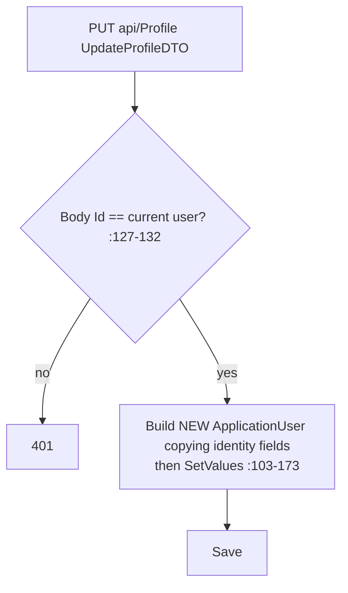
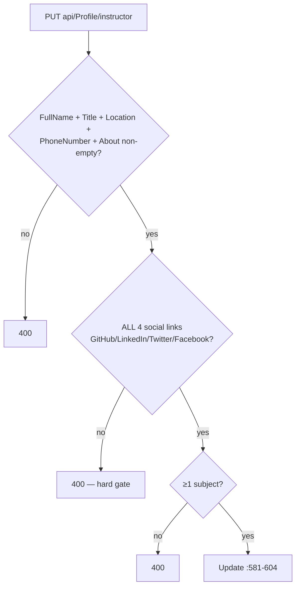

# ProfileController Module Documentation (API)

---

## Overview

### Purpose
User + instructor profile management: read/update profile, image uploads, public instructor profile, and instructor credentials (certificates).

### Business Objective
Maintain identity data (name/email/phone/address) and instructor branding (bio, socials, subjects, certificates).

### Main Functionality
- Get/update profile (ownership-checked)
- Profile image upload
- Instructor profile (private + public) with latest courses
- Instructor certificates add/delete

### Primary User Roles

| Role | Description |
|------|-------------|
| Authenticated | Own profile |
| Instructor | Instructor profile + certificates |
| Anonymous | Public instructor profile (⚠️ leaks PII) |

---

## Module Architecture

```
Presentation           API controllers (JSON)
Application            IProfileService + ICurrentUserService
Storage                wwwroot/Images/profiles + instructor_profiles
```

### Controllers

| Controller | Responsibility |
|-----------|----------------|
| `ProfileController` | 8 actions (`api/Profile`) — class `[Authorize]` |

### Services

| Service | Responsibility |
|---------|----------------|
| `ProfileService` | Full-entity-rebuild updates, image writes, completeness gate, social-link cleaning |

---

## Folder Structure

```
Controllers/Learner/
+-- ProfileController.cs              # 8 actions

Services (Application layer)
+-- ProfileService.cs
```

---

## Endpoints

**Route**: `api/Profile`  
**Authorization**: class `[Authorize]` (:15-18)

| # | Action | HTTP | Route | Auth | Description |
|---|--------|------|-------|------|-------------|
| 1 | GetProfile | GET | `api/Profile` | 🔐 | Current profile (:54) |
| 2 | UpdateProfile | PUT | `api/Profile` | 🔐 | Update (body Id must match) (:105) |
| 3 | UploadProfileImage | POST | `api/Profile/upload-image` | 🔐 | Form file (:166) |
| 4 | GetInstructorProfile | GET | `api/Profile/instructor?latestCoursesCount=2` | 🎓 Instructor (:230) |
| 5 | GetPublicInstructorProfile | GET | `api/Profile/public/instructor/{instructorId}` | 🔓 ⚠️ PII leak (:283) |
| 6 | UpdateInstructorProfile | PUT | `api/Profile/instructor` | 🎓 Instructor + completeness gate (:336) |
| 7 | UploadInstructorProfileImage | POST | `api/Profile/instructor/upload-image` | 🎓 Instructor (:405) |
| 8 | AddCertificate | POST | `api/Profile/certificates` | 🎓 Instructor (:471) |
| 9 | DeleteCertificate | DELETE | `api/Profile/certificates/{certId}` | 🎓 Instructor (:532) |

---

## Internal Workflows & Runtime Behavior

### Workflow 1: Update (identity rebuild)



### Workflow 2: Instructor Completeness Gate



#### Runtime Behavior
- The completeness gate forces **all four social networks** — clients cannot save partial profiles (ProfileController.cs:358-363, 581-604).

### Workflow 3: Image Upload

#### Behavior
- Writes `wwwroot/Images/profiles/{Guid}_{originalFileName}` (ProfileService.cs:184-205) with **no content-type/size validation**; file written BEFORE the DB update — orphan files on DB failure (no cleanup).

---

## Business Rules

| Rule | Verified in | Why it exists |
|------|-------------|---------------|
| Body Id must equal caller | ProfileController.cs:127-132 | No IDOR (✅) |
| Certificates scoped to caller | ProfileService.cs:508-509, 547 | Credential ownership |
| Instructor profile completeness | :581-604 | Storefront quality |
| Email change → unconfirmed, no re-verify | UserSettingsService (settings) / ProfileService | ⚠️ (see Settings doc) |

---

## Security Analysis

| Control | Status |
|---------|--------|
| Ownership | ✅ all mutating actions 401 on mismatch |
| **Public PII leak** | ❌ `GET public/instructor/{id}` returns full DTO incl. Email, PhoneNumber, PostalCode, Location (ProfileDTO.cs:14-64; mapping ProfileService.cs:319 does not scrub) |
| **Arbitrary file upload** | ❌ no type/size check; `UseStaticFiles` serves uploaded `.html` → stored-XSS vector (Program.cs:230-235) |
| Error leakage | Arabic exception messages leak to clients (ProfileService.cs:217 → :212-216) |
| `latestCoursesCount` unbounded | client may pass 100000 (:236) |

---

## Hidden Behaviors & Technical Notes

1. **Public instructor endpoint leaks contact PII** — the most serious finding here.
2. **Orphan files** on failed DB updates (no cleanup).
3. **`[ProducesResponseType(typeof(string),200)]` lies** — uploads return `{ imageUrl }` (:167 vs :200).
4. **AddCertificate failure → 500 not 400** (:500-505).
5. **`CleanSocialLink`** strips schemes and nulls placeholder values containing "username" (ProfileService.cs:574-595).

---

## Configuration

| Key | Purpose |
|-----|---------|
| `wwwroot/Images/profiles/`, `instructor_profiles/` | Upload storage |

---

## Change Log

**Current functionality (verified):** ownership-checked profile CRUD with a hard instructor completeness gate — but a public endpoint leaks PII and uploads are unvalidated.

**Maintenance notes:**
- Scrub PII from the public instructor DTO.
- Validate upload content types/sizes; sanitize filenames; delete orphan files.