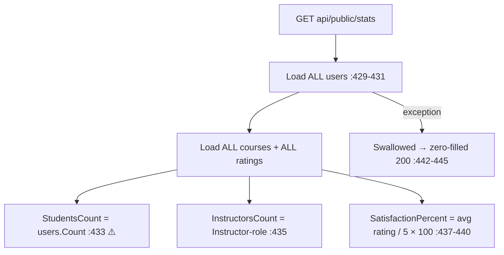

# PublicController Module Documentation (API)

---

## Overview

### Purpose
Public marketing stats: student count, course count, instructor count, satisfaction percentage.

### Business Objective
Power the home page's trust widgets ("X students learned with us").

### Main Functionality
- `GET api/public/stats` → `SiteStatsDto`

### Primary User Roles

| Role | Description |
|------|-------------|
| Anonymous | Read stats |

---

## Module Architecture

```
Presentation           API controllers (JSON)
Application            DashboardService.GetPublicStatsAsync
Storage                Users / Courses / Ratings full-table reads
```

### Controllers

| Controller | Responsibility |
|-----------|----------------|
| `PublicController` | 1 action (`api/public`) — `[AllowAnonymous]` |

### Services

| Service | Responsibility |
|---------|----------------|
| `DashboardService` | `GetPublicStatsAsync` (:423-448) |

---

## Folder Structure

```
Controllers/Learner/
+-- PublicController.cs               # 1 action (35 lines)
```

---

## Endpoints

**Route**: `api/public`  
**Authorization**: `[AllowAnonymous]` (:15-17)

| # | Action | HTTP | Route | Description |
|---|--------|------|-------|-------------|
| 1 | GetStats | GET | `api/public/stats` | Site stats (:32) |

---

## Internal Workflows & Runtime Behavior

### Workflow 1: Stats



#### Runtime Behavior
- **`StudentsCount` counts ALL users** (including instructors/admins) — inflated marketing number (DashboardService.cs:433).
- **No caching** despite `AddMemoryCache` being registered (Program.cs:40) — full-table scans per request.
- Zero ratings → `SatisfactionPercent = 0` (:439-440).

---

## Business Rules

| Rule | Verified in | Why it exists |
|------|-------------|---------------|
| Aggregate-only payload | `SiteStatsDto` | Marketing, no PII |

---

## Security Analysis

| Control | Status |
|---------|--------|
| Anonymous by design | ✅ aggregates only |
| **DoS surface** | ❌ unauthenticated full-table scans, no rate limit or cache |

---

## Hidden Behaviors & Technical Notes

1. **Mislabeled student count** — counts all users (DashboardService.cs:433).
2. **Errors masked** — DB failure renders all-zero stats as 200.
3. **Expensive endpoint**: 3 full-table loads per request on the most-visited page (home).

---

## Configuration

| Key | Purpose |
|-----|---------|
| (none module-specific) | — |

---

## Change Log

**Current functionality (verified):** single anonymous stats endpoint with inflated student counts, no caching, and swallowed failures.

**Maintenance notes:** role-filter `StudentsCount`; add caching; return 500 on failures.