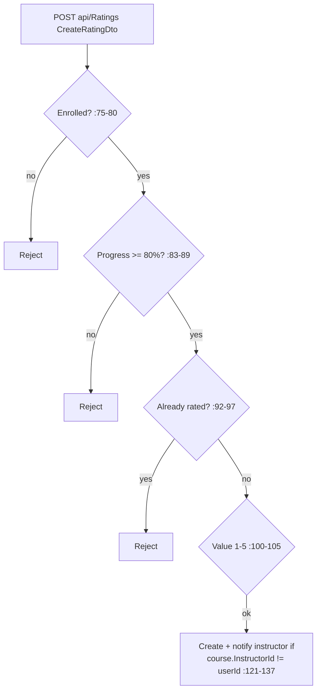

# RatingsController Module Documentation (API)

---

## Overview

### Purpose
Course ratings: public read (list + summary), personal rating CRUD with eligibility gates.

### Business Objective
Collect trustworthy reviews: only enrolled learners with ≥80% progress can rate, one rating per course.

### Main Functionality
- Paginated ratings + summary (anonymous)
- My rating + can-rate eligibility
- Add / update / delete own rating

### Primary User Roles

| Role | Description |
|------|-------------|
| Anonymous | Read ratings + summary |
| Enrolled learners (≥80%) | Rate |

---

## Module Architecture

```
Presentation           API controllers (JSON)
Application            IRatingService
Storage                Ratings table
```

### Controllers

| Controller | Responsibility |
|-----------|----------------|
| `RatingsController` | 7 actions (`api/Ratings`) — namespace `EduLab_API.Controllers` (anomaly, :8) |

### Services

| Service | Responsibility |
|---------|----------------|
| `RatingService` | Enrollment/progress gates, ownership filters, aggregates, instructor notify |

---

## Folder Structure

```
Controllers/Learner/
+-- RatingsController.cs              # 7 actions — namespace anomaly

Services (Application layer)
+-- RatingService.cs
```

---

## Endpoints

**Route**: `api/Ratings`  
**Authorization**: none class-level; mutating/private actions `[Authorize]`

| # | Action | HTTP | Route | Auth | Description |
|---|--------|------|-------|------|-------------|
| 1 | GetCourseRatings | GET | `api/Ratings/course/{courseId}` | 🔓 | Paginated (page=1, pageSize=10) |
| 2 | GetCourseRatingSummary | GET | `api/Ratings/course/{courseId}/summary` | 🔓 | Avg + distribution |
| 3 | GetMyRating | GET | `api/Ratings/course/{courseId}/my-rating` | 🔐 | Own rating or null |
| 4 | CanUserRateCourse | GET | `api/Ratings/can-rate/{courseId}` | 🔐 | Eligibility DTO |
| 5 | AddRating | POST | `api/Ratings` | 🔐 | Create (201) |
| 6 | UpdateRating | PUT | `api/Ratings/{ratingId}` | 🔐 | Update own |
| 7 | DeleteRating | DELETE | `api/Ratings/{ratingId}` | 🔐 | Delete own (204) |

---

## Internal Workflows & Runtime Behavior

### Workflow 1: Add Rating (gated)



#### Runtime Behavior
- **Race window**: enrollment checked at :75, then progress at :83 — if the enrollment is removed between them, `enrollment?.ProgressPercentage < 80` evaluates `null < 80 = false` → rating passes (:84).
- **Instructor self-rating possible** if enrolled (no role check) — progress gate still applies.

### Workflow 2: Pagination (in-memory)

#### Behavior
- Loads ALL course ratings, applies Skip/Take in memory (RatingService.cs:308-318) — O(n) per page; **no bounds on `page`/`pageSize`** — negative page → exception → 500; unlimited pageSize = DoS amplification.

### Workflow 3: Eligibility (fail-closed)

#### Behavior
- `CanUserRateCourseAsync` catches **every** exception and returns a fail-closed default (:410-421) — DB errors are indistinguishable from "not eligible" (no log).

---

## Service Layer

| Service | Key logic (verified) |
|---------|----------------------|
| `RatingService` | Update/Delete ownership filter `r.Id == ratingId && r.UserId == userId` (:172-175, :227-229) — no IDOR ✅; summary via raw repo aggregates (:337-365) |

---

## Business Rules

| Rule | Verified in | Why it exists |
|------|-------------|---------------|
| Enrolled + ≥80% progress | RatingService.cs:75-89, 395 | Trustworthy reviews |
| One rating per course | :92-97 | Fairness |
| Value 1-5 | DTO `[Range(1,5)]` (CreateRatingDto.cs:16) | Data quality |

---

## Security Analysis

| Control | Status |
|---------|--------|
| Ownership (update/delete) | ✅ repo-level filters |
| **PII on public reads** | ⚠️ `RatingDto` exposes reviewer `UserName`/`UserProfileImage` publicly (RatingDto.cs:14-15) — a PII surface for any course |
| **Race condition** | enrollment-removal window lets ratings through |
| Fail-closed masking | DB errors hidden from clients/server logs |
| Arabic error bodies | `StatusCode(500, "...")` not ProblemDetails (:74, :104, …) |

---

## Hidden Behaviors & Technical Notes

1. **Namespace anomaly** — `EduLab_API.Controllers` not `.Learner` (RatingsController.cs:8).
2. **In-memory pagination + unbounded pageSize** — DoS vector.
3. **`GetMyRating` returns 200 with null body** when not rated (:270-274) — consumers must null-check.
4. **Instructor self-rating** not blocked by role (only by enrollment/progress).

---

## Configuration

| Key | Purpose |
|-----|---------|
| (none module-specific) | — |

---

## Change Log

**Current functionality (verified):** enrollment/progress-gated rating CRUD with ownership-safe updates — plus unbounded in-memory pagination, a race window, and public reviewer PII.

**Maintenance notes:** DB-side pagination with bounds; close the race; optionally hide reviewer names on anonymous reads.