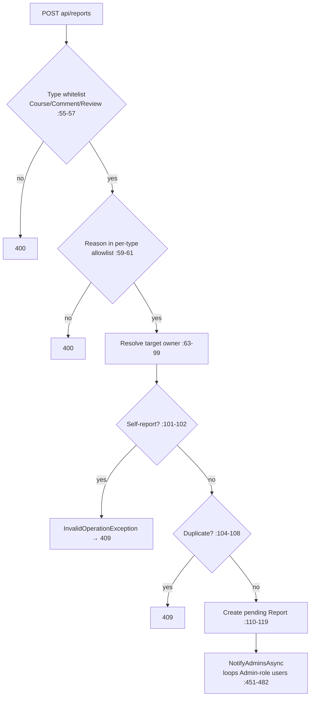

# ReportsController Module Documentation (API — Learner)

---

## Overview

### Purpose
Abuse reporting: check report state, batch-check targets, and submit reports for admin moderation.

### Business Objective
Let learners flag courses/comments/reviews; admins moderate via the admin queue.

### Main Functionality
- Check single target (reported?)
- Check many targets (comma-separated ids)
- Create report (type + target + reason)

### Primary User Roles

| Role | Description |
|------|-------------|
| Authenticated | Report (cannot report own content) |

---

## Module Architecture

```
Presentation           API controllers (JSON)
Application            IReportService
Storage                Reports table (reporter × type × target unique)
```

### Controllers

| Controller | Responsibility |
|-----------|----------------|
| `ReportsController` | 3 actions (`api/reports`) — class `[Authorize]` |

### Services

| Service | Responsibility |
|---------|----------------|
| `ReportService` | Create (whitelist + allowlist + owner resolution + dedupe + admin notify), check, check-many; admin-side methods (status/content-delete) used elsewhere |

---

## Folder Structure

```
Controllers/Learner/
+-- ReportsController.cs              # 3 actions
```

---

## Endpoints

**Route**: `api/reports`  
**Authorization**: class `[Authorize]` (:13-16)

| # | Action | HTTP | Route | Description |
|---|--------|------|-------|-------------|
| 1 | Check | GET | `api/reports/check?type&targetId` | `{ reported: bool }` (:27) |
| 2 | CheckMany | GET | `api/reports/check-many?type&ids` | `{ reportedIds }` (:46) |
| 3 | Create | POST | `api/reports` | Submit (Type, TargetId, Reason, Details≤1000) (:72) |

---

## Internal Workflows & Runtime Behavior

### Workflow 1: Create Report



#### Runtime Behavior
- `CreateReportDto.Type` is a free string — service-side whitelist decides (:55-57).
- `KeyNotFoundException` → 404, `InvalidOperationException` → 409, `ArgumentException` → 400 (:87-98).
- `NotifyAdminsAsync` swallows all errors; silently skips if no admins (:456-457, :478-481).
- ModelState check happens before the try block (:75-77).

### Workflow 2: Checks

#### Behavior
- **No `type` validation** on Check/CheckMany — arbitrary strings queried (ReportService.cs:163-168).
- CheckMany silently drops non-numeric tokens (:56-60).

---

## Service Layer

| Service | Key logic (verified) |
|---------|----------------------|
| `ReportService` | Owner resolution per type (course→instructor, comment→author via `Lecture.Section.Course`, review→rater) (:63-99); self-report blocked (:101-102); dedupe (:104-108); admin DTOs include `ReporterEmail`/`ReporterName`/`TargetOwnerName` (admin-only, never returned here) |

---

## Business Rules

| Rule | Verified in | Why it exists |
|------|-------------|---------------|
| Types Course/Comment/Review | ReportService.cs:55-57 (SD.cs:64-66) | Scoped moderation |
| Reason allowlist per type | SD.cs:84-112 | Consistent labels |
| Cannot report own content | :101-102 | Anti-griefing |
| Duplicates rejected | :104-108 | Spam control |

---

## Security Analysis

| Control | Status |
|---------|--------|
| Authentication | ✅ class-level |
| Self-report + duplicate guards | ✅ |
| Learner endpoints expose no admin DTOs | ✅ (no PII leak here) |
| Type validation on checks | ⚠️ none — user-scoped, low risk |
| Arabic sentinel fallbacks | `ResolveTargetAsync` returns literal `"الكورس محذوف"` etc. into admin DTOs (:365, :374, :380) |

---

## Hidden Behaviors & Technical Notes

1. **`Details` not `[Required]`** on the DTO (CreateReportDto.cs:13-18) — empty details allowed.
2. **Reason is a code, not free text** — `[MaxLength(50)]` is moot.
3. **Check endpoints return undocumented shapes** (`Ok(new { reported })` :37, :63).

---

## Configuration

| Key | Purpose |
|-----|---------|
| (none module-specific) | — |

---

## Change Log

**Current functionality (verified):** self-report-proof, dedupe-guarded report creation with admin notification, plus lenient state checks.

**Maintenance notes:** validate `type` on checks; make `Details` optional-by-design or required explicitly.