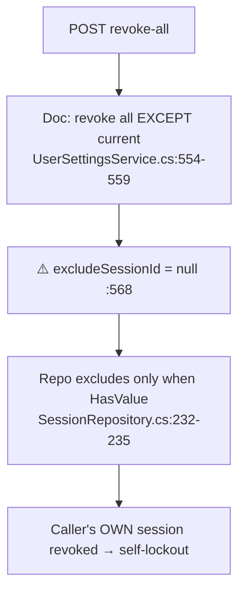

# SettingsController Module Documentation (API)

---

## Overview

### Purpose
Account settings: general info, password change, 2FA (authenticator), and active-session management.

### Business Objective
Self-service account security: users manage credentials, 2FA, and remote sessions.

### Main Functionality
- General settings get/update
- Change password (alert email sent)
- 2FA enable/disable/verify/setup/status
- Active sessions list + revoke (one / all)

### Primary User Roles

| Role | Description |
|------|-------------|
| Authenticated | Own settings (self-scoped) |

---

## Module Architecture

```
Presentation           API controllers (JSON)
Application            IUserSettingsService + IIPService
Storage                Identity users + UserSession rows
```

### Controllers

| Controller | Responsibility |
|-----------|----------------|
| `SettingsController` | 11 actions (`api/Settings`) — class `[Authorize]` |

### Services

| Service | Responsibility |
|---------|----------------|
| `UserSettingsService` | General/2FA/sessions logic |
| `IPService` | Session creation + client-IP heuristics |

---

## Folder Structure

```
Controllers/Learner/
+-- SettingsController.cs             # 11 actions

Services (Application layer)
+-- UserSettingsService.cs
```

---

## Endpoints

**Route**: `api/Settings`  
**Authorization**: class `[Authorize]` (:17-21)

| # | Action | HTTP | Route | Description |
|---|--------|------|-------|-------------|
| 1 | GetGeneralSettings | GET | `api/Settings/general` | Email/FullName/Phone (:60) |
| 2 | UpdateGeneralSettings | PUT | `api/Settings/general` | Partial update (:103) |
| 3 | ChangePassword | POST | `api/Settings/change-password` | Current/New/Confirm (:156) |
| 4 | EnableTwoFactor | POST | `api/Settings/two-factor/enable` | Enable with code (:209) |
| 5 | DisableTwoFactor | POST | `api/Settings/two-factor/disable` | ⚠️ no re-auth (:259) |
| 6 | VerifyTwoFactorCode | POST | `api/Settings/two-factor/verify` | Pure verify (:302) |
| 7 | GetTwoFactorSetup | GET | `api/Settings/two-factor/setup` | QR URL + secret + 5 codes (:346) |
| 8 | GetTwoFactorStatus | GET | `api/Settings/two-factor/status` | Bool (:387) |
| 9 | GetActiveSessions | GET | `api/Settings/active-sessions` | List (:425) |
| 10 | RevokeSession | POST | `api/Settings/active-sessions/revoke/{sessionId}` | One revoke (:463) |
| 11 | RevokeAllSessions | POST | `api/Settings/active-sessions/revoke-all` | ⚠️ self-revocation bug (:511) |

---

## Internal Workflows & Runtime Behavior

### Workflow 1: Revoke All (BROKEN)



#### Runtime Behavior
- **`RevokeAllSessions` revokes the caller's own session** — documented "except current" behavior contradicted by code (UserSettingsService.cs:568 vs :554-559).

### Workflow 2: Change Password

#### Behavior
- `UserManager.ChangePasswordAsync` (Current required) — success generates a **new access token + creates a UserSession that are never used** (UserSettingsService.cs:204-205) — dead work.
- Sends a password-change alert email with a reset link (:207-216).

### Workflow 3: 2FA

#### Behavior
- Enable requires a valid authenticator code (VerifyTwoFactorTokenAsync + SetTwoFactorEnabledAsync, :240-290).
- **Disable requires NO code/re-auth** (:298-334) — a stolen token can disable 2FA.
- Setup **regenerates 5 recovery codes on every call** (:414) — repeatedly calling invalidates prior codes, risking self-lockout.
- QR `otpauth://totp/EduLab:{email}?secret=…&issuer=EduLab&digits=6` — **email not URL-encoded** (:411).

### Workflow 4: General Settings

#### Behavior
- **Email change sets `EmailConfirmed=false` with NO re-confirmation email** (:132-137).
- `PhoneNumber` not `[Required]` — a null body value **clears the stored phone** (:140).
- Email uniqueness only via `UserManager.UpdateAsync` failure (400, no detail) (:142-155).
- `TwoFactorDTO.Enable` is **never read** — the endpoint always enables (dead field, TwoFactorDTO.cs:18).

### Workflow 5: Sessions

#### Behavior
- `IsCurrent` determined by IP equality (:490-499) — NAT/proxy users see the wrong "current" session.
- `RevokeSession` ownership-checked (`session.UserId != userId → false`, :532-536) ✅.

---

## Business Rules

| Rule | Verified in | Why it exists |
|------|-------------|---------------|
| Password change needs current password | UserManager.ChangePasswordAsync | Standard |
| 2FA enable needs valid code | :256-260 | Proof of possession |
| Session revoke ownership | :532-536 | No IDOR |
| Recovery codes: 5 per setup | :414 | Standard count |

---

## Security Analysis

| Control | Status |
|---------|--------|
| Ownership | ✅ all user-scoped; revoke ownership-checked |
| **2FA disable without re-auth** | ❌ stolen token can disable 2FA silently |
| **Self-lockout** | ❌ revoke-all kills the caller's session |
| **Email unconfirm without re-verify** | ❌ account stuck unconfirmed |
| Recovery-code regeneration | ⚠️ repeated setup invalidates prior codes |
| QR encoding | ⚠️ email unencoded in otpauth URL |

---

## Hidden Behaviors & Technical Notes

1. **`RevokeAllSessions` self-revocation** — most significant defect here.
2. **`ChangePasswordAsync` generates a dead JWT + session row** (:204-205).
3. **`TwoFactorDTO.Enable` dead field** (TwoFactorDTO.cs:18).
4. **`GetTwoFactorSetup` leaks raw secret + codes in plain JSON** — by design, but repeated calls = lockout risk.
5. Nonstandard 499 status for cancellations (SettingsController.cs:86, 137).

---

## Configuration

| Key | Purpose |
|-----|---------|
| SMTP | password-change alert emails |

---

## Change Log

**Current functionality (verified):** self-scoped settings with 2FA and sessions — plus the revoke-all self-lockout bug, unguarded 2FA disable, and dead session-creation work.

**Maintenance notes:**
- Exclude the current session in `RevokeAllSessions`; require re-auth for 2FA disable; send a re-confirmation email on email change.