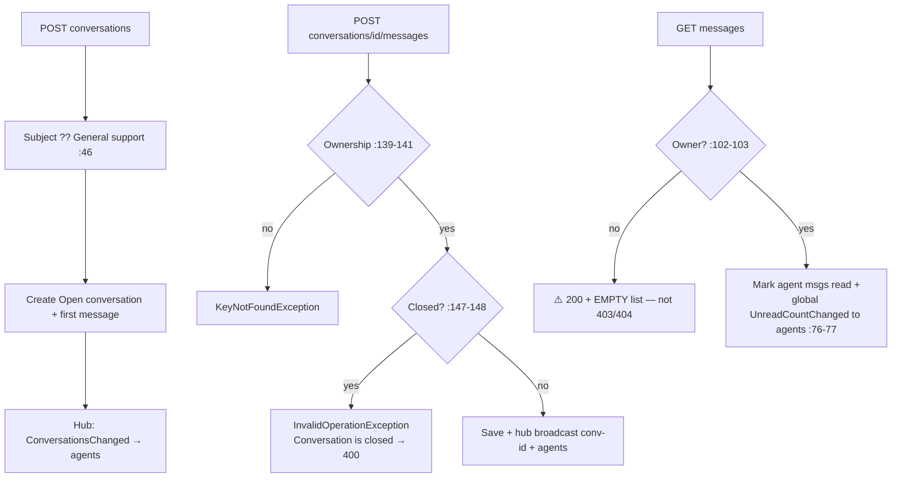

# SupportController Module Documentation (API — Learner)

---

## Overview

### Purpose
Live support tickets: conversations, messages, close/reopen, unread counts — with real-time SignalR delivery.

### Business Objective
Users chat with agents in real time; agents see the same threads in the admin inbox.

### Main Functionality
- Conversation list (with unread)
- Create conversation / send message
- Close / reopen
- Unread count (user + agent broadcast)

### Primary User Roles

| Role | Description |
|------|-------------|
| Authenticated user | Own conversations |
| Admin/Support agents | Agent-side (admin controller + hub group) |

---

## Module Architecture

```
Presentation           API controllers (JSON) + SignalR SupportHub
Application            ISupportService + IHubContext<SupportHub>
Storage                SupportConversations / SupportMessages
```

### Controllers

| Controller | Responsibility |
|-----------|----------------|
| `SupportController` | 7 actions (`api/support`) — class `[Authorize]` |

### Services

| Service | Responsibility |
|---------|----------------|
| `SupportService` | User + agent conversation logic (ownership-scoped) |

### Hubs

| Hub | Responsibility |
|-----|----------------|
| `SupportHub` | Groups: `user-{id}`, `conv-{id}`, `agents`; JWT via `access_token` query |

---

## Folder Structure

```
Controllers/Learner/
+-- SupportController.cs              # 7 actions

Hubs/
+-- SupportHub.cs                     # [Authorize] hub
```

---

## Endpoints

**Route**: `api/support`  
**Authorization**: class `[Authorize]` (:19-22)

| # | Action | HTTP | Route | Description |
|---|--------|------|-------|-------------|
| 1 | GetConversations | GET | `api/support/conversations` | List + unread (:41) |
| 2 | CreateConversation | POST | `api/support/conversations` | New ticket (Message required) (:51) |
| 3 | GetMessages | GET | `api/support/conversations/{conversationId}/messages` | Thread; marks agent msgs read (:67) |
| 4 | SendMessage | POST | `api/support/conversations/{conversationId}/messages` | Reply (:82) |
| 5 | CloseConversation | POST | `api/support/conversations/{conversationId}/close` | Close (:111) |
| 6 | ReopenConversation | POST | `api/support/conversations/{conversationId}/reopen` | Reopen (:125) |
| 7 | GetUnreadCount | GET | `api/support/unread-count` | Total unread (:139) |

---

## Internal Workflows & Runtime Behavior

### Workflow 1: Conversation Lifecycle



#### Runtime Behavior
- **`GetMessages` broadcasts the agents' global unread count on EVERY read** — chatty even when nothing changed (SupportController.cs:76-77).
- No message-length limits; no rate limiting on message sends.

### Workflow 2: Real-Time Delivery (IDOR)

```mermaid
flowchart TD
    A[SupportHub.OnConnected] --> B[Join user-{id} :15-29]
    B --> C{Admin or Support role?}
    C -->|yes| D[Join agents group]
    E[Client calls JoinConversation(id)] --> F[⚠️ NO authorization —<br/>any authenticated client joins conv-{id} :34-41]
    F --> G[Receives ReceiveMessage for conversations<br/>they don't own — realtime IDOR]
```

#### Runtime Behavior
- **`JoinConversation`/`LeaveConversation` are unguarded** (SupportHub.cs:34-41) — REST enforces ownership, the hub does not.

---

## Service Layer

| Service | Key logic (verified) |
|---------|----------------------|
| `SupportService` | Ownership filters everywhere on REST (:102-103, :139-141, :170-173, :187-190); `GetConversationMessagesAsync` returns empty 200 for non-owners (:108-109); agent methods (GetAllConversationsAsync :218-251, SetConversationStatusAsync :326-341) used by the admin controller |

---

## Business Rules

| Rule | Verified in | Why it exists |
|------|-------------|---------------|
| One owner per conversation | created with UserId from claim (:45) | Privacy |
| Closed conversations reject messages | SupportService.cs:147-148 | Ticket lifecycle |
| Agents = Admin/Support roles | SupportHub.cs:24 | Role-based group |

---

## Security Analysis

| Control | Status |
|---------|--------|
| REST ownership | ✅ all conversation ops |
| **Hub-level IDOR (critical)** | ❌ any authenticated client joins any `conv-{id}` group (SupportHub.cs:34-41) |
| Token transport | JWT in `access_token` query for `/hubs` (Program.cs:81-91) — log/Referrer leak risk |
| Spam | ❌ no message length limit or rate limit |
| Existence masking | non-owner reads return empty 200 (hides existence but masks bugs) |

---

## Hidden Behaviors & Technical Notes

1. **Realtime IDOR** — the hub joins are unguarded; conversation content leaks in real time.
2. **Chatty agents broadcast** on every message read.
3. **`NotifyUserConversationsChangedAsync`** (SupportHub.cs:65-66) is **never invoked** — dead helper.
4. **Reopen cycles unlimited** — a user can close/reopen repeatedly.
5. `CreateConversation` fires the hub notify even if service creation failed (unguarded order).

---

## Configuration

| Key | Purpose |
|-----|---------|
| `SignalR` (mapped `/hubs/support`) | real-time transport |

---

## Change Log

**Current functionality (verified):** ownership-scoped REST conversation management with real-time delivery — but the hub allows cross-user conversation subscription.

**Maintenance notes:** authorize `JoinConversation` against conversation ownership; add message length + rate limits.