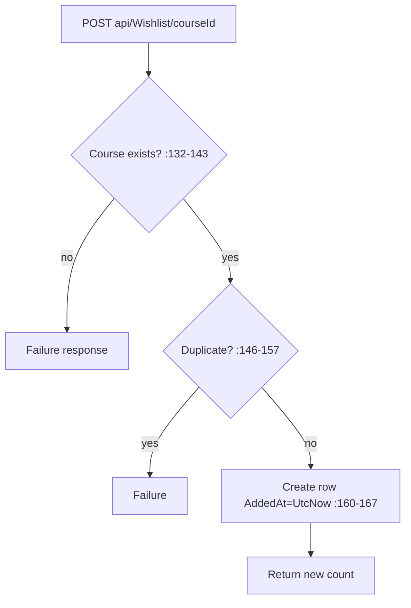

# WishlistController Module Documentation (API)

---

## Overview

### Purpose
Course wishlist: full list, add/remove, check, count.

### Business Objective
Let users bookmark courses for later purchase decisions.

### Main Functionality
- Get wishlist (with per-course ratings)
- Add / remove course
- Check membership + count

### Primary User Roles

| Role | Description |
|------|-------------|
| Authenticated | Own wishlist (self-scoped) |

---

## Module Architecture

```
Presentation           API controllers (JSON)
Application            IWishlistService
Storage                Wishlist rows (UserId × CourseId)
```

### Controllers

| Controller | Responsibility |
|-----------|----------------|
| `WishlistController` | 5 actions (`api/Wishlist`) — class `[Authorize]` — namespace `EduLab_API.Controllers` (anomaly, :10) |

### Services

| Service | Responsibility |
|---------|----------------|
| `WishlistService` | CRUD + rating enrichment |

---

## Folder Structure

```
Controllers/Learner/
+-- WishlistController.cs             # 5 actions — namespace anomaly
```

---

## Endpoints

**Route**: `api/Wishlist`  
**Authorization**: class `[Authorize]` (:16-20)

| # | Action | HTTP | Route | Description |
|---|--------|------|-------|-------------|
| 1 | GetUserWishlist | GET | `api/Wishlist` | List + ratings (:47) |
| 2 | AddToWishlist | POST | `api/Wishlist/{courseId}` | Add (:68) |
| 3 | RemoveFromWishlist | DELETE | `api/Wishlist/{courseId}` | Remove (:96) |
| 4 | IsCourseInWishlist | GET | `api/Wishlist/check/{courseId}` | Bool (:123) |
| 5 | GetWishlistCount | GET | `api/Wishlist/count` | Count (:144) |

---

## Internal Workflows & Runtime Behavior

### Workflow 1: Add



### Workflow 2: Get (N+1)

#### Behavior
- Per item fetches a rating summary via `GetCourseRatingSummaryRawAsync` (:86-91) — **N+1** queries.
- Blank userId → `ArgumentException` (:60-61).

---

## Service Layer

| Service | Key logic (verified) |
|---------|----------------------|
| `WishlistService` | `AddToWishlistAsync` existence+duplicate checks (:119-191); `RemoveFromWishlistAsync` not-found → failure response (:213-224); `IsCourseInWishlistAsync`/`GetWishlistCountAsync` rethrow exceptions (:260-285, :294-318) |

---

## Business Rules

| Rule | Verified in | Why it exists |
|------|-------------|---------------|
| Course must exist | WishlistService.cs:132-143 | FK integrity |
| No duplicates | :146-157 | Wishlist semantics |

---

## Security Analysis

| Control | Status |
|---------|--------|
| Authentication | ✅ class-level |
| Ownership | ✅ user-scoped (userId from claims) — no IDOR |
| Data exposure | Public course data only |

---

## Hidden Behaviors & Technical Notes

1. **Namespace anomaly** — `EduLab_API.Controllers` not `.Learner` (WishlistController.cs:10) — mirrors the RatingsController quirk.
2. **N+1 rating enrichment** on list (:86-91) — performance issue on large wishlists.
3. `[Required] int courseId` route params (:68-74, :96-102) — malformed route → automatic 400.

---

## Configuration

| Key | Purpose |
|-----|---------|
| (none module-specific) | — |

---

## Change Log

**Current functionality (verified):** self-scoped wishlist CRUD with existence/duplicate guards and rating enrichment.

**Maintenance notes:** batch the rating lookups to remove the N+1.