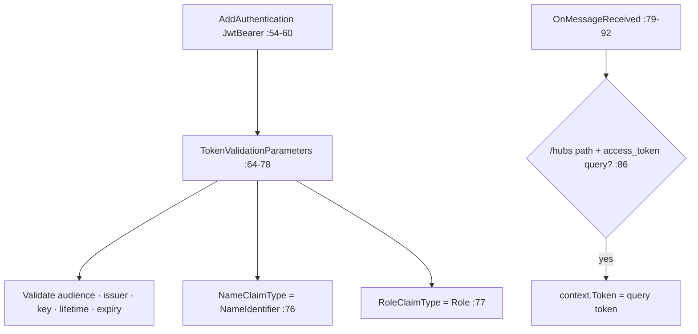
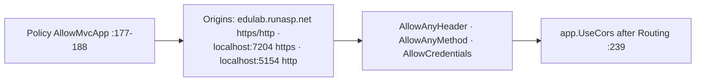

# Program.cs Module Documentation (API — Startup & Configuration)

---

## Overview

### Purpose
Startup and configuration for the EduLab API: Identity/JWT, OAuth providers, Stripe, SignalR, CORS, localization, OpenAPI/Scalar, and DB seeding.

### Business Objective
Compose the secure backend: JWT auth with hub support, social logins, Stripe payments, real-time support chat, and a self-documenting API.

### Main Functionality
- Infrastructure/Application DI + AutoMapper
- JWT bearer (full validation) + SignalR query-token support
- Facebook / Google / Microsoft OAuth
- Stripe API key + settings
- CORS for the MVC app + SignalR
- 20-culture localization (default `en`, Accept-Language only)
- DbInitializer seeding at startup
- OpenAPI + Scalar docs (root `/` → `/scalar`)

---

## Configuration Surface

| Key | Purpose | Verified in |
|-----|---------|-------------|
| `JWT:Key` / `Issuer` / `Audience` | Token signing/validation | Program.cs:71-75 (values in appsettings.json:17-22) |
| `Stripe:SecretKey` | Stripe API key | Program.cs:171 |
| `Authentication:Facebook:AppId/AppSecret` | Facebook OAuth | Program.cs:96-97 |
| `Authentication:Google:ClientId/ClientSecret` | Google OAuth | Program.cs:102-103 |
| `Authentication:Microsoft:ClientId/ClientSecret` | Microsoft OAuth | Program.cs:107-111 |

---

## Service Registration

### Auth: JWT Bearer



#### Key facts
- Full validation: audience, issuer, signing key, lifetime, and **required expiration time** (Program.cs:66-70).
- **SignalR clients authenticate via `?access_token=` query param** for paths starting `/hubs` (:79-92) — the standard SignalR browser limitation workaround.
- `SaveToken = true` (:63).

### Auth: OAuth Providers

| Provider | Config | Callback | Verified in |
|----------|--------|----------|-------------|
| Facebook | AppId/AppSecret + `email` scope | default | Program.cs:94-99 |
| Google | ClientId/ClientSecret | default | Program.cs:100-104 |
| Microsoft | ClientId/ClientSecret | `/signin-microsoft` (:113) | Program.cs:105-114 |

### Infrastructure & DI

| Service | Notes | Verified in |
|---------|-------|-------------|
| `AddInfrastructureServices` + `AddApplicationServices` | layered DI | Program.cs:28-29 |
| AutoMapper | MappingConfig assembly | Program.cs:30 |
| `StripeSettings` options | from `Stripe` section | Program.cs:31 |
| FormOptions 500MB | multipart | Program.cs:32-35 |
| MVC conventions | `AdminAreaAuthorizationConvention` | Program.cs:36-39 |
| MemoryCache | 5-min settings cache | Program.cs:40 |
| DataProtection | keys at `C:\KeyRing\EduLab`, app name `EduLabSharedCookie` | Program.cs:49-51 |
| SignalR | `AddSignalR` | Program.cs:174 |

### Authorization

| Policy | Definition | Verified in |
|--------|-----------|-------------|
| `AdminArea` | any claim in `AdminClaims.All` (case-insensitive) | Program.cs:42-47 |

---

## CORS



#### Key facts
- Purpose: let the MVC app's browser call the API directly **for SignalR** (Program.cs:176).
- `AllowCredentials` + explicit origin allowlist (:180-187).
- **`http://localhost:5154` is allowed** — the same origin where the API's `Secure` guest cookie silently fails (see `CartController.md`).

---

## Localization

| Aspect | Value | Verified in |
|--------|-------|-------------|
| Cultures | 20 (ar, en, zh, nl, fr, de, hi, id, it, ja, ko, ms, pt, ru, es, vi, tr, uk, ur, pl) | Program.cs:194 |
| Default culture | **`en`** (MVC defaults `ar`) | Program.cs:197 |
| Providers | **Accept-Language header only** | Program.cs:200-203 |

---

## Request Pipeline

```mermaid
flowchart TD
    A[Startup scope: DbInitializer.InitializeAsync :208-224] --> B[HttpsRedirection :226]
    B --> C[RequestLocalization :228]
    C --> D[StaticFiles wwwroot PhysicalFileProvider :230-235]
    D --> E[Routing :237]
    E --> F[CORS AllowMvcApp :239]
    F --> G[Authentication :241]
    G --> H[Authorization :242]
    H --> I[MapControllers + MapHub /hubs/support :244-245]
    I --> J[OpenAPI + Scalar BluePlanet :248-253]
    J --> K[/ → redirect /scalar :255-259]
```

#### Key facts
- **DB seeding runs at startup** (`DbInitializer.InitializeAsync`, :208-224) — seeds roles, users (hardcoded `Admin@123` credentials), courses, certificates, payments, reviews (see `AuthController.md`).
- Seeding failures are logged but **do not crash the app** (:219-223).
- Docs: OpenAPI (`/openapi/v1.json`) + **Scalar UI**; root `/` redirects to `/scalar` (:255-259).
- No `UseExceptionHandler`/status-code pages — the API returns ProblemDetails/framework errors directly.

---

## Business Rules

| Rule | Verified in | Why it exists |
|------|-------------|---------------|
| JWT fully validated | Program.cs:64-78 | Token trust |
| Hubs accept query tokens | :79-92 | SignalR browser auth |
| AdminArea = any claim | :42-47 | Broad admin surface |
| Seed on startup | :208-224 | Demo/dev data |
| Arabic error on seed failure | :222 | Ops readability |

---

## Security Analysis

| Control | Status |
|---------|--------|
| JWT | ✅ full validation; HMAC key from config (appsettings.json:17-22 — committed) |
| OAuth secrets | ⚠️ committed in appsettings.json (lines 30-43 per earlier audit) |
| Stripe key | ⚠️ test keys committed (:44-47) |
| CORS | ✅ allowlist + credentials; ⚠️ plain-HTTP localhost origin allowed |
| DataProtection | keys on `C:\KeyRing\EduLab` — machine-local, breaks across hosts |
| Seeding | hardcoded `Admin@123` passwords (DbInitializer.cs:102/173/195) |
| Hub token in query | token appears in URLs/logs (SignalR standard) |

---

## Configuration

| Key | Purpose |
|-----|---------|
| `JWT:*` | Token signing + validation |
| `Stripe:*` | Payment processing |
| `Authentication:*` | OAuth providers |

---

## Change Log

**Current functionality (verified):** complete backend composition — JWT + OAuth + Stripe + SignalR + CORS + 20-culture localization + startup seeding + Scalar docs.

**Maintenance notes:** remove committed secrets; move DataProtection keys to a shared store.