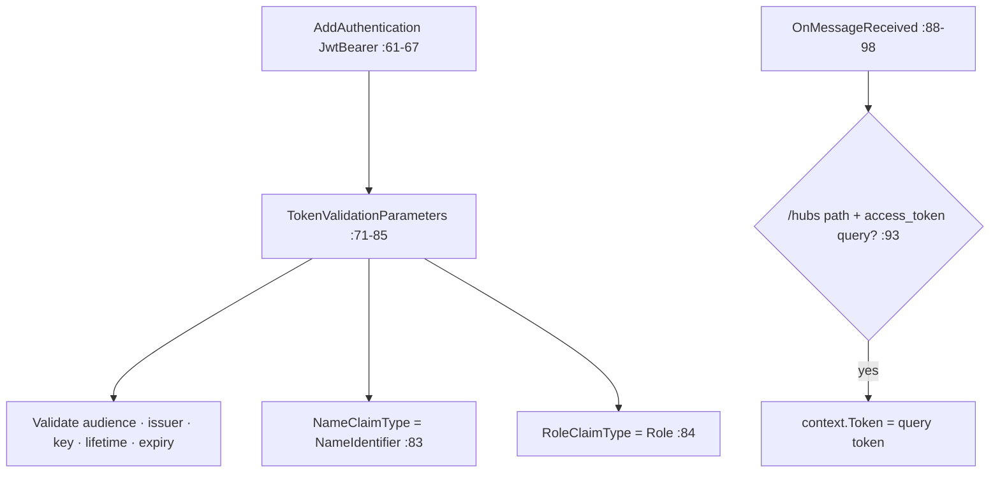
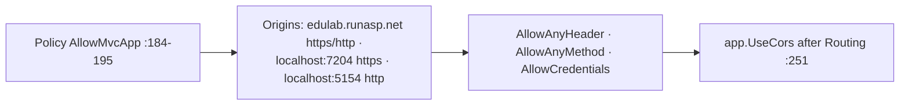

# Program.cs Module Documentation (API — Startup & Configuration)

---

## Overview

### Purpose
Startup and configuration for the EduLab API: Identity/JWT, OAuth providers, Stripe, SignalR, CORS, localization, OpenAPI/Scalar, and DB seeding.

### Business Objective
Compose the secure backend: JWT auth with hub support, social logins, Stripe payments, real-time support chat, and a self-documenting API.

### Main Functionality
- Infrastructure/Application DI (`AddDbContextPool<ApplicationDbContext>` in `InfrastructureContainer.cs:29-30`) + AutoMapper
- Brotli + Gzip response compression (`EnableForHttps = true`) and 7-day static-file `Cache-Control`
- JWT bearer (full validation) + SignalR query-token support
- Facebook / Google / Microsoft OAuth
- Stripe API key + settings
- CORS for the MVC app + SignalR
- 20-culture localization (default `en`, Accept-Language only)
- DbInitializer seeding at startup
- OpenAPI + Scalar docs (root `/` → `/scalar`)

---

## Configuration Surface

| Key | Purpose | Verified in |
|-----|---------|-------------|
| `ConnectionStrings:DefaultConnection` | SQL Server connection for `AddDbContextPool<ApplicationDbContext>` | InfrastructureContainer.cs:29-30 |
| `JWT:Key` / `Issuer` / `Audience` | Token signing/validation | Program.cs:78-82 (values in appsettings.json:17-22) |
| `Stripe:SecretKey` | Stripe API key | Program.cs:178 |
| `Authentication:Facebook:AppId/AppSecret` | Facebook OAuth | Program.cs:103-104 |
| `Authentication:Google:ClientId/ClientSecret` | Google OAuth | Program.cs:109-110 |
| `Authentication:Microsoft:ClientId/ClientSecret` | Microsoft OAuth | Program.cs:114-118 |

---

## Service Registration

### Auth: JWT Bearer

```mermaid
flowchart TD
    A[AddAuthentication JwtBearer :61-67] --> B[TokenValidationParameters :71-85]
    B --> C[Validate audience · issuer · key · lifetime · expiry]
    B --> D[NameClaimType = NameIdentifier :83]
    B --> E[RoleClaimType = Role :84]
    F[OnMessageReceived :88-98] --> G{/hubs path + access_token query? :93}
    G -->|yes| H[context.Token = query token]
```

#### Key facts
- Full validation: audience, issuer, signing key, lifetime, and **required expiration time** (Program.cs:73-77).
- **SignalR clients authenticate via `?access_token=` query param** for paths starting `/hubs` (:88-98) — the standard SignalR browser limitation workaround.
- `SaveToken = true` (:70).

### Auth: OAuth Providers

| Provider | Config | Callback | Verified in |
|----------|--------|----------|-------------|
| Facebook | AppId/AppSecret + `email` scope | default | Program.cs:101-106 |
| Google | ClientId/ClientSecret | default | Program.cs:107-111 |
| Microsoft | ClientId/ClientSecret | `/signin-microsoft` (:120) | Program.cs:112-121 |

### Infrastructure & DI

| Service | Notes | Verified in |
|---------|-------|-------------|
| `AddInfrastructureServices` + `AddApplicationServices` | layered DI (`AddDbContextPool<ApplicationDbContext>` in `InfrastructureContainer.cs:29-30`) | Program.cs:28-29 |
| AutoMapper | MappingConfig assembly | Program.cs:30 |
| `StripeSettings` options | from `Stripe` section | Program.cs:31 |
| FormOptions 500MB | multipart | Program.cs:32-35 |
| MVC conventions | `AdminAreaAuthorizationConvention` | Program.cs:36-39 |
| `AddMemoryCache` | In-memory cache for `SiteSettingsService` (60m), `CategoryService` (15m), `DashboardService` (15m), `InstructorService` (10m) | Program.cs:40 |
| `AddResponseCompression` | `EnableForHttps = true`; `BrotliCompressionProvider` + `GzipCompressionProvider` | Program.cs:41-46 |
| `AddHttpClient` | Default HTTP client factory | Program.cs:47 |
| DataProtection | keys at `C:\KeyRing\EduLab`, app name `EduLabSharedCookie` | Program.cs:56-58 |
| SignalR | `AddSignalR` | Program.cs:181 |

### Authorization

| Policy | Definition | Verified in |
|--------|-----------|-------------|
| `AdminArea` | any claim in `AdminClaims.All` (case-insensitive) | Program.cs:49-54 |

---

## CORS

```mermaid
flowchart LR
    A[Policy AllowMvcApp :184-195] --> B[Origins: edulab.runasp.net https/http ·<br/>localhost:7204 https · localhost:5154 http]
    B --> C[AllowAnyHeader · AllowAnyMethod · AllowCredentials]
    C --> D[app.UseCors after Routing :251]
```

#### Key facts
- Purpose: let the MVC app's browser call the API directly **for SignalR** (Program.cs:183).
- `AllowCredentials` + explicit origin allowlist (:187-194).
- **`http://localhost:5154` is allowed** — the same origin where the API's `Secure` guest cookie silently fails (see `CartController.md`).

---

## Localization

| Aspect | Value | Verified in |
|--------|-------|-------------|
| Cultures | 20 (ar, en, zh, nl, fr, de, hi, id, it, ja, ko, ms, pt, ru, es, vi, tr, uk, ur, pl) | Program.cs:201 |
| Default culture | **`en`** (MVC defaults `ar`) | Program.cs:204 |
| Providers | **Accept-Language header only** | Program.cs:207-210 |

---

## Request Pipeline

```mermaid
flowchart TD
    A[Startup scope: DbInitializer.InitializeAsync :215-231] --> B[HttpsRedirection :233]
    B --> B2[ResponseCompression Brotli + Gzip :234]
    B2 --> C[RequestLocalization :236]
    C --> D[StaticFiles wwwroot PhysicalFileProvider + 7-day Cache-Control :238-247]
    D --> E[Routing :249]
    E --> F[CORS AllowMvcApp :251]
    F --> G[Authentication :253]
    G --> H[Authorization :254]
    H --> I[MapControllers + MapHub /hubs/support :256-257]
    I --> J[OpenAPI + Scalar BluePlanet :260-265]
    J --> K[/ → redirect /scalar :267-271]
```

#### Key facts
- **DB seeding runs at startup** (`DbInitializer.InitializeAsync`, :215-231) — seeds roles, users (hardcoded `Admin@123` credentials), courses, certificates, payments, reviews (see `AuthController.md`).
- Seeding failures are logged but **do not crash the app** (:226-230).
- **Response compression** (`app.UseResponseCompression()`, :234) compresses JSON and text responses over HTTPS using Brotli and Gzip (:41-46).
- **Static files caching** (`app.UseStaticFiles`, :238-247) serves `wwwroot` via `PhysicalFileProvider` and sets `Cache-Control: public,max-age=604800` (7 days) in `OnPrepareResponse` (:242-246).
- Docs: OpenAPI (`/openapi/v1.json`) + **Scalar UI**; root `/` redirects to `/scalar` (:267-271).
- No `UseExceptionHandler`/status-code pages — the API returns ProblemDetails/framework errors directly.

---

## Business Rules

| Rule | Verified in | Why it exists |
|------|-------------|---------------|
| DbContext pooling (`AddDbContextPool`) | InfrastructureContainer.cs:29-30 | Reuse `ApplicationDbContext` instances across requests |
| Brotli + Gzip over HTTPS | Program.cs:41-46, :234 | Minimize API JSON payload size |
| 7-day static asset `Cache-Control` | Program.cs:242-246 | Avoid repeat downloads for course thumbnails/avatars |
| JWT fully validated | Program.cs:71-85 | Token trust |
| Hubs accept query tokens | :88-98 | SignalR browser auth |
| AdminArea = any claim | :49-54 | Broad admin surface |
| Seed on startup | :215-231 | Demo/dev data |
| Arabic error on seed failure | :229 | Ops readability |

---

## Security Analysis

| Control | Status |
|---------|--------|
| JWT | ✅ full validation; HMAC key from config (appsettings.json:17-22 — committed) |
| OAuth secrets | ⚠️ committed in appsettings.json (lines 30-43 per earlier audit) |
| Stripe key | ⚠️ test keys committed (:44-47) |
| CORS | ✅ allowlist + credentials; ⚠️ plain-HTTP localhost origin allowed |
| DataProtection | keys on `C:\KeyRing\EduLab` — machine-local, breaks across hosts |
| Seeding | hardcoded `Admin@123` passwords (DbInitializer.cs:102/173/195) |
| Hub token in query | token appears in URLs/logs (SignalR standard) |

---

## Configuration

| Key | Purpose |
|-----|---------|
| `JWT:*` | Token signing + validation |
| `Stripe:*` | Payment processing |
| `Authentication:*` | OAuth providers |

---

## Change Log

**Current functionality (verified):** complete backend composition — `AddDbContextPool`, Brotli/Gzip response compression, 7-day static-file `Cache-Control`, JWT + OAuth + Stripe + SignalR + CORS + 20-culture localization + startup seeding + Scalar docs.

**Maintenance notes:** remove committed secrets; move DataProtection keys to a shared store.