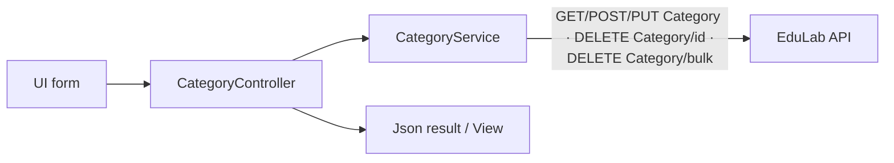
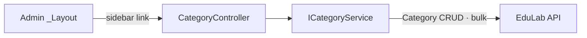

# CategoryController Module Documentation (MVC — Admin Area)

---

## Overview

### Purpose
Full CRUD for course categories (Arabic + English names), including protection of system categories and bulk delete.

### Business Objective
Admins curate the category taxonomy that drives course organization and discovery.

### Main Functionality
- List categories (+ roles for badge display)
- Create / update / delete / bulk-delete categories
- Name validation helper

### Primary User Roles

| Role | Description |
|------|-------------|
| Admin (AdminArea policy) | Category CRUD |

---

## Module Architecture

```
Presentation           Areas/Admin/Views/Category/Index.cshtml (only view)
Application            ICategoryService (+ raw AuthorizedHttpClientService DI)
External               EduLab API: GET Category, POST Category, PUT Category,
                       DELETE Category/{id}, DELETE Category/bulk?ids=
```

### Controllers

| Controller | Responsibility |
|-----------|----------------|
| `CategoryController` | Index, Create, Update, Delete, BulkDelete (295 lines) |

### Services

| Service | Responsibility |
|---------|----------------|
| `CategoryService` | GET `Category` (:42), POST `Category` (:115), PUT `Category` (:154), DELETE `Category/{id}` (:190), DELETE `Category/bulk?ids=` (:236) |
| `AuthorizedHttpClientService` | Injected but not used for the main flows |

### Dependencies on Other Modules
- **Admin layout** (sidebar link).
- **SD.ProtectedCategories** (SD.cs:18-34).
- **EduLab API** (hard dependency).

---

## Folder Structure

```
Areas/Admin/Controllers/
+-- CategoryController.cs             # 5 actions (295 lines)

Areas/Admin/Views/Category/
+-- Index.cshtml                      # Category list + modals
```

---

## Database Design

None (MVC). Categories live in the API's `Categories` table.

---

## Internal Workflows & Runtime Behavior

### Workflow 1: Index

#### Behavior
- `Index` (:45-68): loads categories + roles; **no claim-level check** — any AdminArea user can open the page; renders View.

### Workflow 2: Create / Update / Delete / BulkDelete

#### Flow

```mermaid
flowchart TD
    A[Create form: id?, name, englishName] --> B[POST Create + antiforgery]
    B --> C[ProtectedCategories check → reject]
    C --> D[POST Category]
    E[Update: exists + protected checks] --> F[POST Update + antiforgery]
    F --> G[PUT Category]
    H[Delete] --> I[POST Delete + antiforgery]
    I --> J[Protected check :201 → DELETE Category/id]
    K[BulkDelete List[int] ids] --> L[POST BulkDelete + antiforgery]
    L --> M[DELETE Category/bulk?ids=]
```

#### Runtime Behavior
- All 4 POSTs carry `[ValidateAntiForgeryToken]` (Create :80-82, Update :134-136, Delete :193-195, BulkDelete :224-226).
- `Create` takes `id` as a form field (seeding pattern) plus `name` + `englishName`.
- `IsValidCategoryName` helper (:277-295) centralizes name validation.

---

## Data Flow Analysis



---

## Controllers & Endpoints

### CategoryController

**Route**: `/Admin/Category`  
**Authorization**: `[Area("Admin")]` + `[Authorize(Policy="AdminArea")]` class-level (implicit)  
**Dependencies**: `ICategoryService`, `AuthorizedHttpClientService` (:32)

| Action | HTTP | Route | Description | Anti-forgery |
|--------|------|-------|-------------|--------------|
| Index | GET | `/Admin/Category/Index` | List categories + roles | — |
| Create | POST | `/Admin/Category/Create` | Create category | ✅ |
| Update | POST | `/Admin/Category/Update` | Update category | ✅ |
| Delete | POST | `/Admin/Category/Delete` | Delete category | ✅ |
| BulkDelete | POST | `/Admin/Category/BulkDelete` | Bulk delete (body ids) | ✅ |

---

## Frontend Integration

### Index.cshtml
- Table + modals; delete/update/bulk flows post with antiforgery tokens (Razor forms).

---

## Business Rules

| Rule | Verified in | Why it exists |
|------|-------------|---------------|
| Protected categories cannot be deleted/renamed | ProtectedCategories checks in Create/Update/Delete | System taxonomy integrity |
| Bulk delete via query-string ids | CategoryService.cs:236 | Batch taxonomy cleanup |

---

## Security Analysis

| Control | Status |
|---------|--------|
| Authentication | ✅ AdminArea policy |
| Claim-gating | ❌ none — any AdminArea user can CRUD categories |
| Anti-forgery | ✅ all 4 POSTs |

---

## Module Dependencies



**Internal**: Admin layout, SD.ProtectedCategories.
**External**: EduLab API only.

---

## Hidden Behaviors & Technical Notes

1. **No claim-level gates**: unlike other admin controllers, category mutations require no specific claim — any member of any AdminArea role (including Moderator with the trailing-space role name) can modify the taxonomy.
2. **Create accepts an explicit `id`** — form-driven seeding pattern; a malicious client could attempt to influence the id (API must ignore or validate it).
3. **`IsValidCategoryName`** (:277-295) centralizes name rules — used by both create and update paths.

---

## Configuration

| Key | Purpose |
|-----|---------|
| `EduLab:ApiBaseUrl` | API base |

---

## Change Log

**Current functionality (verified):** category CRUD + bulk delete with protected-category guards and full antiforgery coverage.

**Maintenance notes:** consider claim-gating category mutations.