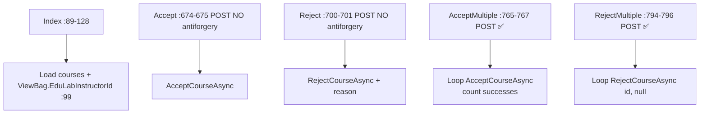
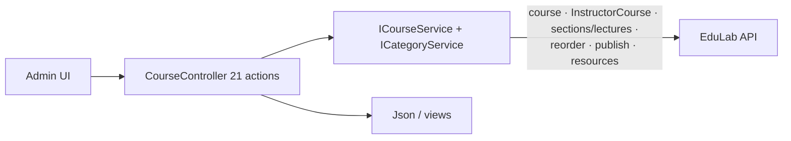
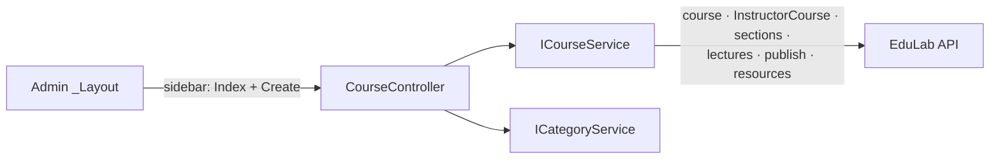

# CourseController Module Documentation (MVC — Admin Area)

---

## Overview

### Purpose
Admin course oversight: platform-owned course management, review queue (approve/reject), editing, and bulk operations.

### Business Objective
Moderate the catalog: approve/reject submissions, maintain platform-owned (EduLab) courses, and curate content.

### Main Functionality
- Course list with status filters + EduLab badge
- Review queue: accept / reject single + multiple
- Edit/curriculum/settings/details pages (EduLab-owned courses only)
- Publish/unpublish, section/lecture/resource management
- Delete + bulk delete (EduLab courses only)

### Primary User Roles

| Role | Description |
|------|-------------|
| Admin (AdminArea policy) | All course oversight |

---

## Module Architecture

```
Presentation           Areas/Admin/Views/Course/{Index, Create, Edit, Details,
                       Curriculum, Settings}.cshtml (6 files)
Application            ICourseService + ICategoryService
External               EduLab API: Course/* (admin), InstructorCourse/*,
                       course/lecture/*, course/resources/*
```

### Controllers

| Controller | Responsibility |
|-----------|----------------|
| `CourseController` | 21 actions (945 lines) |

### Services

| Service | Responsibility |
|---------|----------------|
| `CourseService` | full CRUD surface (admin `course` paths + instructor paths + resource paths) |
| `CategoryService` | `GetAllCategoriesAsync` -> GET `Category` (CategoryService.cs:42) for dropdowns |

### Dependencies on Other Modules
- **Admin layout** (sidebar: Course Index + Create).
- **SD.EduLabInstructorId** (`"edulab-instructor"`, SD.cs:11) — EduLab-owned course guard.
- **EduLab API** (hard dependency).

---

## Folder Structure

```
Areas/Admin/Controllers/
+-- CourseController.cs               # 21 actions (945 lines)

Areas/Admin/Views/Course/
+-- Index.cshtml                      # Catalog + review queue
+-- Create.cshtml                     # Create form
+-- Edit.cshtml                       # ⚠️ ORPHANED — Edit GET redirects to Settings
+-- Details.cshtml                    # Course detail
+-- Curriculum.cshtml                 # Section/lecture editor
+-- Settings.cshtml                   # Course settings
```

---

## Database Design

None (MVC). Courses live in the API's `Courses` table with `InstructorId` ownership.

---

## Internal Workflows & Runtime Behavior

### Workflow 1: Catalog & Review Queue

#### Flow



### Workflow 2: EduLab-Course Guarding

#### Behavior
- `Curriculum` (:160-161) checks `IsEduLabCourseAsync` (:171).
- `Settings` (:187-188) ownership check (:198).
- `Details` (:219-220) checks `CanAdminViewCourseAsync` (:233).
- `BulkDelete` (:726-728) filters ids to EduLab courses only: `InstructorId == SD.EduLabInstructorId || InstructorId == edulabInstructorId` (:741).

### Workflow 3: Create / Edit

#### Flow

```mermaid
flowchart TD
    A[GET Create :130-131] --> B[ViewBag.Categories + Levels]
    C[POST CreateCourse<br/>[FromForm] CourseDraftDTO<br/>NO antiforgery :304-305] --> D[Json success + courseId]
    E[GET Edit :154-155] --> F[⚠️ REDIRECTS to Settings]
    G[POST Edit<br/>[RequestFormLimits][RequestSizeLimit]<br/>NO antiforgery :339-342] --> H[UpdateCourseAsync multipart]
```

#### Runtime Behavior
- Edit POST is heavy-duty: `[RequestFormLimits]`/`[RequestSizeLimit]` for large multipart payloads (videos + resources).
- `CreateCourseUpdateFromFormData` (:866-889): builds `CourseUpdateDTO` from raw form; **always sets `HasCertificate = true`**; `Requirements`/`Learnings` split on `\n` and trimmed; `Price` parsed with `CultureInfo.InvariantCulture`.
- `ParseAndProcessSectionsWithResourcesAsync` (:891-941): parses `sections` JSON, assigns `Order` sequentially, defaults `ContentType ??= "video"`, attaches files keyed `video_{s}_{l}` / `resource_{s}_{l}_{i}`, preserves existing resources not re-sent.

### Workflow 4: Section / Lecture / Resource Ops

#### Flow

```mermaid
flowchart TD
    A[AddSection :458-459 [FromBody] NO ✅❌] --> B[POST InstructorCourse/courseId/sections]
    C[UpdateSection :479-480 NO] --> D[PUT sections/id]
    E[DeleteSection :500-501 NO] --> F[DELETE sections/id]
    G[AddLecture :518-520 [RequestFormLimits] NO] --> H[POST sections/id/lectures]
    I[UpdateLecture :544-545 NO] --> J[PUT lectures/id]
    K[DeleteLecture :569-570 NO] --> L[DELETE lectures/id]
    M[AddResourceToLecture :587-588 NO] --> N[POST course/lecture/id/resources]
    O[DeleteResource :608-609 NO] --> P[DELETE course/resources/id]
    Q[GetLectureResources :626-627 GET] --> R[Json]
    S[Publish :645-646 NO] --> T[POST InstructorCourse/courseId/publish]
```

#### Runtime Behavior
- **All 11 of these POSTs lack `[ValidateAntiForgeryToken]`** — only `Delete` (:420-422) and the three bulk ops (`BulkDelete` :726-728, `AcceptMultiple` :765-767, `RejectMultiple` :794-796) carry it.

### Workflow 5: Filters

#### Behavior
- `CoursesByInstructor` (:827): loads courses for an instructor + categories, renders `View("Index", courses)`.

---

## Data Flow Analysis



---

## Controllers & Endpoints

### CourseController (Admin)

**Route**: `/Admin/Course`  
**Authorization**: `[Area("Admin")]` + `[Authorize(Policy="AdminArea")]`  
**Dependencies**: `ICourseService`, `ICategoryService`, logger, localizer (:27-34)

| Action | HTTP | Route | Description | Anti-forgery |
|--------|------|-------|-------------|--------------|
| Index | GET | `/Admin/Course/Index` | Catalog + review queue | — |
| Create | GET | `/Admin/Course/Create` | Create form | — |
| Edit | GET | `/Admin/Course/Edit/{id}` | ⚠️ Redirects to Settings | — |
| Curriculum | GET | `/Admin/Course/Curriculum/{id}` | Editor (EduLab-owned only) | — |
| Settings | GET | `/Admin/Course/Settings/{id}` | Settings (ownership check) | — |
| Details | GET | `/Admin/Course/Details/{id}` | Detail (CanAdminViewCourse) | — |
| GetCategories | GET | `/Admin/Course/GetCategories` | Categories JSON | — |
| GetInstructors | GET | `/Admin/Course/GetInstructors` | Instructors JSON | — |
| CreateCourse | POST | `/Admin/Course/CreateCourse` | Create (multipart) | ❌ |
| Edit | POST | `/Admin/Course/Edit` | Update (multipart, heavy limits) | ❌ |
| Delete | POST | `/Admin/Course/Delete?id` | Delete | ✅ |
| AddSection | POST | `/Admin/Course/AddSection` | Add section (body) | ❌ |
| UpdateSection | POST | `/Admin/Course/UpdateSection` | Update section | ❌ |
| DeleteSection | POST | `/Admin/Course/DeleteSection` | Delete section | ❌ |
| AddLecture | POST | `/Admin/Course/AddLecture` | Add lecture (multipart) | ❌ |
| UpdateLecture | POST | `/Admin/Course/UpdateLecture` | Update lecture | ❌ |
| DeleteLecture | POST | `/Admin/Course/DeleteLecture` | Delete lecture | ❌ |
| AddResourceToLecture | POST | `/Admin/Course/AddResourceToLecture` | Upload resource | ❌ |
| DeleteResource | POST | `/Admin/Course/DeleteResource` | Delete resource | ❌ |
| GetLectureResources | GET | `/Admin/Course/GetLectureResources?lectureId` | Resources JSON | — |
| Publish | POST | `/Admin/Course/Publish?courseId` | Publish/unpublish | ❌ |
| Accept | POST | `/Admin/Course/Accept?id` | Approve review | ❌ |
| Reject | POST | `/Admin/Course/Reject?id&reason` | Reject review | ❌ |
| BulkDelete | POST | `/Admin/Course/BulkDelete` | Bulk delete (EduLab only) | ✅ |
| AcceptMultiple | POST | `/Admin/Course/AcceptMultiple` | Bulk accept | ✅ |
| RejectMultiple | POST | `/Admin/Course/RejectMultiple` | Bulk reject | ✅ |
| CoursesByInstructor | GET | `/Admin/Course/CoursesByInstructor?instructorId` | Filter view (reuses Index) | — |

**Models**: `CourseDraftDTO`, `CourseUpdateDTO`, `SectionCreateDTO`/`UpdateDTO`, `LectureCreateDTO`/`UpdateDTO`, `LectureResourceDTO`.

---

## Frontend Integration

### Index.cshtml
- Review queue cards (accept/reject + bulk selection); status tabs; EduLab badge via `ViewBag.EduLabInstructorId`; details/settings/curriculum links.

### Create.cshtml / Edit.cshtml / Settings.cshtml / Curriculum.cshtml
- Multipart forms; category dropdowns; section/lecture editors with per-lecture video/resource file inputs (`video_{s}_{l}`, `resource_{s}_{l}_{i}` naming contract).

---

## Business Rules

| Rule | Verified in | Why it exists |
|------|-------------|---------------|
| EduLab courses only for structural edits | IsEduLabCourseAsync checks | Platform-owned content guard |
| Bulk delete restricted to EduLab ids | CourseController.cs:741 | Protect instructor-owned content |
| HasCertificate forced true on update | CreateCourseUpdateFromFormData :879 | Platform courses always certify |
| Bulk accept/reject loops with partial success | AcceptMultiple/RejectMultiple | Resilient review flows |

---

## Security Analysis

| Control | Status |
|---------|--------|
| Authentication | ✅ AdminArea policy |
| Ownership guards | ✅ EduLab-only checks on structural actions |
| Anti-forgery | ❌ 15+ POSTs unprotected; ✅ only Delete + 3 bulk ops |
| Bulk review ops | antiforgery-protected (good) |

---

## Module Dependencies



**Internal**: Admin layout, SD.EduLabInstructorId.
**External**: EduLab API only.

---

## Hidden Behaviors & Technical Notes

1. **CSRF on nearly all lifecycle POSTs** (15+ actions without antiforgery) — verified.
2. **Edit GET redirects to Settings** — `Edit.cshtml` exists but is unreachable via the GET action (orphaned file).
3. **`CreateCourseUpdateFromFormData` hardcodes `HasCertificate = true`** — admin edits always enable certification.
4. **Bulk accept/reject report partial success** ("accepted X of N") rather than failing atomically.
5. **Heavy multipart limits** on Edit/AddLecture (`[RequestFormLimits]`, `[RequestSizeLimit]`) — aligns with Program.cs 500MB cap.
6. **Admin and Instructor Course controllers duplicate the same 20-action surface** — two parallel implementations with divergent antiforgery coverage (Admin bulk ops protected, Instructor's not; Instructor's Delete protected, Admin's wider).

---

## Configuration

| Key | Purpose |
|-----|---------|
| `EduLab:ApiBaseUrl` | API base |

---

## Change Log

**Current functionality (verified):** catalog + review queue (single/bulk accept-reject), EduLab-owned structural editing (curriculum/settings/details), multipart create/edit with video/resource contracts, bulk delete restricted to EduLab courses.

**Maintenance notes:**
- Add antiforgery to the unprotected POSTs.
- Remove/replace the orphaned `Edit.cshtml` + redirect-to-Settings behavior.
- Consider unifying with the Instructor CourseController to close the security divergence.