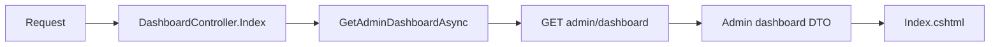
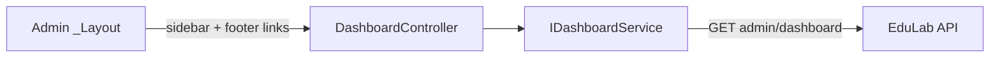

# DashboardController Module Documentation (MVC — Admin Area)

---

## Overview

### Purpose
Admin landing page: platform-wide KPIs and recent activity.

### Business Objective
Give admins a single at-a-glance view of platform health (users, courses, revenue, reports).

### Main Functionality
- Load `GET admin/dashboard`
- Render KPIs

### Primary User Roles

| Role | Description |
|------|-------------|
| Admin (AdminArea policy) | Platform dashboard |

---

## Module Architecture

```
Presentation           Areas/Admin/Views/Dashboard/Index.cshtml (only view)
Application            IDashboardService -> GetAdminDashboardAsync
External               EduLab API: GET admin/dashboard
```

### Controllers

| Controller | Responsibility |
|-----------|----------------|
| `DashboardController` | Single `Index` action (26 lines) |

### Services

| Service | Responsibility |
|---------|----------------|
| `DashboardService` | `GetAdminDashboardAsync` -> GET `admin/dashboard` (DashboardService.cs:45); also `public/stats` (:166) for public stats and instructor variants |

### Dependencies on Other Modules
- **Admin layout** (sidebar + footer link).
- **EduLab API** (hard dependency).

---

## Folder Structure

```
Areas/Admin/Controllers/
+-- DashboardController.cs            # 1 action (26 lines)

Areas/Admin/Views/Dashboard/
+-- Index.cshtml                      # KPI render
```

---

## Database Design

None (MVC). Aggregates come from the API.

---

## Internal Workflows & Runtime Behavior

### Workflow 1: Load Dashboard

#### Flow

```mermaid
flowchart TD
    A[GET Admin/Dashboard/Index] --> B[GetAdminDashboardAsync]
    B --> C[GET admin/dashboard]
    C -->|ok| D[Deserialize dashboard DTO]
    C -->|fail| E[Empty-DTO fallback in service]
    D --> F[View(model)]
    E --> F
```

#### Runtime Behavior
- No controller-level try/catch — service fallback absorbs API failures (DashboardController.cs:20-24).
- No claim-level gate; class-level `[Authorize(Policy="AdminArea")]`.

---

## Data Flow Analysis



---

## Controllers & Endpoints

### DashboardController

**Route**: `/Admin/Dashboard`  
**Authorization**: `[Area("Admin")]` + `[Authorize(Policy="AdminArea")]`  
**Dependencies**: `IDashboardService`

| Action | HTTP | Route | Description |
|--------|------|-------|-------------|
| Index | GET | `/Admin/Dashboard/Index` | Platform KPIs |

---

## Frontend Integration

### Index.cshtml
- KPI cards; also the **error fallback target** for `InstructorApplicationsController.Index` on cancellation (RedirectToAction("Index","Dashboard")).

### Admin _Layout
- Sidebar first item + footer link to Dashboard (Layout.cshtml:858, 1017).

---

## Business Rules

| Rule | Verified in | Why it exists |
|------|-------------|---------------|
| AdminArea-only | `[Authorize(Policy="AdminArea")]` | Platform-wide data exposure |

---

## Security Analysis

| Control | Status |
|---------|--------|
| Authentication | ✅ AdminArea policy |
| Claim-gating | none on this page |
| Data exposure | Platform aggregates (admin-only by role policy) |

---

## Module Dependencies



**Internal**: Admin layout.
**External**: EduLab API only.

---

## Hidden Behaviors & Technical Notes

1. **Shared service**: `DashboardService` serves Admin, Instructor, and public stats — three surfaces from one service (DashboardService.cs:45, 83, 166).
2. **No error state in UI**: API failure renders a zeroed dashboard silently (service fallback).

---

## Configuration

| Key | Purpose |
|-----|---------|
| `EduLab:ApiBaseUrl` | API base |

---

## Change Log

**Current functionality (verified):** single-action admin dashboard from `GET admin/dashboard`.

**Maintenance notes:** none outstanding.