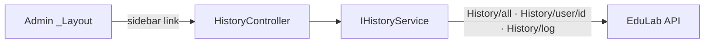

# HistoryController Module Documentation (MVC — Admin Area)

---

## Overview

### Purpose
Admin audit log: all platform activity, filterable per user, with localized operation descriptions.

### Business Objective
Full auditability — admins can trace who did what across the platform.

### Main Functionality
- All history (GET `History/all`)
- Per-user history (GET `History/user/{userId}`)
- Logging push from MVC (POST `History/log`)

### Primary User Roles

| Role | Description |
|------|-------------|
| Admin (AdminArea policy) | Audit review |

---

## Module Architecture

```
Presentation           Areas/Admin/Views/History/Index.cshtml (only view — reused by ByUser)
Application            IHistoryService -> GetAllHistoryAsync + GetHistoryByUserAsync
External               EduLab API: GET History/all, GET History/user/{userId},
                       POST History/log?userId=&operation=
```

### Controllers

| Controller | Responsibility |
|-----------|----------------|
| `HistoryController` | Index, ByUser (2 actions) |

### Services

| Service | Responsibility |
|---------|----------------|
| `HistoryService` | `GetAllHistoryAsync` -> GET `History/all` (HistoryService.cs:115); `GetHistoryByUserAsync` -> GET `History/user/{userId}` (HistoryService.cs:215); logging helper POST `History/log?userId=&operation=` (HistoryService.cs:72) |
| `IStringLocalizer` | Localized operation labels (constructor :38-43) |

### Dependencies on Other Modules
- **Admin layout** (sidebar link).
- **HistoryDTO** localization model.
- **EduLab API** (hard dependency).

---

## Folder Structure

```
Areas/Admin/Controllers/
+-- HistoryController.cs              # 2 actions

Areas/Admin/Views/History/
+-- Index.cshtml                      # Single log view (used by both actions)
```

---

## Database Design

None (MVC). Logs live in the API's `HistoryLogs` table.

---

## Internal Workflows & Runtime Behavior

### Workflow 1: All History

#### Behavior
- `Index` (`[HttpGet]`, :54-55) -> `GetAllHistoryAsync` -> View.

### Workflow 2: Per-User History

#### Flow

```mermaid
flowchart TD
    A[User link on dashboard/table] --> B[GET History/ByUser?userId=]
    B --> C[GET History/user/userId]
    C -->|ok| D[View Index, logs :93]
    C -->|fail| E[Fallback (service default)]
```

#### Runtime Behavior
- `ByUser` (:78-79) reuses the **same Index view** with the user's logs (HistoryController.cs:93).

---

## Data Flow Analysis

```mermaid
flowchart LR
    A[Request] --> B[HistoryController]
    B --> C[HistoryService]
    C -->|GET History/all · History/user/id ·<br/>POST History/log| API[EduLab API]
    C --> D[HistoryDTO[]]
    D --> E[Index.cshtml badges]
```

#### Mapping & Transformations
- `HistoryDTO.Date` is `DateOnly`, `HistoryDTO.Time` is `TimeOnly` (HistoryDTO.cs:38-41).
- `BadgeClass` switch (HistoryDTO.cs:43-54): delete ops = 1/10/7, create ops = 2/9/8/6, update = 4.
- `LocalizeOperation` with `{0..n}` placeholder padding (HistoryDTO.cs:56-99).

---

## Controllers & Endpoints

### HistoryController

**Route**: `/Admin/History`  
**Authorization**: `[Area("Admin")]` + `[Authorize(Policy="AdminArea")]`  
**Dependencies**: `IHistoryService`, `ILogger`, `IStringLocalizer`

| Action | HTTP | Route | Description |
|--------|------|-------|-------------|
| Index | GET | `/Admin/History/Index` | All platform history |
| ByUser | GET | `/Admin/History/ByUser?userId` | History for one user |

**Model**: `List<HistoryDTO>`.

---

## Frontend Integration

### Index.cshtml
- Log entries with `BadgeClass` colors + `LocalizeOperation` text; per-user drill-down links to `ByUser`.

---

## Business Rules

| Rule | Verified in | Why it exists |
|------|-------------|---------------|
| AdminArea-only | class policy | Audit data is sensitive |
| User-scoped logs | `History/user/{userId}` | Drill-down audit |

---

## Security Analysis

| Control | Status |
|---------|--------|
| Authentication | ✅ AdminArea policy |
| Authorization | API returns requested user's logs to authorized admins |
| Data exposure | Full audit trail (admin-only by policy) |

---

## Module Dependencies



**Internal**: Admin layout, HistoryDTO.
**External**: EduLab API only.

---

## Hidden Behaviors & Technical Notes

1. **Logging POST from MVC**: `HistoryService` can push log entries (`POST History/log?userId=&operation=`, HistoryService.cs:72) — the MVC layer both reads and writes history.
2. **Single shared view** for both actions — no dedicated user view; filtering state isn't preserved in the URL (refresh loses the filter).
3. **URL-base stripping**: `HistoryService` uses `Replace("/api","")` (HistoryService.cs:39) — inconsistent with other services' `Replace("/api/","/")`.

---

## Configuration

| Key | Purpose |
|-----|---------|
| `EduLab:ApiBaseUrl` | API base |

---

## Change Log

**Current functionality (verified):** all-history + per-user history with localized/color-coded operation badges.

**Maintenance notes:** unify `/api` stripping; consider dedicated ByUser view with URL state.