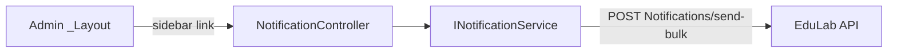

# NotificationController Module Documentation (MVC — Admin Area)

---

## Overview

### Purpose
Platform-wide broadcast: admin composes a notification and pushes it to all users (bulk send).

### Business Objective
Reach every user with announcements (maintenance, promotions, policy changes) in-app (+ optional email).

### Main Functionality
- Send bulk notification (JSON POST)
- (List surface is a placeholder view)

### Primary User Roles

| Role | Description |
|------|-------------|
| Admin (AdminArea policy) | Broadcast notifications |

---

## Module Architecture

```
Presentation           Areas/Admin/Views/Notification/Index.cshtml (only view)
Application            INotificationService -> SendBulkAsync
External               EduLab API: POST Notifications/send-bulk,
                       GET notifications?Type=&Status=&PageNumber=&PageSize=
```

### Controllers

| Controller | Responsibility |
|-----------|----------------|
| `NotificationController` | Index, SendNotification (2 actions) |

### Services

| Service | Responsibility |
|---------|----------------|
| `NotificationService` | `SendBulkAsync` -> POST `Notifications/send-bulk` (NotificationService.cs:242); paginated GET `notifications?Type=&Status=&PageNumber=&PageSize=` (:33-43); mark-all-read (:133), unread-count (:105), delete-all (:207) used by Learner area |

### Dependencies on Other Modules
- **Admin layout** (sidebar link).
- **EduLab API** (hard dependency).

---

## Folder Structure

```
Areas/Admin/Controllers/
+-- NotificationController.cs         # 2 actions

Areas/Admin/Views/Notification/
+-- Index.cshtml                      # Compose + send UI
```

---

## Database Design

None (MVC). Notifications live in the API's `Notifications` table (targeted per user).

---

## Internal Workflows & Runtime Behavior

### Workflow 1: Send Bulk Notification

#### Flow

```mermaid
flowchart TD
    A[Compose form: title + message + options] --> B[POST SendNotification<br/>[FromBody] AdminNotificationRequestDto<br/>antiforgery ✅]
    B --> C[Manual ModelState check<br/>Arabic error messages]
    C --> D[SendBulkAsync]
    D --> E[POST Notifications/send-bulk]
    E -->|ok| F[Json success + data]
    E -->|fail| G[Json failure]
```

#### Runtime Behavior
- `[ValidateAntiForgeryToken]` present (NotificationController.cs:34-36).
- ModelState handled manually with Arabic messages (not `[ApiController]`-style).
- `Index` (:29-32) renders `View()` with **no model** — the page is purely a composer.

---

## Data Flow Analysis

```mermaid
flowchart LR
    A[Form fields] --> B[AdminNotificationRequestDto]
    B --> C[SendBulkAsync]
    C --> D[POST Notifications/send-bulk]
    D --> E[Json {success, data}]
```

---

## Controllers & Endpoints

### NotificationController

**Route**: `/Admin/Notification`  
**Authorization**: `[Area("Admin")]` + `[Authorize(Policy="AdminArea")]`  
**Dependencies**: `INotificationService` (:19-22)

| Action | HTTP | Route | Description | Anti-forgery |
|--------|------|-------|-------------|--------------|
| Index | GET | `/Admin/Notification/Index` | Composer view (no model) | — |
| SendNotification | POST | `/Admin/Notification/SendNotification` | Bulk send (JSON) | ✅ |

**Model**: `AdminNotificationRequestDto` (body).

---

## Frontend Integration

### Index.cshtml
- Compose form (title, message, audience options); fetch POST with antiforgery header; toasts for result.

---

## Business Rules

| Rule | Verified in | Why it exists |
|------|-------------|---------------|
| Bulk send only (no targeting) | single DTO + send-bulk | Broadcast channel is platform-wide |
| ModelState enforced manually | controller body | Explicit validation UX |

---

## Security Analysis

| Control | Status |
|---------|--------|
| Authentication | ✅ AdminArea policy |
| Anti-forgery | ✅ |
| Abuse control | Broadcast reach = platform-wide; payload limits enforced by DTO + API |

---

## Module Dependencies



**Internal**: Admin layout.
**External**: EduLab API only.

---

## Hidden Behaviors & Technical Notes

1. **No claim gate** on broadcast — any AdminArea user can send platform-wide notifications (compare Refunds/Reports which claim-gate).
2. **Index carries no data** — no recent-sends list; admins can't review what was broadcast from this page.
3. **No email option here**? (Dependency on DTO — send-bulk payload decides email delivery; check `AdminNotificationRequestDto` for the SendEmail flag.)

---

## Configuration

| Key | Purpose |
|-----|---------|
| `EduLab:ApiBaseUrl` | API base |

---

## Change Log

**Current functionality (verified):** bulk notification composer with antiforgery-protected JSON send.

**Maintenance notes:** consider claim-gating + a sent-history list.