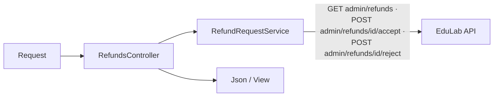
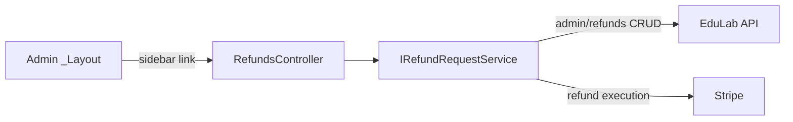

# RefundsController Module Documentation (MVC — Admin Area)

---

## Overview

### Purpose
Admin refund-request review: list requests, approve or reject with reason.

### Business Objective
Enforce the refund policy: admins decide, the API executes the actual Stripe refund.

### Main Functionality
- List refund requests
- Approve a request (claim-gated)
- Reject a request with reason (claim-gated)

### Primary User Roles

| Role | Description |
|------|-------------|
| Admin (AdminArea policy) | List + approve/reject |
| Claim holders | `ViewRefunds` (list), `ManageRefunds` (decide) |

---

## Module Architecture

```
Presentation           Areas/Admin/Views/Refunds/Index.cshtml (only view)
Application            IRefundRequestService -> GetRefundRequestsAsync, AcceptAsync, RejectAsync
External               EduLab API: GET admin/refunds,
                       POST admin/refunds/{id}/accept,
                       POST admin/refunds/{id}/reject
```

### Controllers

| Controller | Responsibility |
|-----------|----------------|
| `RefundsController` | Index, Approve, Reject (3 actions) |

### Services

| Service | Responsibility |
|---------|----------------|
| `RefundRequestService` | `GetRefundRequestsAsync` -> GET `admin/refunds` (RefundRequestService.cs:46); `AcceptAsync` -> POST `admin/refunds/{id}/accept` (:97); `RejectAsync` -> POST `admin/refunds/{id}/reject` body `{reason}` (:135-137) |

### Dependencies on Other Modules
- **Admin layout** (sidebar link).
- **Claims** (`AdminClaims`).
- **EduLab API** (hard dependency).

---

## Folder Structure

```
Areas/Admin/Controllers/
+-- RefundsController.cs              # 3 actions

Areas/Admin/Views/Refunds/
+-- Index.cshtml                      # Request list + decision modals
```

---

## Database Design

None (MVC). Requests live in the API's refund tables; actual money movement is Stripe-side.

---

## Internal Workflows & Runtime Behavior

### Workflow 1: List Refund Requests

#### Behavior
- `Index` (:42-68): **claim gate `ViewRefunds`** (:48-52); loads `List<AdminRefundRequestDto>`; View.

### Workflow 2: Approve / Reject

#### Flow

```mermaid
flowchart TD
    A[Approve button] --> B[POST Approve + antiforgery ✅]
    B --> C{claim ManageRefunds :84-88}
    C -->|no| D[Forbid]
    C -->|yes| E[AcceptAsync id]
    E --> F[POST admin/refunds/id/accept]
    F --> G[Json + TempData result]
    H[Reject form: id + reason] --> I[POST Reject + antiforgery ✅]
    I --> J{claim ManageRefunds :125-129}
    J -->|no| K[Forbid]
    J -->|yes| L[RejectAsync id, reason]
    L --> M[POST admin/refunds/id/reject<br/>body {reason}]
    M --> N[Json]
```

#### Runtime Behavior
- Both decision POSTs are claim-gated AND antiforgery-protected (Approve :76-78/84-88, Reject :117-119/125-129).

---

## Data Flow Analysis



---

## Controllers & Endpoints

### RefundsController

**Route**: `/Admin/Refunds`  
**Authorization**: `[Area("Admin")]` + `[Authorize(Policy="AdminArea")]` + per-action claims  
**Dependencies**: `IRefundRequestService` (:27-30)

| Action | HTTP | Route | Claim | Description | Anti-forgery |
|--------|------|-------|-------|-------------|--------------|
| Index | GET | `/Admin/Refunds/Index` | ViewRefunds (:48-52) | Request list | — |
| Approve | POST | `/Admin/Refunds/Approve?id` | ManageRefunds (:84-88) | Accept request | ✅ |
| Reject | POST | `/Admin/Refunds/Reject?id&reason` | ManageRefunds (:125-129) | Reject with reason | ✅ |

**Model**: `List<AdminRefundRequestDto>`.

---

## Frontend Integration

### Index.cshtml
- Request cards/table with approve + reject-reason modals; Json + TempData-driven toasts.

---

## Business Rules

| Rule | Verified in | Why it exists |
|------|-------------|---------------|
| View vs decide separated by claims | ViewRefunds vs ManageRefunds | Least-privilege access |
| Reject requires a reason | body `{reason}` | Refund trail + policy fairness |

---

## Security Analysis

| Control | Status |
|---------|--------|
| Authentication | ✅ AdminArea policy |
| Claim-gating | ✅ view/decide split |
| Anti-forgery | ✅ both decision POSTs |
| Financial risk | Approve triggers real Stripe refunds — API must validate status transitions |

---

## Module Dependencies



**Internal**: Admin layout, claims.
**External**: EduLab API (+ Stripe behind the API).

---

## Hidden Behaviors & Technical Notes

1. **Claim split** (ViewRefunds vs ManageRefunds) — the strongest gating pattern in the Admin area; model others on it.
2. **Refund policy enforcement is API-side** — the MVC layer never touches Stripe; status-transition validation must exist in the API.

---

## Configuration

| Key | Purpose |
|-----|---------|
| `EduLab:ApiBaseUrl` | API base |

---

## Change Log

**Current functionality (verified):** claim-gated refund list + approve/reject with antiforgery and localized feedback.

**Maintenance notes:** none outstanding.