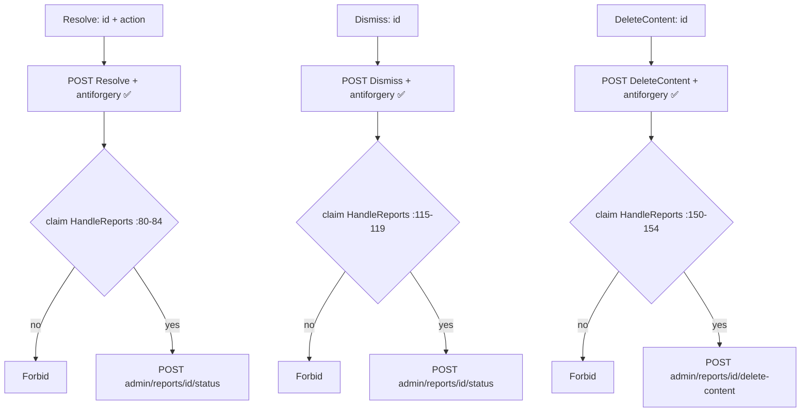
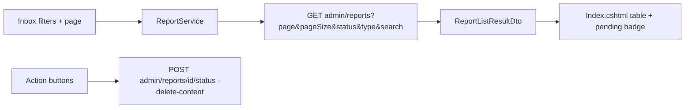
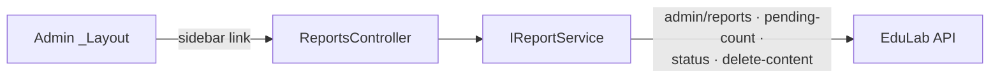

# ReportsController Module Documentation (MVC — Admin Area)

---

## Overview

### Purpose
Moderation inbox: user-submitted reports (course/comment/review) with resolve, dismiss, and content-deletion actions.

### Business Objective
Keep the platform clean: admins triage reports, act on policy violations, and remove offending content.

### Main Functionality
- Paginated report list with status/type/search filters
- Resolve with an action (warn/remove/no-violation)
- Dismiss a report
- Delete offending content (course/comment/review)

### Primary User Roles

| Role | Description |
|------|-------------|
| Admin (AdminArea policy) | List + act |
| Claim holders | `ViewReports` (list), `HandleReports` (act) |

---

## Module Architecture

```
Presentation           Areas/Admin/Views/Reports/Index.cshtml (only view)
Application            IReportService -> GetPendingCountAsync, GetReportedContentAsync,
                       ResolveReportAsync, DismissReportAsync, DeleteReportedContentAsync
External               EduLab API: GET admin/reports?page&pageSize&status&type&search,
                       GET admin/reports/pending-count,
                       POST admin/reports/{id}/status,
                       POST admin/reports/{id}/delete-content
```

### Controllers

| Controller | Responsibility |
|-----------|----------------|
| `ReportsController` | Index, Resolve, Dismiss, DeleteContent (4 actions) |

### Services

| Service | Responsibility |
|---------|----------------|
| `ReportService` | `GetReportedContentAsync` -> GET `admin/reports?page=&pageSize=&status=&type=&search=` (ReportService.cs:38); `GetPendingCountAsync` -> GET `admin/reports/pending-count` (:66); `ResolveReportAsync` -> POST `admin/reports/{id}/status` (:88); `DeleteReportedContentAsync` -> POST `admin/reports/{id}/delete-content` (:115) |
| `IStringLocalizer` | Localized status/action labels (:21-24) |

### Dependencies on Other Modules
- **Admin layout** (sidebar link).
- **Claims** (`AdminClaims`).
- **SD constants**: `ReportStatus` (pending/resolved/dismissed), `ReportType` (Course/Comment/Review), `ReportAction` (WarnedUser/RemovedContent/ReviewedNoViolation), reason lists.
- **EduLab API** (hard dependency).

---

## Folder Structure

```
Areas/Admin/Controllers/
+-- ReportsController.cs              # 4 actions

Areas/Admin/Views/Reports/
+-- Index.cshtml                      # Moderation inbox
```

---

## Database Design

None (MVC). Reports + moderation actions live in the API's `Reports` table.

---

## Internal Workflows & Runtime Behavior

### Workflow 1: Report Inbox

#### Behavior
- `Index` (:34-69): **claim gate `ViewReports`** (:38-42); `page = Math.Max(1, page)` (:44); fixed `pageSize = 10` (:45); filters pass through to the API; renders `ReportListResultDto`.

### Workflow 2: Act on a Report

#### Flow



#### Runtime Behavior
- All three POSTs claim-gated + antiforgery-protected (Resolve :74-76/80-84, Dismiss :109-111/115-119, DeleteContent :144-146/150-154).

---

## Data Flow Analysis



---

## Controllers & Endpoints

### ReportsController

**Route**: `/Admin/Reports`  
**Authorization**: `[Area("Admin")]` + `[Authorize(Policy="AdminArea")]` + per-action claims  
**Dependencies**: `IReportService`, `IStringLocalizer` (:21-24)

| Action | HTTP | Route | Claim | Description | Anti-forgery |
|--------|------|-------|-------|-------------|--------------|
| Index | GET | `/Admin/Reports/Index?page&status&type&search` | ViewReports (:38-42) | Paginated inbox | — |
| Resolve | POST | `/Admin/Reports/Resolve?id&action` | HandleReports (:80-84) | Mark resolved with action | ✅ |
| Dismiss | POST | `/Admin/Reports/Dismiss?id` | HandleReports (:115-119) | Dismiss report | ✅ |
| DeleteContent | POST | `/Admin/Reports/DeleteContent?id` | HandleReports (:150-154) | Remove offending content | ✅ |

**Model**: `ReportListResultDto`; page size fixed at 10.

---

## Frontend Integration

### Index.cshtml
- Filter bar (status/type/search), paginated table, action modals; pending-count badge; toasts via Json + TempData.

---

## Business Rules

| Rule | Verified in | Why it exists |
|------|-------------|---------------|
| Page clamped >= 1 | ReportsController.cs:44 | Defensive pagination |
| Page size fixed at 10 | ReportsController.cs:45 | Predictable payload |
| View vs act claims split | ViewReports / HandleReports | Least privilege |
| ReportAction vocabulary | SD.cs:57-59 | Consistent action semantics |

---

## Security Analysis

| Control | Status |
|---------|--------|
| Authentication | ✅ AdminArea policy |
| Claim-gating | ✅ view/act split |
| Anti-forgery | ✅ all 3 POSTs |
| Content deletion | API-side ownership + cascade safety required (DeleteContent forwards only ids) |

---

## Module Dependencies



**Internal**: Admin layout, claims, SD report constants.
**External**: EduLab API only.

---

## Hidden Behaviors & Technical Notes

1. **`Resolve` takes an `action`** — the status POST must map `ReportAction` values (WarnedUser/RemovedContent/ReviewedNoViolation) to API semantics.
2. **Pending-count endpoint** (`admin/reports/pending-count`, ReportService.cs:66) feeds the nav badge — called outside this controller's flows.
3. **Report moderation affects real content**: `DeleteContent` forwards only the report id — the API decides what to delete.

---

## Configuration

| Key | Purpose |
|-----|---------|
| `EduLab:ApiBaseUrl` | API base |

---

## Change Log

**Current functionality (verified):** claim-gated, paginated moderation inbox with resolve/dismiss/delete-content actions, all antiforgery-protected.

**Maintenance notes:** none outstanding.