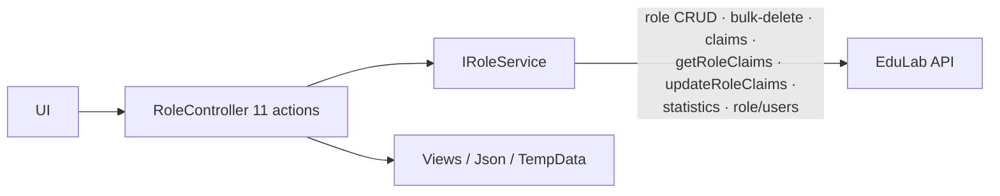
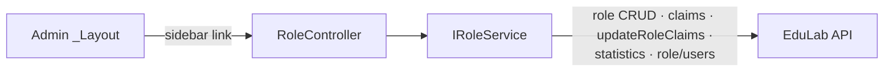

# RoleController Module Documentation (MVC — Admin Area)

---

## Overview

### Purpose
Role & permissions administration: list roles, create/edit/delete (protected-role aware), manage role claims (permissions), and list users in a role.

### Business Objective
RBAC administration — admins define roles and their permission claims; the API enforces them.

### Main Functionality
- Role CRUD with protected-role guards
- Claims (permissions) viewer + categorized editor
- Users-in-role listing

### Primary User Roles

| Role | Description |
|------|-------------|
| Admin (AdminArea policy) | Full role management |

---

## Module Architecture

```
Presentation           Areas/Admin/Views/Role/{Index, ManagePermissions}.cshtml (2 views)
Application            IRoleService
External               EduLab API: role/* endpoints (12 verified paths)
```

### Controllers

| Controller | Responsibility |
|-----------|----------------|
| `RoleController` | Index, Details, Create, Edit, Delete, BulkDelete, Claims, ManagePermissions, UpdateClaims, GetClaimsJson, UsersInRole (11 actions) |

### Services

| Service | Responsibility |
|---------|----------------|
| `RoleService` | GET `role` (:39), GET `role/{id}` (:83), POST `role` (:128), PUT `role/{id}` (:173), DELETE `role/{id}` (:217), POST `role/bulk-delete` (:261), POST `role/{roleId}/claims` (:310), GET `role/{roleId}/claims` (:355), GET `role/getRoleClaims/{roleId}` (:389), PUT `role/updateRoleClaims/{roleId}` (:420), GET `role/statistics` (:456), GET `role/{roleName}/users` (:504) |

### Dependencies on Other Modules
- **Admin layout** (sidebar link, active state includes ManagePermissions).
- **SD.ProtectedRoles** (SD.cs:13-16 — Admin, Instructor, InstructorPending, Student, Support; Moderator NOT protected).
- **ClaimsModel** (Models/DTOs/Roles).
- **EduLab API** (hard dependency).

---

## Folder Structure

```
Areas/Admin/Controllers/
+-- RoleController.cs                 # 11 actions (520 lines)
+-- (namespace anomaly: EduLab_MVC.Controllers, :9)

Areas/Admin/Views/Role/
+-- Index.cshtml                      # Role list + CRUD modals
+-- ManagePermissions.cshtml          # Claims editor
+-- ⚠️ MISSING: Details, Claims, UsersInRole views (actions 500)
```

---

## Database Design

None (MVC). Roles/claims live in the API's `Roles` + `RoleClaims` tables.

---

## Internal Workflows & Runtime Behavior

### Workflow 1: Role CRUD

#### Flow

```mermaid
flowchart TD
    A[Index :39-59] --> B[GET role → View(roles)]
    C[Create roleName :111-113 POST ✅] --> D{roleName blank → TempData error}
    D --> E[POST role]
    F[Edit id + roleName :159-161 POST ✅] --> G[PUT role/id]
    H[Delete id :206 NO HttpPost attr!] --> I[⚠️ GET-invocable: protected check :219 → DELETE role/id]
    J[BulkDelete roleIds csv :258-260 POST ✅] --> K[protected-in-request check :275 → POST role/bulk-delete]
```

#### Runtime Behavior
- Create/Edit/BulkDelete have `[ValidateAntiForgeryToken]` + `[HttpPost]`.
- **`Delete` has NO `[HttpPost]` attribute** — it runs on GET and POST alike (link-triggerable, CSRF-able despite the protected-role check).
- Protected roles blocked in Delete (:219) and BulkDelete (:275).

### Workflow 2: Claims Management

#### Flow

```mermaid
flowchart TD
    A[Claims id :320] --> B[GET role/{id}/claims → View(roleClaims)]
    B --> C[⚠️ NO Claims.cshtml → 500]
    D[ManagePermissions id :360] --> E[GET role/{id} → ViewBag.RoleId + RoleName]
    E --> F[View() → ManagePermissions.cshtml ✅]
    G[UpdateClaims [FromBody] ClaimsModel :403-404<br/>NO antiforgery] --> H[ModelState → BadRequest]
    H --> I[PUT role/updateRoleClaims/{roleId}]
    I -->|ok| J[Ok + TempData Success]
    I -->|cancel| K[StatusCode 499]
    I -->|error| L[StatusCode 500]
    M[GetClaimsJson id :446-447 GET] --> N[GET role/getRoleClaims/{roleId} → Json]
```

### Workflow 3: Users In Role

#### Behavior
- `UsersInRole` (:490): `GET role/{roleName}/users` -> `View(users)` — **no UsersInRole.cshtml → 500**.

---

## Data Flow Analysis



---

## Controllers & Endpoints

### RoleController

**Route**: `/Admin/Role`  
**Authorization**: `[Area("Admin")]` (:14) + `[Authorize(Policy="AdminArea")]` (:15) — **namespace `EduLab_MVC.Controllers` (:9), anomaly**  
**Dependencies**: `IRoleService`, `ILogger`, `IStringLocalizer` (:25-30)

| Action | HTTP | Route | Description | Anti-forgery |
|--------|------|-------|-------------|--------------|
| Index | GET | `/Admin/Role/Index` | Role list | — |
| Details | GET | `/Admin/Role/Details/{id}` | ⚠️ No view — 500 | — |
| Create | POST | `/Admin/Role/Create?roleName` | Create role | ✅ |
| Edit | POST | `/Admin/Role/Edit?id&roleName` | Rename role | ✅ |
| Delete | POST(**+GET**) | `/Admin/Role/Delete?id` | ⚠️ No [HttpPost] — GET-invocable | ❌ |
| BulkDelete | POST | `/Admin/Role/BulkDelete?roleIds` | Bulk delete (csv) | ✅ |
| Claims | GET | `/Admin/Role/Claims/{id}` | ⚠️ No view — 500 | — |
| ManagePermissions | GET | `/Admin/Role/ManagePermissions/{id}` | Permissions page | — |
| UpdateClaims | POST | `/Admin/Role/UpdateClaims` | Save claims (JSON) | ❌ |
| GetClaimsJson | GET | `/Admin/Role/GetClaimsJson?id` | Claims JSON | — |
| UsersInRole | GET | `/Admin/Role/UsersInRole?roleName` | ⚠️ No view — 500 | — |

**Models**: `List<RoleDto>` (Index), `ClaimsModel` (UpdateClaims body), role-claims DTOs.

---

## Frontend Integration

### Index.cshtml
- Role table with create/edit/delete/bulk modals; links to ManagePermissions (active state in sidebar, Layout.cshtml:890).

### ManagePermissions.cshtml
- Categorized claim toggles; fetch POST to `UpdateClaims`; permissions saved via JSON.

---

## Business Rules

| Rule | Verified in | Why it exists |
|------|-------------|---------------|
| Protected roles undeletable | Delete :219, BulkDelete :275 | System roles must survive |
| ProtectedRoles excludes Moderator | SD.cs:13-16 | ⚠️ Moderator can be deleted/renamed |
| Blank role name rejected | Create :117-122 | Data quality |

---

## Security Analysis

| Control | Status |
|---------|--------|
| Authentication | ✅ AdminArea policy |
| Anti-forgery | ❌ Delete (GET-invocable) + UpdateClaims unprotected |
| Protected-role enforcement | ✅ in Delete/BulkDelete (client-side equivalent via API too) |
| Privilege risk | Anyone with AdminArea can change permissions — no claim gate on UpdateClaims |

---

## Module Dependencies



**Internal**: Admin layout, SD.ProtectedRoles, ClaimsModel.
**External**: EduLab API only.

---

## Hidden Behaviors & Technical Notes

1. **`Delete` lacks `[HttpPost]`** (RoleController.cs:206) — a GET to `/Admin/Role/Delete?id=` deletes a role (CSRF vector, no antiforgery).
2. **Three dead actions with missing views**: `Details`, `Claims`, `UsersInRole` return views that don't exist (verified: only Index + ManagePermissions.cshtml in the folder) — runtime 500s.
3. **Namespace anomaly**: `EduLab_MVC.Controllers` instead of `.Areas.Admin.Controllers` (RoleController.cs:9).
4. **`UpdateClaims` has no antiforgery and no claim gate** — any AdminArea user can rewrite any role's permissions.
5. **Moderator not in ProtectedRoles** (SD.cs:13-16) — deleting/renaming it can orphan `"Moderator "`-role users.
6. **Two claims-read paths**: `GET role/{roleId}/claims` (:355) and `GET role/getRoleClaims/{roleId}` (:389) — used by different actions (Claims vs GetClaimsJson).

---

## Configuration

| Key | Purpose |
|-----|---------|
| `EduLab:ApiBaseUrl` | API base |

---

## Change Log

**Current functionality (verified):** role CRUD with protected-role guards, categorized permissions editor, claims JSON, users-in-role — with view gaps and antiforgery holes.

**Maintenance notes:**
- Add `[HttpPost]` + antiforgery to `Delete`.
- Create the missing Details/Claims/UsersInRole views or remove the actions.
- Claim-gate + antiforgery `UpdateClaims`.
- Add Moderator to ProtectedRoles.