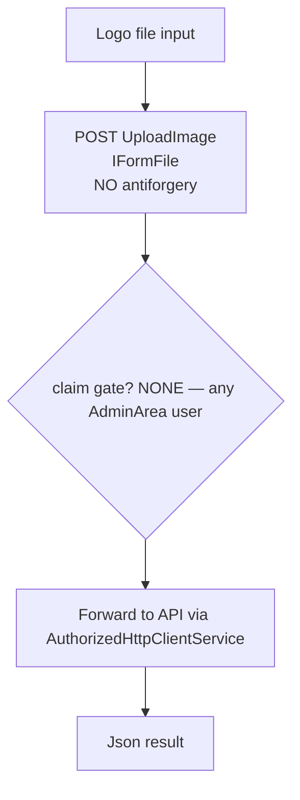
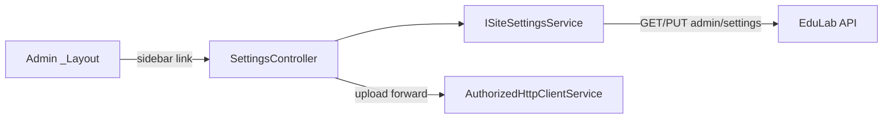

# SettingsController Module Documentation (MVC — Admin Area)

---

## Overview

### Purpose
Platform settings editor: read/write site-wide configuration + logo upload.

### Business Objective
Admins control branding and global settings without touching code.

### Main Functionality
- Load settings (GET `admin/settings`, cached 5 min)
- Save settings (PUT `admin/settings`)
- Upload logo image (API-forwarded)

### Primary User Roles

| Role | Description |
|------|-------------|
| Admin (AdminArea policy) | View settings (`ViewSiteSettings`) |
| Claim holders | `EditSiteSettings` (save) |

---

## Module Architecture

```
Presentation           Areas/Admin/Views/Settings/Index.cshtml (only view)
Application            ISiteSettingsService -> GetSiteSettingsAsync, UpdateSiteSettingsAsync
                       (+ raw AuthorizedHttpClientService for upload)
External               EduLab API: GET admin/settings, PUT admin/settings,
                       upload endpoint (via AuthorizedHttpClientService)
```

### Controllers

| Controller | Responsibility |
|-----------|----------------|
| `SettingsController` | Index, Save, UploadImage (3 actions) |

### Services

| Service | Responsibility |
|---------|----------------|
| `SiteSettingsService` | `GetSiteSettingsAsync` -> GET `admin/settings` (SiteSettingsService.cs:35) with **5-minute `IMemoryCache`** (:43); `UpdateSiteSettingsAsync` -> PUT `admin/settings` (:67) |
| `AuthorizedHttpClientService` | Direct upload forwarding (:20 DI) |

### Dependencies on Other Modules
- **Admin layout** (sidebar link).
- **Claims** (`AdminClaims`).
- **EduLab API** (hard dependency).

---

## Folder Structure

```
Areas/Admin/Controllers/
+-- SettingsController.cs             # 3 actions

Areas/Admin/Views/Settings/
+-- Index.cshtml                      # Settings form + logo upload
```

---

## Database Design

None (MVC). Settings live in the API's settings table (single row).

---

## Internal Workflows & Runtime Behavior

### Workflow 1: View Settings

#### Behavior
- `Index` (:28-35): **claim gate `ViewSiteSettings`** (:30-31) — missing claim -> `Forbid()`; renders View.

### Workflow 2: Save Settings

#### Flow

```mermaid
flowchart TD
    A[Settings form] --> B[POST Save<br/>[FromBody] SiteSettingsDTO<br/>NO antiforgery]
    B --> C{claim EditSiteSettings :40-41}
    C -->|no| D[Forbid]
    C -->|yes| E[UpdateSiteSettingsAsync]
    E --> F[PUT admin/settings]
    F --> G[Json result]
```

### Workflow 3: Upload Logo

#### Flow



#### Runtime Behavior
- **`Save` and `UploadImage` lack `[ValidateAntiForgeryToken]`** (SettingsController.cs:37-38, 58-59).
- **`UploadImage` has NO claim gate** — any AdminArea user (e.g. Moderator) can replace the platform logo.

---

## Data Flow Analysis

```mermaid
flowchart LR
    A[Settings form / logo] --> B[SettingsController]
    B --> C[GET admin/settings (cached 5min) · PUT admin/settings ·<br/>upload forward]
    C --> D[Json / View]
```

---

## Controllers & Endpoints

### SettingsController

**Route**: `/Admin/Settings`  
**Authorization**: `[Area("Admin")]` + `[Authorize(Policy="AdminArea")]` + per-action claims  
**Dependencies**: `ISiteSettingsService`, `AuthorizedHttpClientService` (:20)

| Action | HTTP | Route | Claim | Description | Anti-forgery |
|--------|------|-------|-------|-------------|--------------|
| Index | GET | `/Admin/Settings/Index` | ViewSiteSettings (:30-31) | Settings form | — |
| Save | POST | `/Admin/Settings/Save` | EditSiteSettings (:40-41) | Persist settings (JSON) | ❌ |
| UploadImage | POST | `/Admin/Settings/UploadImage` | **none** | Logo upload | ❌ |

**Model**: `SiteSettingsDTO` (body).

---

## Frontend Integration

### Index.cshtml
- Settings form + logo uploader; fetch POSTs; toasts.

---

## Business Rules

| Rule | Verified in | Why it exists |
|------|-------------|---------------|
| View requires claim | `ViewSiteSettings` | Settings are admin-sensitive |
| Save requires claim | `EditSiteSettings` | Least privilege |
| Upload unrestricted | no claim check (verified) | ⚠️ gap |

---

## Security Analysis

| Control | Status |
|---------|--------|
| Authentication | ✅ AdminArea policy |
| Claim-gating | ✅ view/save; ❌ upload |
| Anti-forgery | ❌ both POSTs unprotected (verified) |
| Cache | 5-min IMemoryCache — stale settings after save until expiry |

---

## Module Dependencies



**Internal**: Admin layout, claims.
**External**: EduLab API only.

---

## Hidden Behaviors & Technical Notes

1. **Upload is unguarded**: no claim gate AND no antiforgery — lowest-privilege AdminArea members can swap the logo (verified SettingsController.cs:58-59).
2. **Save also CSRF-exposed** (no antiforgery, SettingsController.cs:37-38).
3. **5-minute cache staleness**: after `Save`, other sessions may still see old settings until cache expiry (SiteSettingsService.cs:43).
4. **`Forbid()` on missing view claim** — returns 403 rather than redirecting to the login/403 page.

---

## Configuration

| Key | Purpose |
|-----|---------|
| `EduLab:ApiBaseUrl` | API base |

---

## Change Log

**Current functionality (verified):** claim-gated settings view/save + unguarded logo upload, 5-minute cached reads.

**Maintenance notes:** add antiforgery + claim gate to `UploadImage`; add antiforgery to `Save`; consider cache invalidation on save.