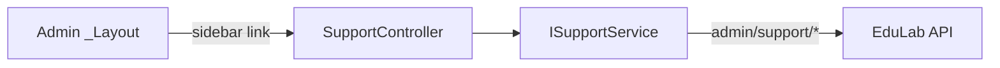

# SupportController Module Documentation (MVC — Admin Area)

---

## Overview

### Purpose
Admin support inbox: list conversations, view one, reply, open/close, mark-all-read, unread badge.

### Business Objective
Agents handle user support tickets from the same live-chat system users see, in one admin inbox.

### Main Functionality
- Conversation list + single conversation view
- Send message
- Set conversation open/closed status
- Mark all read + unread count

### Primary User Roles

| Role | Description |
|------|-------------|
| Admin (AdminArea policy) | View inbox (`ViewSupport`) |
| Claim holders | `HandleSupport` (message/status/read actions) |

---

## Module Architecture

```
Presentation           Areas/Admin/Views/Support/Index.cshtml (only view)
Application            ISupportService (admin variants)
External               EduLab API: admin/support/* paths
                       ViewBags: ApiBaseUrl + AuthToken passed to the view
```

### Controllers

| Controller | Responsibility |
|-----------|----------------|
| `SupportController` | Index, GetConversations, GetConversation, SendMessage, SetStatus, MarkAllRead, UnreadCount (7 actions) |

### Services

| Service | Responsibility |
|---------|----------------|
| `SupportService` | admin paths: GET `admin/support/conversations` (:165), GET `admin/support/conversations/{id}` (:183), POST `admin/support/conversations/{id}/messages` (:204), POST `admin/support/conversations/{id}/status` (:225), GET `admin/support/unread-count` (:240), POST `admin/support/mark-all-read` (:258); user-side `support/conversations` (:35) shared |

### Dependencies on Other Modules
- **Admin layout** (sidebar link).
- **Claims** (`AdminClaims`).
- **EduLab API** (hard dependency).

---

## Folder Structure

```
Areas/Admin/Controllers/
+-- SupportController.cs              # 7 actions

Areas/Admin/Views/Support/
+-- Index.cshtml                      # Inbox (widget-style)
```

---

## Database Design

None (MVC). Conversations/messages live in the API's support tables.

---

## Internal Workflows & Runtime Behavior

### Workflow 1: View Inbox

#### Behavior
- `Index` (:29-30): **claim gate `ViewSupport`** (:32-33).
- Sets `ViewBag.ApiBaseUrl` = `ApiBaseUrl.Replace("/api/","").TrimEnd('/')` (:39) and `ViewBag.AuthToken` = `AuthToken` cookie (:40) — the view consumes both directly.

### Workflow 2: Conversation Operations

#### Flow

```mermaid
flowchart TD
    A[List conversations] --> B[GET GetConversations<br/>claim ViewSupport :53-54]
    B --> C[GET admin/support/conversations]
    D[Open one] --> E[GET GetConversation?id<br/>claim ViewSupport :63-64]
    E --> F[GET admin/support/conversations/id]
    G[Reply] --> H[POST SendMessage<br/>[FromBody] string<br/>claim HandleSupport :73-74<br/>NO antiforgery]
    H --> I[POST admin/support/conversations/id/messages]
    J[Open/close] --> K[POST SetStatus?open=<bool><br/>claim HandleSupport :86-87<br/>NO antiforgery]
    K --> L[POST admin/support/conversations/id/status]
    M[Mark all read] --> N[POST MarkAllRead<br/>claim HandleSupport :96-97<br/>NO antiforgery]
    N --> O[POST admin/support/mark-all-read]
    P[Badge] --> Q[GET UnreadCount<br/>claim ViewSupport :106-107]
    Q --> R[GET admin/support/unread-count]
```

#### Runtime Behavior
- **All three POSTs lack `[ValidateAntiForgeryToken]`** (SendMessage :70-71, SetStatus :83-84, MarkAllRead :93-94) — claim-gated but CSRF-exposed.
- `SetStatus` binds `open` as `[FromQuery] bool` (query, not body).

---

## Data Flow Analysis

```mermaid
flowchart LR
    A[Inbox UI] --> B[SupportController]
    B --> C[SupportService]
    C -->|admin/support/conversations · {id} · messages ·<br/>status · unread-count · mark-all-read| API[EduLab API]
    B --> D[ViewBag.ApiBaseUrl + AuthToken]
    D --> E[Index.cshtml direct API/media calls]
```

---

## Controllers & Endpoints

### SupportController

**Route**: `/Admin/Support`  
**Authorization**: `[Area("Admin")]` + `[Authorize(Policy="AdminArea")]` + per-action claims  
**Dependencies**: `ISupportService` (:19-22)

| Action | HTTP | Route | Claim | Description | Anti-forgery |
|--------|------|-------|-------|-------------|--------------|
| Index | GET | `/Admin/Support/Index` | ViewSupport (:32-33) | Inbox page | — |
| GetConversations | GET | `/Admin/Support/GetConversations` | ViewSupport (:53-54) | List JSON | — |
| GetConversation | GET | `/Admin/Support/GetConversation?id` | ViewSupport (:63-64) | Thread JSON | — |
| SendMessage | POST | `/Admin/Support/SendMessage?id` | HandleSupport (:73-74) | Reply (raw string body) | ❌ |
| SetStatus | POST | `/Admin/Support/SetStatus?open=` | HandleSupport (:86-87) | Open/close | ❌ |
| MarkAllRead | POST | `/Admin/Support/MarkAllRead` | HandleSupport (:96-97) | Mark all read | ❌ |
| UnreadCount | GET | `/Admin/Support/UnreadCount` | ViewSupport (:106-107) | Badge JSON | — |

---

## Frontend Integration

### Index.cshtml
- Widget-style inbox using `ViewBag.AuthToken` for direct API/media calls and `ViewBag.ApiBaseUrl` (stripped of `/api/`) for asset URLs; message polling or SignalR per view wiring.

---

## Business Rules

| Rule | Verified in | Why it exists |
|------|-------------|---------------|
| Read vs act claim split | ViewSupport / HandleSupport | Least privilege |
| Status is a query param | SetStatus `[FromQuery] bool` | Simple toggle contract |

---

## Security Analysis

| Control | Status |
|---------|--------|
| Authentication | ✅ AdminArea policy |
| Claim-gating | ✅ read/act split |
| Anti-forgery | ❌ all 3 POSTs unprotected (verified) |
| Token exposure | AuthToken passed to the view — any XSS on the inbox page exposes the JWT |

---

## Module Dependencies



**Internal**: Admin layout, claims.
**External**: EduLab API only.

---

## Hidden Behaviors & Technical Notes

1. **CSRF-exposed POSTs** (all three) despite claim gating — verified.
2. **AuthToken in ViewBag**: the inbox view needs the raw JWT for direct API calls — a stored-XSS there would leak the session token.
3. **`ViewBag.ApiBaseUrl` strips `/api/`** (:39) — mirrors the Learner Support widget's URL derivation.
4. **`SetStatus` boolean from query**: `?open=` expects `true`/`false` — malformed values revert to default binding behavior.

---

## Configuration

| Key | Purpose |
|-----|---------|
| `EduLab:ApiBaseUrl` | API base (stripped for the view) |
| `AuthToken` (cookie) | Passed to the view for direct API calls |

---

## Change Log

**Current functionality (verified):** claim-gated support inbox with messaging, status toggling, mark-all-read, and unread badge — antiforgery gaps on all POSTs.

**Maintenance notes:** add antiforgery to the three POSTs; avoid exposing raw AuthToken in the view.