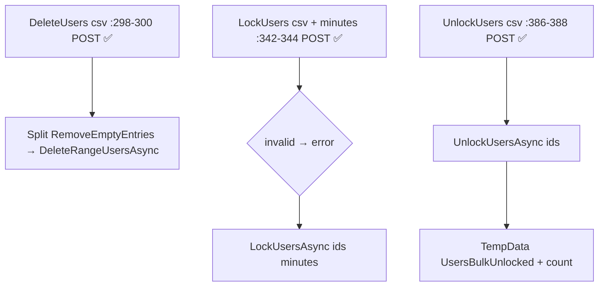
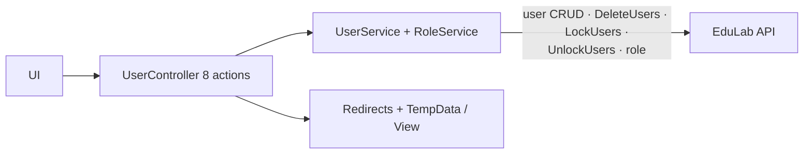
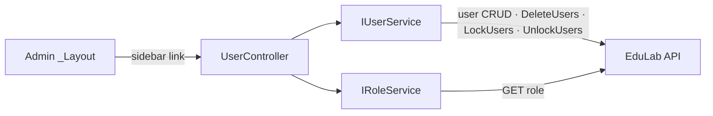

# UserController Module Documentation (MVC — Admin Area)

---

## Overview

### Purpose
User administration: browse users with role filter, edit profiles, lock/unlock accounts, delete users (single + bulk).

### Business Objective
Identity lifecycle management — admins enforce account state (locks) and remove accounts (with API-side protection for self-deletion).

### Main Functionality
- User list + roles dropdown
- Update user (name/role)
- Lock/unlock single user
- Delete single user
- Bulk: delete / lock / unlock

### Primary User Roles

| Role | Description |
|------|-------------|
| Admin (AdminArea policy) | All user management |

---

## Module Architecture

```
Presentation           Areas/Admin/Views/User/Index.cshtml (only view)
Application            IUserService + IRoleService
External               EduLab API: user/* endpoints
```

### Controllers

| Controller | Responsibility |
|-----------|----------------|
| `UserController` | Index, Delete, UpdateUser, Lock, Unlock, DeleteUsers, LockUsers, UnlockUsers (8 actions) |

### Services

| Service | Responsibility |
|---------|----------------|
| `UserService` | GET `user` (:58), GET `user/instructors` (:87), GET `user/admins` (:114), GET `user/{id}` (:145), GET `user/me` (:172), GET `user/by-edulab-id/{id}` (:225), DELETE `user/{userId}` (:260), POST `user/DeleteUsers` (:302), PUT `user` (:354), POST `user/LockUsers` (:403), POST `user/UnlockUsers` (:435) |
| `RoleService` | `GetAllRolesAsync` -> GET `role` (RoleService.cs:39) for the filter dropdown |

### Dependencies on Other Modules
- **Admin layout** (sidebar link).
- **Claims**: none — any AdminArea user manages users.
- **EduLab API** (hard dependency).

---

## Folder Structure

```
Areas/Admin/Controllers/
+-- UserController.cs                 # 8 actions (418 lines)

Areas/Admin/Views/User/
+-- Index.cshtml                      # Users table + modals
```

---

## Database Design

None (MVC). Users live in the API's `Users` table; locks are API-enforced (lockout end time).

---

## Internal Workflows & Runtime Behavior

### Workflow 1: Index

#### Behavior
- `Index` (:50-97): `GetAllUsersAsync`; null/empty users -> `TempData["Info"]` + empty list view; roles loaded into `ViewBag.Roles` (`SelectListItem`s); exception -> `TempData["Error"]` + empty view.
- **Arabic log messages throughout** the controller (mixed-language codebase).

### Workflow 2: Single-User Operations

#### Flow

```mermaid
flowchart TD
    A[Delete id :108-110 POST ✅] --> B[DeleteUserAsync<br/>returns errorMessage string]
    B -->|null = success| C[TempData Success UserDeleted]
    B -->|message| D[TempData Error UserDeleteError]
    E[UpdateUser UpdateUserDTO :143-145 POST ✅] --> F[validations: dto null / Id / FullName / Role]
    F --> G[FullName.Trim → UpdateUserAsync → result.Success]
    H[Lock id + minutes :210-212 POST ✅] --> I{id empty or minutes<=0 → TempData error}
    I --> J[LockUsersAsync [id] minutes]
    K[Unlock id :252-254 POST ✅] --> L[UnlockUsersAsync [id]]
```

### Workflow 3: Bulk Operations

#### Flow



#### Runtime Behavior
- **All 7 POSTs carry `[ValidateAntiForgeryToken]`** — the Admin UserController is fully antiforgery-covered (unlike most admin controllers).
- Unlock bulk ignores `result.Success` — always shows success (UserController.cs:402-405).

---

## Data Flow Analysis



---

## Controllers & Endpoints

### UserController

**Route**: `/Admin/User`  
**Authorization**: `[Area("Admin")]` (:12) + `[Authorize(Policy="AdminArea")]` (:13)  
**Dependencies**: `IUserService`, `IRoleService`, `ILogger`, `IStringLocalizer` (:30-40)

| Action | HTTP | Route | Description | Anti-forgery |
|--------|------|-------|-------------|--------------|
| Index | GET | `/Admin/User/Index` | Users list + role filter | — |
| Delete | POST | `/Admin/User/Delete?id` | Delete user | ✅ |
| UpdateUser | POST | `/Admin/User/UpdateUser` | Update name/role | ✅ |
| Lock | POST | `/Admin/User/Lock?id&minutes` | Lock user (minutes) | ✅ |
| Unlock | POST | `/Admin/User/Unlock?id` | Unlock user | ✅ |
| DeleteUsers | POST | `/Admin/User/DeleteUsers?userIds` | Bulk delete (csv) | ✅ |
| LockUsers | POST | `/Admin/User/LockUsers?userIds&minutes` | Bulk lock | ✅ |
| UnlockUsers | POST | `/Admin/User/UnlockUsers?userIds` | Bulk unlock | ✅ |

**Models**: `List<UserDTO>` (Index), `UpdateUserDTO` (form body).

---

## Frontend Integration

### Index.cshtml
- Users table with per-row edit/delete/lock/unlock modals + bulk selection bar; role dropdown from `ViewBag.Roles`; TempData toasts.

---

## Business Rules

| Rule | Verified in | Why it exists |
|------|-------------|---------------|
| Update requires Id + FullName + Role | UserController.cs:158-177 | Complete profile edits |
| Lock duration must be positive | :218 | Meaningful locks |
| Empty user lists degrade gracefully | :58-70 | UX on empty system |
| Bulk unlock always reports success | :402-405 | ⚠️ silently hides failures |

---

## Security Analysis

| Control | Status |
|---------|--------|
| Authentication | ✅ AdminArea policy |
| Anti-forgery | ✅ ALL 7 POSTs (best coverage in the Admin area) |
| Self-delete protection | API-side only (MVC sends any id; API must block self-deletion) |
| Privilege risk | No claim gate — any AdminArea user can lock/delete any account |

---

## Module Dependencies



**Internal**: Admin layout, DTOs.
**External**: EduLab API only.

---

## Hidden Behaviors & Technical Notes

1. **Full antiforgery coverage** — the Admin area's most disciplined controller (all 7 POSTs protected).
2. **Bulk unlock swallows failures** (UserController.cs:402-405): `UnlockUsersAsync` result ignored, success always shown.
3. **Arabic log messages** — logging language inconsistent with the rest of the codebase.
4. **No claim gating**: delete/lock are high-impact ops open to every AdminArea member (incl. Moderator).
5. **Delete semantics**: `DeleteUserAsync` returns an error message (null = success) — different contract from the lock/unlock `result.Success` pattern.

---

## Configuration

| Key | Purpose |
|-----|---------|
| `EduLab:ApiBaseUrl` | API base |

---

## Change Log

**Current functionality (verified):** full user lifecycle admin (list/edit/lock/unlock/delete, single + bulk) with complete antiforgery coverage and localized feedback.

**Maintenance notes:** honor bulk-unlock results; consider claim gates for destructive ops.