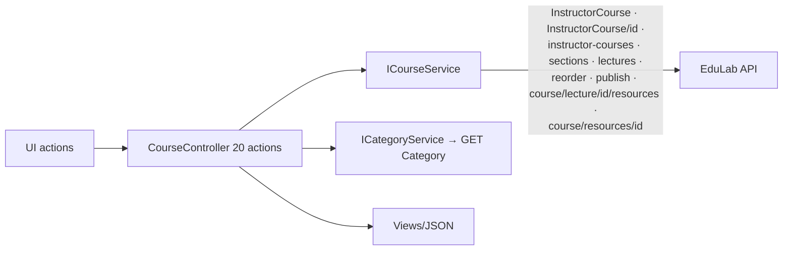
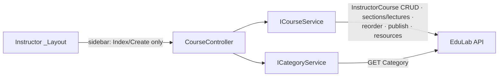

# CourseController Module Documentation (MVC — Instructor Area)

---

## Overview

### Purpose
The instructor's course management hub: list, create, edit, delete (single/bulk), curriculum editing (sections/lectures/resources), publish, and settings.

### Business Objective
Full course lifecycle ownership for instructors: draft -> edit -> publish, with curriculum built section-by-section.

### Main Functionality
- Course list + status visibility
- Create course (draft) / edit course (multipart)
- Delete single course / bulk delete
- Curriculum editor: sections + lectures + lecture resources
- Publish/unpublish
- Course settings + details pages

### Primary User Roles

| Role | Description |
|------|-------------|
| Instructor | All course lifecycle operations (own courses only) |

---

## Module Architecture

```
Presentation           Views/Course/{Index, Create, Details, Curriculum, Settings}.cshtml
Application            ICourseService (20 actions), ICategoryService (dropdowns)
External               EduLab API: InstructorCourse/*, course/lecture/*,
                       course/resources/*, Course (categories)
```

### Controllers

| Controller | Responsibility |
|-----------|----------------|
| `CourseController` | 20 actions covering the full lifecycle |

### Services

| Service | Responsibility |
|---------|----------------|
| `CourseService` | Instructor course CRUD (`InstructorCourse` paths), section/lecture/reorder/publish paths, lecture resources (`course/lecture/{id}/resources`), get-current-instructor-id from JWT `sub` (CourseService.cs:1552-1569), `ExtractApiError` parses `message` (CourseService.cs:1883-1893), legacy `AddCourseAsInstructorAsync` wrapper copying only Title+ShortDescription (CourseService.cs:1427-1446) |
| `CategoryService` | `GetAllCategoriesAsync` -> GET `Category` (CategoryService.cs:42) for dropdowns |

### Dependencies on Other Modules
- **Instructor layout** (sidebar links to Index/Create only).
- **EduLab API** (hard dependency).

---

## Folder Structure

```
Areas/Instructor/Controllers/
+-- CourseController.cs               # 20 actions (1007 lines)

Areas/Instructor/Views/Course/
+-- Index.cshtml                      # Course list + status + publish (990 lines)
+-- Create.cshtml                     # Create form
+-- Details.cshtml                    # Details page
+-- Curriculum.cshtml                 # Section/lecture editor
+-- Settings.cshtml                   # Course settings
```

---

## Database Design

None (MVC). Courses/sections/lectures/resources live in the API's DB.

---

## Internal Workflows & Runtime Behavior

### Workflow 1: Course List

#### Flow

```mermaid
flowchart TD
    A[GET Instructor/Course/Index] --> B[GetInstructorCoursesAsync]
    B --> C[GET InstructorCourse/instructor-courses]
    C -->|ok| D[View(courses)]
    C -->|fail| E[Empty list fallback]
    F[Publish button] --> G[POST Publish<br/>fetch with antiforgery header<br/>Index.cshtml:946-950]
    G --> H[POST InstructorCourse/{courseId}/publish]
```

### Workflow 2: Create / Edit Course

#### Flow

```mermaid
flowchart TD
    A[GET Create] --> B[GetCategories → ViewBag.Categories]
    B --> C[Create.cshtml multipart form]
    D[POST CreateCourse<br/>[FromForm] CourseDraftDTO<br/>NO antiforgery] --> E[POST InstructorCourse]
    E -->|ok| F[Redirect to course list / details]
    F2[GET Edit/id] --> G[Edit view with CourseUpdateDTO]
    H[POST Edit<br/>[FromForm] CourseUpdateDTO<br/>NO antiforgery] --> I[PUT InstructorCourse/{id}]
    I -->|ok| J[Redirect]
```

#### Runtime Behavior
- `CourseDraftDTO` defaults: `Level = "beginner"`, `Language = "ar"`.
- Multipart includes videos/resources per lecture (`AddVideosAndResourcesToFormDataForUpdate`, CourseService.cs:1640-1680).

### Workflow 3: Curriculum Editing

#### Flow

```mermaid
flowchart TD
    A[Curriculum/id view] --> B[Section ops: AddSection POST<br/>InstructorCourse/courseId/sections]
    B --> C[UpdateSection PUT sections/id · DeleteSection DELETE]
    D[Lecture ops: AddLecture POST sections/id/lectures ·<br/>UpdateLecture PUT lectures/id ·<br/>DeleteLecture DELETE lectures/id]
    E[Resources: AddResourceToLecture POST<br/>course/lecture/id/resources ·<br/>DeleteResource DELETE course/resources/id]
    F[⚠️ Reorder buttons call ReorderSections /<br/>ReorderLectures — NO such actions<br/>→ silent 404 (Curriculum.cshtml:574-577, 725)]
```

#### Runtime Behavior
- Section/lecture reorder API paths exist (`PUT InstructorCourse/sections/reorder` CourseService.cs:809, `PUT InstructorCourse/lectures/reorder` :972) **but no controller actions call them** — the curriculum page's drag-reorder silently fails.

### Workflow 4: Delete / BulkDelete

#### Flow

```mermaid
flowchart TD
    A[Delete course] --> B[POST Delete<br/>antiforgery ✅]
    B --> C[DELETE InstructorCourse/instructor/{id}]
    D[Bulk select] --> E[POST BulkDelete<br/>[FromBody] List[int]<br/>antiforgery ✅]
    E --> F[POST InstructorCourse/instructor/BulkDelete]
```

#### Runtime Behavior
- **Only 2 of the 18 POSTs carry `[ValidateAntiForgeryToken]`**: Delete (CourseController.cs:359-360) and BulkDelete (:395-396).

---

## Data Flow Analysis



---

## Controllers & Endpoints

### CourseController

**Route**: `/Instructor/Course`  
**Authorization**: `[Authorize(Roles = SD.Instructor)]`  
**Dependencies**: `ICourseService`, `ICategoryService`, `ILogger`, localizer

| Action | HTTP | Route | Description | Anti-forgery |
|--------|------|-------|-------------|--------------|
| Index | GET | `/Instructor/Course/Index` | Course list + statuses | — |
| Create | GET | `/Instructor/Course/Create` | Create form (categories) | — |
| Edit | GET | `/Instructor/Course/Edit/{id}` | Edit view | — |
| AddResourceToLecture | POST | `/Instructor/Course/AddResourceToLecture?lectureId` | Upload lecture resource (IFormFile) | ❌ |
| DeleteResource | POST | `/Instructor/Course/DeleteResource?resourceId` | Delete resource by id — **no ownership check** | ❌ |
| GetLectureResources | GET | `/Instructor/Course/GetLectureResources?lectureId` | Lecture resources JSON | — |
| Details | GET | `/Instructor/Course/Details/{id}` | Details page | — |
| GetCategories | GET | `/Instructor/Course/GetCategories` | Categories JSON (create form) | — |
| CreateCourse | POST | `/Instructor/Course/CreateCourse` | Create draft (multipart) | ❌ |
| Edit | POST | `/Instructor/Course/Edit` | Update (multipart) | ❌ |
| Delete | POST | `/Instructor/Course/Delete?id` | Delete single | ✅ |
| BulkDelete | POST | `/Instructor/Course/BulkDelete` | Bulk delete (body ids) | ✅ |
| Curriculum | GET | `/Instructor/Course/Curriculum/{id}` | Curriculum editor | — |
| Settings | GET | `/Instructor/Course/Settings/{id}` | Settings page | — |
| AddSection | POST | `/Instructor/Course/AddSection` | Add section (body) | ❌ |
| UpdateSection | POST | `/Instructor/Course/UpdateSection` | Update section (body) | ❌ |
| DeleteSection | POST | `/Instructor/Course/DeleteSection` | Delete section (body int) | ❌ |
| AddLecture | POST | `/Instructor/Course/AddLecture` | Add lecture (multipart) | ❌ |
| UpdateLecture | POST | `/Instructor/Course/UpdateLecture` | Update lecture (multipart) | ❌ |
| DeleteLecture | POST | `/Instructor/Course/DeleteLecture` | Delete lecture (body int) | ❌ |
| Publish | POST | `/Instructor/Course/Publish?courseId` | Publish/unpublish | ❌ (token sent by view fetch) |

**Missing (no actions exist):** `ReorderSections`, `ReorderLectures` — called by Curriculum.cshtml:574-577, 725; silent 404s.
**Models**: `CourseDraftDTO` (Level default "beginner", Language default "ar"), `CourseUpdateDTO`, `SectionCreateDTO`, `SectionUpdateDTO`, `LectureCreateDTO`, `LectureUpdateDTO`, `CourseDTO` (Status default "Pending", RejectionReason, Sections, rating aggregates, EnrollmentCount), `PublishResultDTO` (Success + Errors), `LectureResourceDTO`.

---

## Frontend Integration

### Index.cshtml (990 lines)
- Course cards with status badges + publish toggle (fetch w/ antiforgery header, Index.cshtml:946-950); bulk-select bar; details/settings/curriculum links.

### Curriculum.cshtml
- Section/lecture CRUD via fetch; **drag-reorder buttons hit nonexistent actions** (Curriculum.cshtml:574-577, 725) with empty catch blocks — silent failures.

### Details.cshtml
- **Mojibake bug**: Arabic duration suffixes garbled (`ط³/ط¯/ط«` mojibake, Details.cshtml:35-37) — encoding corruption in the view source.

### Create.cshtml / Settings.cshtml
- Multipart forms; category dropdown from ViewBag.

---

## Business Rules

| Rule | Verified in | Why it exists |
|------|-------------|---------------|
| Instructor-only | class `[Authorize]` | Course ownership |
| Status default "Pending" | `CourseDTO` | New courses need admin approval |
| RejectionReason surfaced | `CourseDTO` | Admin rejection feedback loop |
| Draft defaults | `CourseDraftDTO` Level/Language | Sensible form defaults |
| PublishResult carries Errors | `PublishResultDTO` | Publish validation feedback |

---

## Security Analysis

| Control | Status |
|---------|--------|
| Authentication | ✅ role-gated |
| Authorization | ❌ **`DeleteResource` has NO ownership check** — any instructor can delete any resource by id (CourseController.cs:166); other mutations rely on the API's ownership checks |
| Anti-forgery | ❌ 16 of 18 POSTs unprotected (only Delete + BulkDelete have it) |
| Identity | `GetCurrentInstructorId` parses JWT `sub` claim (CourseService.cs:1552-1569) |

---

## Module Dependencies



**Internal**: Instructor layout, shared services.
**External**: EduLab API only.

---

## Hidden Behaviors & Technical Notes

1. **16/18 POSTs lack antiforgery** — CSRF exposure on nearly the whole lifecycle (only Delete/BulkDelete protected).
2. **DeleteResource ownership gap**: resource deletion by id with no course/instructor verification — cross-instructor deletion possible (verified CourseController.cs:165-166).
3. **Dead reorder UI**: no `ReorderSections`/`ReorderLectures` actions while the API supports both (CourseService.cs:809, 972) — the curriculum page's reorder silently 404s.
4. **5 dead private helpers** in CourseController (lines 774, 806, 849, 878, 896).
5. **Mojibake in Details.cshtml:35-37** — Arabic duration suffixes corrupted (encoding bug).
6. **Legacy `AddCourseAsInstructorAsync`** (CourseService.cs:1427-1446) copies only Title+ShortDescription — unused by current UI flows (CreateCourse uses `InstructorCourse` POST).
7. **Sidebar hides Settings/Curriculum/Details** — reachable only from Index cards, not navigation.

---

## Configuration

| Key | Purpose |
|-----|---------|
| `EduLab:ApiBaseUrl` | API base |

---

## Change Log

**Current functionality (verified):** full course lifecycle (list/create/edit/delete/bulk-delete), curriculum editing with sections/lectures/resources, publish flow with PublishResult feedback, settings/details pages.

**Maintenance notes:**
- Add antiforgery to all remaining POSTs.
- Add ownership check to `DeleteResource` (or delegate to API-side check).
- Implement `ReorderSections`/`ReorderLectures` actions or remove the UI.
- Remove dead helpers; fix Details.cshtml mojibake; retire the legacy course-create wrapper.