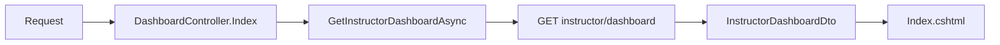
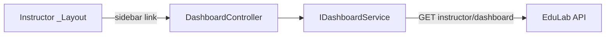

# DashboardController Module Documentation (MVC — Instructor Area)

---

## Overview

### Purpose
Instructor landing page: aggregate KPIs, recent activity, notifications, and revenue snapshot for the logged-in instructor.

### Business Objective
Give instructors an at-a-glance business overview without navigating to individual reports.

### Main Functionality
- Load the full instructor dashboard payload (KPIs + revenue + notifications)
- Render `Views/Dashboard/Index.cshtml`

### Primary User Roles

| Role | Description |
|------|-------------|
| Instructor | Single dashboard view |

---

## Module Architecture

```
Presentation           Areas/Instructor/Views/Dashboard/Index.cshtml
Application            IDashboardService -> DashboardService.GetInstructorDashboardAsync
External               EduLab API: GET instructor/dashboard
```

### Controllers

| Controller | Responsibility |
|-----------|----------------|
| `DashboardController` | Single `Index` action |

### Services

| Service | Responsibility |
|---------|----------------|
| `DashboardService` | `GetInstructorDashboardAsync` -> GET `instructor/dashboard` (DashboardService.cs:83); shared by Reports/Revenue controllers too |

### Dependencies on Other Modules
- **Instructor layout**: `Views/Shared/_Layout.cshtml` sidebar links here.
- **EduLab API** (hard dependency).

---

## Folder Structure

```
Areas/Instructor/Controllers/
+-- DashboardController.cs            # 1 action (26 lines)

Areas/Instructor/Views/Dashboard/
+-- Index.cshtml                      # Dashboard render
```

---

## Database Design

None (MVC). Aggregates come from the API's analytics tables.

---

## Internal Workflows & Runtime Behavior

### Workflow 1: Load Dashboard

#### Flow

```mermaid
flowchart TD
    A[GET Instructor/Dashboard/Index] --> B[GetInstructorDashboardAsync]
    B --> C[GET instructor/dashboard]
    C -->|ok| D[Deserialize InstructorDashboardDto]
    C -->|fail| E[Default/empty DTO]
    D --> F[View(model)]
```

#### Runtime Behavior
- `Index` has no try/catch — service-level defaulting absorbs API failures (DashboardController.cs:20-24).
- Class-level `[Area("Instructor")]` + `[Authorize(Roles = SD.Instructor)]` (DashboardController.cs:9-10).

---

## Data Flow Analysis



---

## Controllers & Endpoints

### DashboardController

**Route**: `/Instructor/Dashboard`  
**Authorization**: `[Authorize(Roles = SD.Instructor)]` (DashboardController.cs:10)  
**Dependencies**: `IDashboardService` only

| Action | HTTP | Route | Description |
|--------|------|-------|-------------|
| Index | GET | `/Instructor/Dashboard/Index` | Load + render dashboard |

**Model**: `InstructorDashboardDto` (KPIs, revenue, notification items with `TitleKey`/`MessageKey`/`Parameters` localization keys).

---

## Frontend Integration

### Index.cshtml
- Renders KPIs, revenue snapshot, recent notifications (localized via `TitleKey`/`MessageKey` + `Parameters`).
- `Views/Shared/_Layout.cshtml` sidebar: Dashboard first item, hardcoded `/Instructor/Dashboard/Index` link (Layout:617).

---

## Business Rules

| Rule | Verified in | Why it exists |
|------|-------------|---------------|
| Instructor-only | `[Authorize(Roles = SD.Instructor)]` | Financial data exposure |
| API failure -> empty DTO | DashboardService.cs:83 catch path | Dashboard never crashes on API outage |

---

## Security Analysis

| Control | Status |
|---------|--------|
| Authentication | ✅ role-gated |
| Authorization | API scopes payload to the calling instructor (JWT) |
| Data exposure | KPI + revenue are instructor-owned aggregates |

---

## Module Dependencies



**Internal**: Instructor layout.
**External**: EduLab API only.

---

## Hidden Behaviors & Technical Notes

1. **No error handling in controller** — relies entirely on the service's empty-DTO fallback (DashboardController.cs:22-23).
2. **No period parameter** — revenue shown is whatever the API default is; period selection lives in Revenue/Reports controllers instead.

---

## Configuration

| Key | Purpose |
|-----|---------|
| `EduLab:ApiBaseUrl` | API base (used by AuthorizedHttpClientService) |

---

## Change Log

**Current functionality (verified):** single-action instructor dashboard loading KPIs/revenue/notifications from `GET instructor/dashboard`.

**Maintenance notes:** none outstanding.