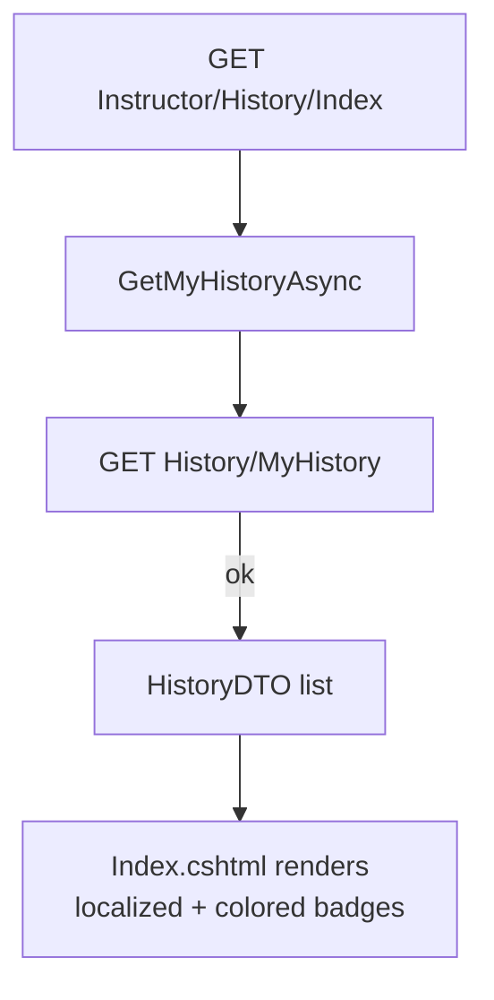
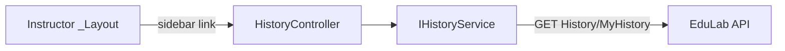

# HistoryController Module Documentation (MVC — Instructor Area)

---

## Overview

### Purpose
Show the instructor's own activity log: course creates/updates/deletes, lecture edits, etc.

### Business Objective
Auditability — instructors can see what changed and when, with localized operation descriptions.

### Main Functionality
- Load `GET History/MyHistory`
- Render localized log entries with colored badges

### Primary User Roles

| Role | Description |
|------|-------------|
| Instructor | View own activity history |

---

## Module Architecture

```
Presentation           Areas/Instructor/Views/History/Index.cshtml
Application            IHistoryService -> HistoryService.GetMyHistoryAsync
External               EduLab API: GET History/MyHistory
```

### Controllers

| Controller | Responsibility |
|-----------|----------------|
| `HistoryController` | Single `Index` action |

### Services

| Service | Responsibility |
|---------|----------------|
| `HistoryService` | `GetMyHistoryAsync` -> GET `History/MyHistory` (HistoryService.cs:162); `GetAllHistoryAsync` -> GET `History/all` (HistoryService.cs:115, used by admin) |

### Dependencies on Other Modules
- **Instructor layout** (sidebar link).
- **EduLab API** (hard dependency).

---

## Folder Structure

```
Areas/Instructor/Controllers/
+-- HistoryController.cs              # 1 action (26 lines)

Areas/Instructor/Views/History/
+-- Index.cshtml                      # Log list render
```

---

## Database Design

None (MVC). Logs live in the API's `HistoryLogs` table (user-scoped).

---

## Internal Workflows & Runtime Behavior

### Workflow 1: Load My History

#### Flow



#### Runtime Behavior
- No try/catch in the controller — service fallback returns an empty list on API failure (HistoryController.cs:20-24).
- Badge color/icon mapping by operation type: delete=1/10/7, create=2/9/8/6, update=4 (`HistoryDTO.BadgeClass` map).

---

## Data Flow Analysis

```mermaid
flowchart LR
    A[Request] --> B[HistoryController.Index]
    B --> C[GetMyHistoryAsync]
    C --> D[GET History/MyHistory]
    D --> E[HistoryDTO[] with LocalizeOperation]
    E --> F[Index.cshtml badges]
```

#### Mapping & Transformations
- `LocalizeOperation` maps API operation codes to localized labels.
- **URL-fix inconsistency**: `HistoryService` strips `/api` from the base URL via `Replace("/api","").TrimEnd('/')` (HistoryService.cs:39) — different from services using `Replace("/api/","/")` (e.g. InstructorService.cs:40) and from `_Layout.cshtml` which does no stripping at all.

---

## Controllers & Endpoints

### HistoryController

**Route**: `/Instructor/History`  
**Authorization**: `[Authorize(Roles = SD.Instructor)]` (HistoryController.cs:10)  
**Dependencies**: `IHistoryService` only

| Action | HTTP | Route | Description |
|--------|------|-------|-------------|
| Index | GET | `/Instructor/History/Index` | Load my history log |

**Model**: `List<HistoryDTO>`.

---

## Frontend Integration

### Index.cshtml
- Renders each log entry with `BadgeClass`-derived colors and `LocalizeOperation` text; API-failure empty state.

---

## Business Rules

| Rule | Verified in | Why it exists |
|------|-------------|---------------|
| Instructor-only | `[Authorize(Roles = SD.Instructor)]` | Logs are personal |
| Logs user-scoped | API `History/MyHistory` | Users never see others' activity |

---

## Security Analysis

| Control | Status |
|---------|--------|
| Authentication | ✅ role-gated |
| Authorization | API returns only the caller's logs |

---

## Module Dependencies



**Internal**: Instructor layout.
**External**: EduLab API only.

---

## Hidden Behaviors & Technical Notes

1. **URL-base stripping inconsistency across services** — `HistoryService` uses `Replace("/api","")` (HistoryService.cs:39), `InstructorService`/`StudentService`/`RatingService` use `Replace("/api/","/")` (:40), `_Layout.cshtml:41` strips nothing. All "work" only because the API URL happens to end in `/api/`.
2. **No controller-level error handling** — relies on service's empty-list fallback.

---

## Configuration

| Key | Purpose |
|-----|---------|
| `EduLab:ApiBaseUrl` | API base |

---

## Change Log

**Current functionality (verified):** single-action instructor history page from `GET History/MyHistory` with localized, color-coded operation badges.

**Maintenance notes:** unify the `/api` stripping pattern across services.