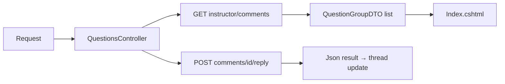
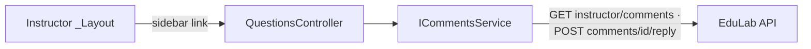

# QuestionsController Module Documentation (MVC — Instructor Area)

---

## Overview

### Purpose
Instructor Q&A inbox: all comment threads grouped by course/lecture, with in-page reply capability.

### Business Objective
Instructors answer student questions from one place without opening each course's Learn page.

### Main Functionality
- Load question threads grouped by course (GET `instructor/comments`)
- Reply to a thread (JSON POST)
- Localized validation messages

### Primary User Roles

| Role | Description |
|------|-------------|
| Instructor | Read + reply to student questions |

---

## Module Architecture

```
Presentation           Areas/Instructor/Views/Questions/Index.cshtml
Application            ICommentsService -> GetInstructorQuestionsAsync + ReplyToCommentAsync
External               EduLab API: GET instructor/comments,
                       POST comments/{commentId}/reply
```

### Controllers

| Controller | Responsibility |
|-----------|----------------|
| `QuestionsController` | Index + Reply (2 actions) |

### Services

| Service | Responsibility |
|---------|----------------|
| `CommentsService` | `GetInstructorQuestionsAsync` -> GET `instructor/comments` (CommentsService.cs:121); `ReplyToCommentAsync` -> POST `comments/{id}/reply`; also `GetLectureCommentsAsync` (GET `comments/lecture/{lectureId}`) and `AddCommentAsync` (POST `comments`) used by the Learner area |

### Dependencies on Other Modules
- **CommentsService** (shared with Learner CommentsController).
- **Instructor layout** (sidebar link).
- **EduLab API** (hard dependency).

---

## Folder Structure

```
Areas/Instructor/Controllers/
+-- QuestionsController.cs            # 2 actions (65 lines; nested ReplyModel)

Areas/Instructor/Views/Questions/
+-- Index.cshtml                      # Grouped question threads
```

---

## Database Design

None (MVC). Threads live in the API's `LectureComments` table.

---

## Internal Workflows & Runtime Behavior

### Workflow 1: Load Questions

#### Flow

```mermaid
flowchart TD
    A[GET Instructor/Questions/Index] --> B[try GetInstructorQuestionsAsync]
    B --> C[GET instructor/comments]
    C -->|ok| D[View(List[QuestionGroupDTO])]
    C -->|exception| E[LogError + View(empty list)]
    D --> F[Index.cshtml grouped threads]
```

### Workflow 2: Reply

#### Flow

```mermaid
flowchart TD
    A[Reply box submit] --> B[POST Reply<br/>[FromBody] ReplyModel<br/>NO antiforgery]
    B --> C{Content blank?}
    C -->|yes| D[Json success=false<br/>localized ReplyRequired]
    C -->|no| E[ReplyToCommentAsync id, Content]
    E -->|comment| F[Json success=true + comment]
    E -->|null| G[Json success=false<br/>ReplySendFailed]
    E -->|exception| H[LogError + Json success=false<br/>ErrorOccurred]
```

#### Runtime Behavior
- `Reply` is `[HttpPost]` with **no `[ValidateAntiForgeryToken]`** (QuestionsController.cs:40-41).
- Nested `ReplyModel { Content }` bound from body (QuestionsController.cs:61-64).
- Null/blank content rejected client-and-server-side (`ReplyRequired`).

---

## Data Flow Analysis



---

## Controllers & Endpoints

### QuestionsController

**Route**: `/Instructor/Questions`  
**Authorization**: `[Authorize(Roles = SD.Instructor)]` (QuestionsController.cs:12)  
**Dependencies**: `ICommentsService`, `ILogger<QuestionsController>`, `IStringLocalizer<SharedResources>`

| Action | HTTP | Route | Description | Anti-forgery |
|--------|------|-------|-------------|--------------|
| Index | GET | `/Instructor/Questions/Index` | Grouped question threads | — |
| Reply | POST | `/Instructor/Questions/Reply?id` | Reply to a thread (JSON) | ❌ |

**Model**: `List<QuestionGroupDTO>`; nested `ReplyModel` for the POST body.

---

## Frontend Integration

### Index.cshtml
- Threads grouped by course (`QuestionGroupDTO`), reply composer per thread; JSON fetch to `Reply`; localized toasts.

---

## Business Rules

| Rule | Verified in | Why it exists |
|------|-------------|---------------|
| Instructor-only | `[Authorize(Roles = SD.Instructor)]` | Replies come from the course owner |
| Content required | QuestionsController.cs:45-46 | No empty replies |
| Failure -> empty list / false JSON | try/catch blocks | Graceful degradation |

---

## Security Analysis

| Control | Status |
|---------|--------|
| Authentication | ✅ role-gated |
| Authorization | API validates the caller owns the commented course |
| Anti-forgery | ❌ `Reply` POST unprotected (verified) |

---

## Module Dependencies



**Internal**: Instructor layout, shared CommentsService.
**External**: EduLab API only.

---

## Hidden Behaviors & Technical Notes

1. **CSRF-exposed Reply POST** (no antiforgery) — verified.
2. **Silent empty state** on load failure — same pattern as Reviews/Dashboard.
3. **Reply id is unvalidated** at the MVC layer: `int id` from route; any id is forwarded to the API, which must enforce ownership.

---

## Configuration

| Key | Purpose |
|-----|---------|
| `EduLab:ApiBaseUrl` | API base |

---

## Change Log

**Current functionality (verified):** grouped question inbox + JSON reply flow, localized validation, error-safe rendering.

**Maintenance notes:** add antiforgery to `Reply`.