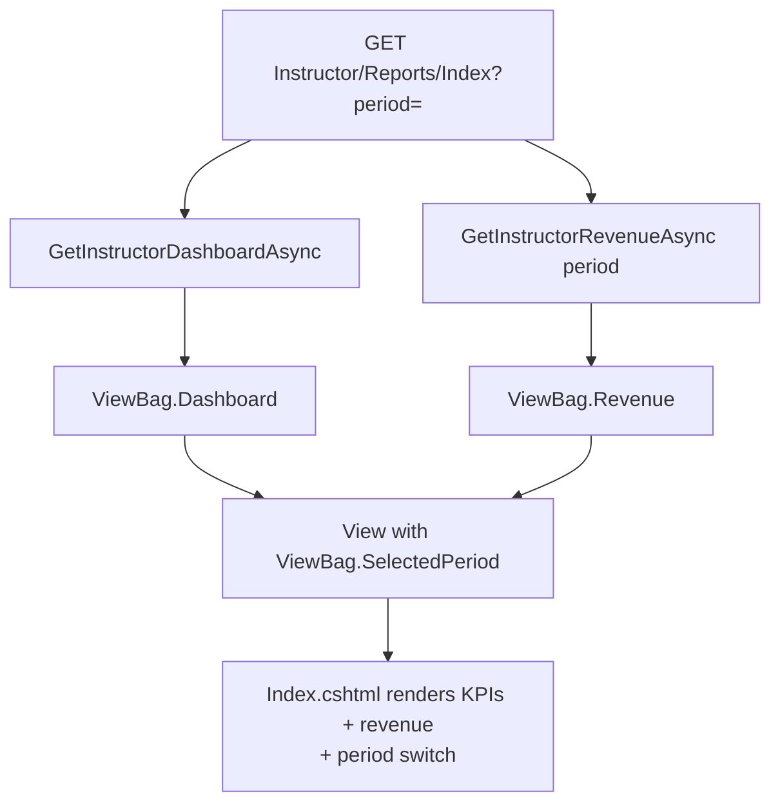
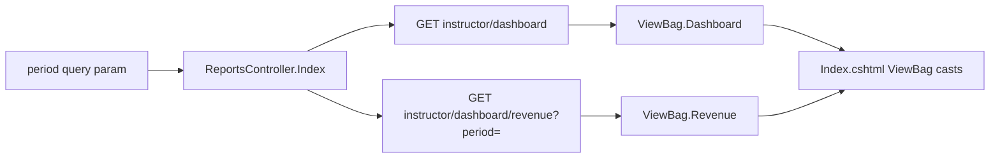
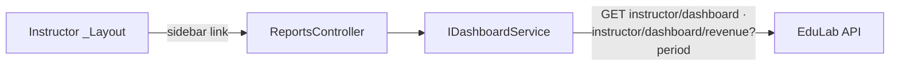

# ReportsController Module Documentation (MVC — Instructor Area)

---

## Overview

### Purpose
Instructor analytics page combining the dashboard KPIs with period-filterable revenue trends.

### Business Objective
One page for performance review: KPIs on top, revenue chart + period switch below.

### Main Functionality
- Load dashboard + revenue for a selected period
- Period presets: `7days` / `month` / `3months` / `year` / `all`
- Export buttons (UI only — dead, see Hidden Behaviors)

### Primary User Roles

| Role | Description |
|------|-------------|
| Instructor | View KPIs + revenue analytics |

---

## Module Architecture

```
Presentation           Areas/Instructor/Views/Reports/Index.cshtml
Application            IDashboardService -> GetInstructorDashboardAsync + GetInstructorRevenueAsync
External               EduLab API: GET instructor/dashboard,
                       GET instructor/dashboard/revenue?period=
```

### Controllers

| Controller | Responsibility |
|-----------|----------------|
| `ReportsController` | Single `Index(period)` action |

### Services

| Service | Responsibility |
|---------|----------------|
| `DashboardService` | `GetInstructorDashboardAsync` (GET `instructor/dashboard`, DashboardService.cs:83) + `GetInstructorRevenueAsync(period)` (GET `instructor/dashboard/revenue?period=`, DashboardService.cs:128; `safePeriod` defaults `"month"` when blank) |

### Dependencies on Other Modules
- **Instructor layout** (sidebar link).
- **EduLab API** (hard dependency).

---

## Folder Structure

```
Areas/Instructor/Controllers/
+-- ReportsController.cs              # 1 action (32 lines)

Areas/Instructor/Views/Reports/
+-- Index.cshtml                      # KPI + revenue render (dead Export buttons)
```

---

## Database Design

None (MVC). Data is API-derived analytics.

---

## Internal Workflows & Runtime Behavior

### Workflow 1: Reports Page

#### Flow



#### Runtime Behavior
- `ViewBag.SelectedPeriod = IsNullOrWhiteSpace(period) ? "month" : period` (ReportsController.cs:27) — note: empty-string period falls back to `"month"` here, but **RevenueController.cs:23 uses `?? "month"` (only null)** — inconsistent behavior for `?period=`.
- **No view model** — controller passes only ViewBags; the view itself casts `ViewBag.Dashboard`/`ViewBag.Revenue` to `InstructorDashboardDto`/`InstructorRevenueDto` (Reports/Index.cshtml:1-21).

---

## Data Flow Analysis



---

## Controllers & Endpoints

### ReportsController

**Route**: `/Instructor/Reports`  
**Authorization**: `[Authorize(Roles = SD.Instructor)]` (ReportsController.cs:10)  
**Dependencies**: `IDashboardService` only

| Action | HTTP | Route | Description |
|--------|------|-------|-------------|
| Index | GET | `/Instructor/Reports/Index?period` | KPIs + period revenue |

**Period presets** (view): `7days` / `month` / `3months` / `year` / `all`.

---

## Frontend Integration

### Index.cshtml
- `ViewBag.Dashboard`/`ViewBag.Revenue` casts (Index.cshtml:1-21); `ViewBag.SelectedPeriod ?? "month"` default (Index.cshtml:20-21).
- Period switch buttons re-navigate with `?period=`.
- **Export buttons are dead**: "Export" UI at Index.cshtml:137-140 calls nothing — no handler wired (mirrors Revenue/Index.cshtml:135-138).

---

## Business Rules

| Rule | Verified in | Why it exists |
|------|-------------|---------------|
| Instructor-only | `[Authorize(Roles = SD.Instructor)]` | Financial analytics |
| Empty period -> "month" | ReportsController.cs:27 | Sensible default |
| Period set differs from Revenue | `7days`/`month`/`3months`/`year`/`all` here vs `week`/`month`/`year`/`all` in Revenue | Inconsistent feature sets — see notes |

---

## Security Analysis

| Control | Status |
|---------|--------|
| Authentication | ✅ role-gated |
| Authorization | API scopes data to calling instructor (JWT) |
| Data exposure | Instructor-owned aggregates only |

---

## Module Dependencies



**Internal**: Instructor layout, DashboardService.
**External**: EduLab API only.

---

## Hidden Behaviors & Technical Notes

1. **Period fallback inconsistency**: `ReportsController.cs:27` uses `IsNullOrWhiteSpace`; `RevenueController.cs:23` uses `?? "month"` — `?period=` yields `"month"` on Reports but is passed through to the API raw on Revenue.
2. **Period sets diverge**: Reports offers `7days`/`month`/`3months`/`year`/`all`; Revenue offers `week`/`month`/`year`/`all`. The API must support both vocabularies.
3. **Dead Export buttons** on both Reports and Revenue pages (no JS handler).
4. **No view model**: heavy reliance on ViewBag casts in the view — a null ViewBag crashes the render, not the controller.

---

## Configuration

| Key | Purpose |
|-----|---------|
| `EduLab:ApiBaseUrl` | API base |

---

## Change Log

**Current functionality (verified):** KPI + period-filtered revenue page backed by two API calls, ViewBag-driven render.

**Maintenance notes:** wire or remove the Export buttons; unify period fallback + presets with Revenue.